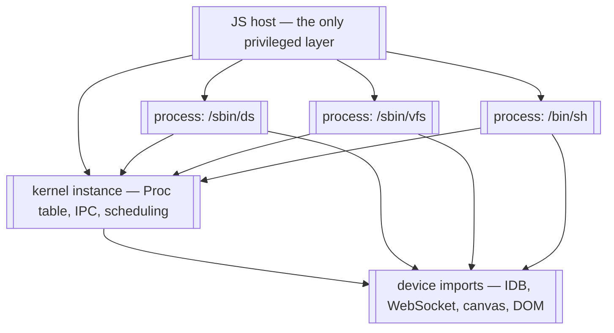

# ARCH_WASM32 — MINIX/Rust as a WebAssembly target

Rough design for an `arch-wasm32` port: the kernel, servers, and userland
compiled to WebAssembly and run in a browser tab (or Node, or any wasm host).

Status: **partially implemented.** M0 (host-mode HAL), M1 (kernel boots as
wasm, no processes), and M2's protocol core (instance-per-process, the dispatch
protocol, Asyncify across the boundary, a real two-process rendezvous) are all
**done** — see §11 for commands and results. What remains of M2 is the real
servers as modules, which needs the toolchain work in §10 rather than more
protocol design. M3 onward is design.

The design's riskiest assumption — that `fork` is implementable for a suspended
wasm process — has been **verified by a runnable spike** in `tools/fork-spike/`
(20/20 checks, including a negative control, with buffer sizing and overflow
behaviour measured). See §4.2 and §12, risk 1.

## 1. Goal and non-goals

**Goal.** `just run-wasm` produces a `kernel.wasm` plus a set of process
modules, and opening `index.html` boots the same boot-process stack as QEMU
(DS → RS → PM → SCHED → VFS → VM → MFS → TTY → shell) and gives you a prompt.

**Non-goals.**

- Bit-exact hardware fidelity. The wasm port is a fourth arch, not an emulator;
  where hardware semantics cannot be reproduced (§5), the design says what
  replaces them.
- Beating QEMU on speed. Asyncify (§4) costs roughly 2–3x plus code size. That
  is acceptable for the goal above.
- Preserving MINIX's threat model unchanged. This is the one honest casualty;
  see §6's closing note.

## 2. Why this is viable at all

Three properties of this codebase do most of the work:

1. **`crates/kernel/src/hal.rs` is the single `#[cfg(target_arch)]` boundary.**
   It is six lines long and re-exports one arch crate. Everything else in
   `crates/kernel/src/` — `sched.rs` (985 lines), `ipc.rs` (2161), `proc.rs`
   (750), `syscall.rs` (1376) — is arch-independent and survives untouched.
2. **`crates/arch-common` has zero dependencies and is already `#![no_std]`.**
   The arch-independent primitives (IPC message types, grants, endpoints) are
   portable by construction.
3. **The kernel is `#![no_std]`.** It needs only `core` for wasm32, so the
   kernel-side build does not need the `rust/` fork or `just bootstrap` (§10).

The port surface is therefore the ~150 functions in
`crates/arch-x86_64/src/hal.rs`, a new `crates/arch-wasm32`, and a handful of
`#[cfg]` gates where the kernel reaches past the HAL into paging (§7).

## 3. The model: instances as processes

The central decision: **each MINIX process becomes its own WebAssembly module
instance**, and the JS host is the actual privileged layer.

A wasm instance has its own linear memory and can reach the outside world only
through declared imports. That is, almost exactly, MINIX's process model: a
process owns an address space and reaches the kernel only through the syscall
gate. Here the import table *is* the syscall gate — enforced by the engine
rather than by rings.

What each layer owns:

| Layer | Owns | Corresponds to |
|---|---|---|
| JS host | Instances, their `WebAssembly.Memory`, cross-instance copies, timer ticks, async device I/O | MMU + physical memory + interrupt controller + device hardware |
| Kernel instance | `Proc` table, IPC, scheduling decisions, privilege table, VM bookkeeping | The MINIX kernel |
| Process instance (×N) | One process's code, data, stacks, heap | One user process or server |



Note the asymmetry: the kernel instance is authoritative about *policy*
(scheduling, IPC routing, privileges) but is not privileged relative to the
host. It cannot read another instance's memory any more than a process can. So
every cross-process memory operation in the kernel — `deliver_msg`, grant
copies, `safecopy` — has to either go through a host import or use a shared
arena (§5).

## 4. Control transfer — the crux

`crates/arch-x86_64/src/asm.rs:354` is `switch_to(new_rsp: u64)`. MINIX's
context switch is a stack-pointer swap; `restore()` (`asm.rs:956`) resumes a
process by building an `iretq` frame out of `p_reg`. The other two ports have
the same primitive under a different name — `switch_to_user(proc_ptr)` in
`arch-riscv64/src/switch.rs:21` and `arch-aarch64/src/switch.rs:27` — so
"resume a process by taking over the CPU and its stack" is a uniform assumption
across all three existing arches. Wasm is the first target that cannot provide
it at all.

**Wasm has exactly one stack per instance and no way to switch it.** The
`stack-switching` proposal (typed continuations) would fix this and is not
shipped in browsers. So the stack swap cannot be reproduced, and this is the
single largest difference from the other three ports.

The design replaces the stack swap with a **host-driven dispatch loop**, using
Binaryen's **Asyncify** as the enabling mechanism for blocking calls.

### 4.1 The dispatch protocol

Kernel instance exports:

```
minix_kernel_init(config_ptr: i32, config_len: i32)
minix_kernel_step() -> i32            // returns a dispatch descriptor
minix_kernel_syscall(proc_nr: i32, nr: i32, args_ptr: i32) -> i64
minix_kernel_interrupt(kind: i32, payload_ptr: i32)
```

Host loop:

```
for (;;) {
  const d = kernel.step();            // who should run, and why
  switch (d.op) {
    case RUN:  instances[d.proc_nr].resume(); break;   // returns on yield/syscall
    case SLEEP: await nextTimerTick(); break;
    case EXIT: return;
  }
}
```

Process module imports:

```
host_syscall(nr, a, b, c, d, e, f) -> i64
host_yield()
host_console_write(byte) / host_console_read() -> i32
host_exit(code) -> !
```

### 4.2 How a blocking syscall works

`recv` with no sender must suspend the calling process and run someone else.
In a normal kernel that is a stack switch. Here the process module is compiled
with Asyncify, so the syscall import **unwinds the caller's stack into linear
memory** and returns control to the host. The host then resumes whoever the
kernel says should run next. When a message arrives, the host resumes the
blocked instance, Asyncify rewinds from the saved buffer, and `host_syscall`
returns to the caller with the result.

```mermaid
sequenceDiagram
    participant H as JS host
    participant K as kernel instance
    participant A as process A
    participant B as process B

    H->>A: resume
    A->>K: host_syscall(SENDREC, B, msg)
    K->>K: pick_proc, enqueue A as blocked
    K-->>H: dispatch: RUN B
    Note over A: Asyncify unwound A's stack to linear memory
    H->>B: resume
    B->>K: host_syscall(RECV)
    K->>K: copy message, unblock A
    K-->>H: dispatch: RUN A
    H->>A: resume
    Note over A: Asyncify rewinds; host_syscall returns
    A->>A: continues with straight-line code
```

**Why Asyncify rather than restructuring userland.** The alternative is to make
everything a continuation — every blocking syscall becomes an explicit state
machine. That would touch all of `minix-std`, `minix-libc`, and every server.
Asyncify keeps userland source unchanged: `recv()` still looks synchronous.
Given the project ships a whole userland, that trade is worth the runtime cost.

The kernel instance is Asyncify-compiled too, for its own blocking points
(waiting on device I/O).

#### Verified against Binaryen 132

`tools/fork-spike/` exercises this end to end and confirms it. Details worth
carrying into the implementation, read out of the instrumented module rather
than from documentation:

- `--asyncify` adds exactly two mutable i32 globals and exports
  `asyncify_start_unwind` / `asyncify_start_rewind` / `asyncify_stop_rewind` /
  `asyncify_stop_unwind` / `asyncify_get_state`. **Nothing outside those hooks
  writes the state global**, so the state machine is entirely host-drivable and
  the guest needs no cooperation. That suits a microkernel better than
  emscripten's guest-driven flow: the kernel is already the entity that decides
  a syscall must block, so it can drive all four transitions itself and userland
  stays straight-line.
- `asyncify_data` is `{stack_ptr, end, start}` at offsets 0/4/8 with an
  **ascending** buffer. `asyncify_start_unwind` asserts the *initial*
  `stack_ptr` is within bounds, but **the unwind path then pushes frames without
  re-checking**. Measured: a 64-byte buffer with a 512-frame stack suspended
  normally and overwrote 8184 bytes past the end — no trap. An undersized buffer
  corrupts the process's own memory rather than failing. Size it from the
  process's stack limit (~36 bytes per frame; MINIX's `DEFAULT_STACK_LIMIT` of
  4 MiB implies a 2–2.5 MiB buffer) and place it **flush against the end of
  committed linear memory** so overflow traps instead of landing in the
  process's own data.
- When a suspended operation finally completes, the state must return to NORMAL
  **before the import returns**, or the instrumented caller re-enters its rewind
  path and traps with `unreachable`. Emscripten does this from the guest's
  runtime wrapper; with a raw module the host's import is the only place that
  knows the wait is over. This is the one non-obvious rule in the protocol.

See `tools/fork-spike/README.md` for the full protocol and the host-side fork
mechanics.

### 4.3 The frame becomes a struct

There is no trap: a syscall is an ordinary call. So `TrapFrame` (a `[u8; 256]`
with `read_frame_field`/`write_frame_field` poking offsets) is replaced by a
plain kernel-side struct that the syscall shim fills from its arguments:

- `read_syscall_nr`, `read_syscall_arg(i)` → field reads
- `write_retval` → field write
- `read_frame_ip`/`write_frame_ip` → meaningless without a program counter; the
  call/return is the engine's business
- `exec_init_regs`, `set_initial_regs` → set the new module's entry arguments
- `copy_frame`, `trapframe_to_mcontext`, `mcontext_to_trapframe` → only needed
  for signals, which are redesigned in §6.3

This is a simplification, not a loss: the 256-byte frame exists only because
the hardware hands you a stack image.

## 5. Memory model

**A process's address space is its instance's linear memory.** MINIX VAs map to
wasm offsets by subtracting a base and bounds-checking. Consequences:

- **Wasm pages are 64 KiB, not 4 KiB** (`memory.grow` granularity). Keep
  `PAGE_SIZE = 4096` for MINIX's own VM bookkeeping and treat one wasm page as
  16 MINIX pages. The allocation granularity differs from the accounting
  granularity; `arch-wasm32::hal` owns that translation.
- **VA space is 32-bit.** wasm32 has i32 addresses and a 4 GiB ceiling, so the
  wasm target is effectively a 32-bit-address-space port: `user_stack_base`,
  `mmap_base`, `user_heap_base` etc. need a wasm32 layout that fits below 4 GiB.
  `VirBytes`/`PhysBytes` stay `u64` (they are opaque handles), but every user VA
  must fit in 32 bits. wasm64 would lift this; it is a stretch goal (§11).
- **`brk`/`mmap` become `memory.grow`.** No demand paging is possible: wasm
  memory can only grow, never be mapped at a chosen address or faulted in.
- **No COW, no file-backed lazy mmap.** `FILEMMAP.md` documents that exec is
  already file-backed lazy mmap. That mechanism is replaced, not ported: exec
  becomes module instantiation (§7.2).
- **"Physical memory" is a host-managed page pool.** `alloc_phys_page`,
  `alloc_phys_contig`, `init_phys_alloc` become host imports over a fixed
  budget declared at startup; "physical address" is an opaque handle, not an
  address.

### 5.1 Cross-process copies and IPC payloads

`deliver_msg` and the grant machinery write directly into the target process's
memory today. In the instance model only the host can do that. Two options:

- **(a) Host-mediated copy.** Correct and simple; every IPC message and every
  `safecopy` crosses the FFI boundary. `ipc.rs` is a hot path, so this is the
  biggest performance risk in the design.
- **(b) Shared mailbox arena.** One bounded `WebAssembly.Memory` imported by the
  kernel and by every process, with the kernel allocating indices. Message
  payloads and small grants never cross the host boundary.

Recommendation: **(b), with (a) for anything large.** The caveat is that wasm
memory has no protection, so a misbehaving process could *scan* the arena and
read another process's message. It cannot touch another process's private
memory — that stays sealed — so the protection that matters (server privilege
separation over private data) is preserved. Worth stating in the port's
documentation rather than discovering later.

**What was built: (a), and the reason is that the seam turned out not to be
optional.** There are three places in the kernel where two address spaces meet —
`vm::virtual_copy` (which `SYS_VIRCOPY` reduces to), `ipc::copy_from_user`, and
`ipc::delivermsg` — and none of them can be reached from outside the kernel when
the two sides are separate memories. Each now asks the HAL for a copy via
`hal::CROSS_ADDRESS_SPACE_COPY`, which is `Some` on wasm32 (the host performs it)
and `None` where page tables already join the two spaces, so the hardware arches
keep their existing code path untouched.

A second gap surfaced only once that worked, and it is worth recording because
it is invisible from the kernel: the receive path sets `MF_DELIVERMSG` and leaves
the actual copy to *the syscall-return epilogue*, which lives in each arch's asm.
A wasm instance has no such epilogue — its syscall is an ordinary call whose
return belongs to the host — so `ipc::deliver_pending_msg` names that step and
`kernel-wasm` calls it. A third followed the notification work:
`system::kernel_call_finish` writes the kernel call's reply straight to the
caller's address, so PM's `SYS_GETKSIG` answer never arrived and PM span forever.
And a fourth only surfaced once a *server* was given a request to answer: the
epilogue does two things, and only the copy had been given a wasm equivalent.
The other is the return value — a `RECEIVE` that blocks is answered later, and the
sender's endpoint reaches the guest through the frame `mini_send` writes, which is
where the shipping arches read it on the way back to userland. Without it a resumed
call returned the value cached at *block* time, so DS replied to endpoint 0 instead
of to its client (`PORTING_PLAN.md` finding 15). `kernel-wasm` now records a blocked
call's result and answers `minix_proc_retval`, and the host reads that slot on
rewind rather than replaying what it saw.
Measured cost of the whole thing: **two FFI crossings per message**
(sender→kernel, kernel→receiver), which is the number (b) would remove. The arena
stays the right optimisation if the boundary ever costs too much; it is no longer
on the critical path to a booting system.

**The seam is routed everywhere it has been found, and the worklist is now
closed.** Each site is gated rather than rewritten: where
`hal::CROSS_ADDRESS_SPACE_COPY` is `None` the original code runs verbatim, so the
shipping arches are byte-for-byte unchanged and only wasm takes the new path.
Every conversion that takes a user pointer reduces to one of two operations —
`vm::virtual_copy` when two address spaces meet, and `vm::read_from_proc` /
`vm::write_to_proc` when a kernel buffer is on one side — and `PORTING_PLAN.md`
finding 10 carries the per-site table, including the two entries that turned out
to be already converted when the list was finally read through.

Three of the eight were found by a test rather than by reading, and the last one
is the sharpest: `sys_kernel_call_handler` read the caller's message with a raw
`copy_nonoverlapping`, so on wasm **every kernel call dispatched on the kernel's
own memory** — and it did so silently, returning 0. A `SYS_VIRCOPY` test that
simply asked for a copy and checked the bytes caught it in one run, which is the
argument for the test below existing at all.

The lesson worth keeping is about the searches: each of those three had been
grepped for and missed, because the grep excluded the site's shape (`kbuf`, or the
argument pattern). A grep over a kernel that assumes an identity map is not an
audit. The last five sites were therefore read one at a time, and each conversion
was required to bring a test: `do_trace_handler` and `SYS_PRIVCTL` were already
routed through `vm::virtual_copy`, `EXEC_SETUP`'s name read and `vm::vm_memset`
(the `do_safememset` helper, which had lost the process argument C's
`vm_memset(caller, who, ph, c, count)` carries) were converted and are exercised
by the M2 harness, and `do_vumap`'s vector transfers were converted with the
harness asserting the input-vector read itself — the call cannot *complete*,
because its result is physical addresses and this port has none, but that is
`PORTING_PLAN.md` finding 14 rather than a seam gap. `ps_str` turned out to need
nothing: it is passed to `arch_proc_init` as a value, and no implementation
dereferences it.

**A ninth site came later, and its shape is the one worth remembering.**
`verify_grant` resolved a grant id by reading the *granter's* grant table with
`core::ptr::read` at `s_grant_pa + id * size_of::<CpGrant>()` — the granter's own
memory, addressed out of a priv structure rather than out of a message. Every
grep above was a message grep, so none could have matched; reading C's
`do_safecopy.c` is what turned it up. It now goes through `vm::read_from_proc`,
and the M2 harness pins it with a real `SYS_SETGRANT`/`SYS_SAFECOPYFROM` pair
across two instances (`PORTING_PLAN.md` finding 16). *Finding 17* is the bug that
test uncovered underneath it: `proc_init` never marked the dynamic privilege
slots free, so the allocator `SYS_SETGRANT` needs could never return one.

### 5.2 Pointer width: the port's sharpest constraint

wasm32 pointers are 32 bits. M1 established that this is not a formality: the
kernel assumed 64-bit pointers in four places, none of which had ever been
exercised on a 32-bit target.

| Site | Assumption | Fix applied |
|---|---|---|
| `vm.rs` `NR_PHYS_PAGES` | `0x8_0000_0000` as a `usize` literal | compute through `u64`, cast the quotient |
| `ipc.rs` `ipc_senda_handler` | `usize::from_le_bytes` over an 8-byte message field | read `u64`, narrow to `usize` |
| `clock.rs` `MinixTimer` | static asserts pinning a 32-byte layout | asserted only where 64-bit pointers hold |
| `syscall.rs` | `asm!` compiler barrier (unstable on wasm32) | `compiler_fence` on that target |

All four fixes are ABI-neutral on the 64-bit arches, and the host kernel suite
still passes after them. But the general lesson is a **port invariant rather than
a bug**: on wasm32 a `usize` is four bytes, so any ABI struct containing a pointer
or a `usize` has a different layout there than on the three shipping arches.
`MinixTimer` is already written that way — it stores a function pointer and an
opaque argument as `usize`.

This lands hardest on M2, where servers exchange message structs over IPC:

> Message and ABI structs must carry `u64` handles and fixed-width integers —
> never pointers, never `usize`.

A struct that violates this agrees with itself on any one target and disagrees
with a server compiled for another, which is the kind of mismatch that shows up
as corrupted fields rather than a link error. A static size assertion per message
struct, as `clock.rs` already does for `MinixTimer`, is the cheap way to hold the
line.

## 6. Privilege, traps, signals

### 6.1 No rings

There are no privilege levels. What replaces them:

- **Ring 3 → a separate instance.** Enforced by the engine; stronger than the
  hardware version in one respect (a process genuinely cannot address another's
  memory).
- **Ring 0 → the kernel instance plus the JS host.** But the host is the real
  supervisor (it can read and write every instance's memory), so the kernel's
  authority is *contractual*, not enforced. The VM server's control over other
  processes' address spaces becomes bookkeeping that the host acts on.

### 6.2 Traps are process death

A wasm trap (out-of-bounds access, `unreachable`, integer divide by zero) is not
catchable within the instance. The host catches `WebAssembly.RuntimeError` and
routes it to the kernel's process-termination path — the same path as an
unrecoverable hardware fault. `read_fault_addr` has no equivalent; the trap
gives no address.

### 6.3 Signals without sigframes

`sigframe_*`, `build_sigframe`, and the naked `minix_sigreturn_trampoline` in
`crates/minix-rt/src/lib.rs` all rely on building a stack frame in the user's
address space and forcing a jump to the handler. Forcing a jump is impossible.

The replacement, which fits MINIX's existing shape: **deliver signals at
syscall-return time, in the process's own shim.**

1. The kernel sets `p_pending` as it does today.
2. Instead of building a frame, the kernel marks the process's next resume as
   "signal pending".
3. When the host resumes that instance and `host_syscall` is about to return,
   the shim checks the flag, calls the handler (a plain function call), and
   every handler is uniformly `-> !`, ending in the sigreturn trampoline.
4. The trampoline calls `host_syscall(SENDREC, PM, PM_SIGRETURN)` exactly as it
   does now.

This removes `Mcontext` save/restore entirely: there is no register state to
restore, because unwinding and rewinding already returns the process to the
right place with the right locals. The naked per-arch trampolines get a wasm
arm that is just a normal Rust function.

### 6.4 No preemption of a runaway process

A synchronously executing wasm call cannot be interrupted from outside. The JS
event loop is blocked until it returns; a Worker cannot be signalled either
(only terminated, destructively). So quantum-based preemption degrades to
**cooperative**: the host injects a tick at the next syscall or yield point.

This is a real semantic change. MINIX's scheduler expects to be able to
preempt. Mitigations, in order of preference:

1. Accept it. MINIX userland and servers are extremely syscall-heavy, so yield
   points are frequent in practice.
2. Optional: run each process in its own Worker and terminate on quantum
   overrun, treating it as a crash. Requires COOP/COEP headers for
   `SharedArrayBuffer`.
3. Engine-level fuel metering would solve it properly; browsers do not expose it.

## 7. Kernel-side changes beyond `hal.rs`

### 7.1 Paging call sites

This is the one place the "`hal.rs` is the only `#[cfg]`" invariant erodes. The
kernel reaches past the HAL into paging in a bounded set of places:

| File | Reaches into | Wasm disposition |
|---|---|---|
| `pagetable.rs` (624 lines) | `walk`, `map_page`, `clear_page`, `boot_cr3`, `pt_mapkernel` | Entire module is x86/RISC-V/AArch64-only; not compiled for wasm |
| `exec.rs` | `pt_levels`, `pt_index`, `pte_to_phys` | Replaced by module instantiation |
| `syscall.rs:952–1037` | `boot_cr3`, `clear_page`, `map_page`, `pte_user_flags` | `brk`/`mmap` paths rewrite to `memory.grow` requests |
| `system.rs:3656–3714` | `boot_cr3`, `map_page` | Same |
| `ipc.rs:691`, `grants.rs` | `pagetable::walk`, `pte_to_phys` | Grant VA→PA translation becomes instance+offset resolution |
| `vm.rs` (989 lines) | Extensively | Keep the region/alloc bookkeeping; replace the mapping half |

Rather than sprinkling `#[cfg(target_arch = "wasm32")]` at each site, expose
`hal::PAGING: bool` and gate at these ~10 call sites, or gate whole functions.
This is the design's main piece of unavoidable ugliness and should be entered
into `.rules` as a known exception once it lands.

### 7.2 exec becomes instantiation

`elf.rs` + `exec.rs` load ELF segments into a new address space. For wasm, a
program is a wasm module; exec becomes:

1. Kernel reads the module bytes through VFS/MFS as usual.
2. Kernel asks the host to instantiate that module with the standard import set.
3. Host creates the instance, links imports to the syscall gate, copies `argv`
   into the instance's memory.
4. Kernel records the instance handle in the `Proc`.

The disk image and initramfs therefore carry **wasm modules instead of ELF
binaries**. That is a userland build-pipeline change (§10), not a kernel one, and
`elf.rs` is untouched on other arches.

### 7.3 Boot

`crates/kernel-boot` is really per-arch platform glue: trampolines,
multiboot parsing, BSS clearing, plus `syscall_handler_c`, `save_timer_context`,
`isr_deliver_msg` (all in `main.rs`). For wasm none of that applies. The
entry is:

```
host: instantiate(kernel.wasm, imports) -> call minix_kernel_init() -> loop step()
```

`BootProcessConfig.procs` (the ordered `(path, endpoint)` list) is exactly the
right shape already; the host resolves each path to a module and instantiates it
on request instead of the kernel mapping ELF pages for it.

`crates/kernel/build.rs` already emits **empty initramfs stubs** when
`target_from_rustc_target` does not recognise the triple. wasm32 will fall into
that arm automatically, which is convenient: the kernel compiles with embed
features on, and the host supplies modules from JS instead.

## 8. The HAL surface, function by function

All ~150 items in `crates/arch-x86_64/src/hal.rs`, grouped. "Delete" means the
function has no meaning on wasm; "no-op" means it stays in the API because the
kernel calls it unconditionally, but it does nothing.

| Group | Functions | Wasm disposition |
|---|---|---|
| Console | `serial_write_byte`, `serial_read_byte`, `serial_byte_available`, `poll_console` | **Rewrite.** Host imports. Blocking read unwinds via Asyncify. |
| Interrupt flag | `irq_save`, `irq_restore` | **No-op.** x86_64 already returns `false`/does nothing here, so this sets no precedent. |
| CPU idle | `cpu_idle`, `pause`, `hlt`, `halt` | **Rewrite.** Yield to the host loop; `halt` unwinds to it. |
| Time | `read_cycles`, `read_tsc`, `read_tsc_ctr_switch`, `write_tsc_ctr_switch`, `init_profile_clock`, `stop_profile_clock` | **Rewrite.** Host tick counter + `performance.now()`; the host is the clock source. |
| Per-CPU / sched globals | `set_current_proc`, `current_proc`, `init_cpulocals`, `sched_run_q_head`, `sched_run_q_tail`, `sched_nr_queues`, `sched_current_proc`, `sched_bill_proc`, `sched_set_bill_proc`, `smp_proc_ptr`, `smp_set_proc_ptr` | **Rewrite.** Single-CPU statics inside the kernel instance. |
| CPU identity | `cpu_id` | **Constant `0`.** |
| Locking | `Spinlock`, `bkl_lock`, `bkl_unlock`, `mfence` | **No-op** (single-threaded), or Atomics for the SMP stretch. |
| Frames | `TrapFrame`, `read_frame_field`, `write_frame_field`, `exec_init_regs`, `read_syscall_arg`, `write_retval`, `read_syscall_nr`, `read_frame_ip`, `write_frame_ip`, `set_initial_regs`, `copy_frame`, `frame_default`, `read_frame_pointer` | **Rewrite as a struct.** Filled by the syscall shim; the 256-byte byte-array form is an artifact of the hardware trap frame. |
| Context switch | `arch_proc_init`, `switch_to`, `restore`/`switch_to_user`, `Mcontext`, `trapframe_to_mcontext`, `mcontext_to_trapframe` | **Delete.** Replaced by host dispatch (§4). Register save/restore has no analogue. |
| Signals | `sigframe_size`, `sigframe_addr`, `read_frame_sp`, `build_sigframe`, `sigframe_set_entry`, `sigframe_restore` | **Delete.** No stack frames; delivery at syscall return (§6.3). |
| TLS / FPU | `set_tls_current`, `release_fpu`, `FPU_STATE_SIZE` | **No-op / constant.** TLS base is the engine's business. |
| Paging registers | `boot_cr3`, `read_cr3`, `write_cr3`, `tlb_flush`, `tlb_flush_page`, `clear_rw`, `read_fault_addr`, `PageNotMapped`, `vm_paging_fork`, `exec_create_root` | **Delete.** Callers gated (§7.1). No MMU, no faults. |
| Page-table encoding | `pt_levels`, `pt_index`, `pte_*` (~24 fns), `build_pte`, `pte_to_phys`, `pte_user_owned` | **Delete.** Callers gated (§7.1). |
| VA layout | `PAGE_SIZE`, `PAGE_SHIFT`, `KERNBASE`, `kern_vaddr`, `user_stack_base`, `user_stack_size`, `user_heap_base`, `user_heap_limit`, `mmap_base`, `vm_scratch_base`, `MAX_USER_ADDRESS`, `user_priority`, `user_quantum_ms`, `user_quantum_cycles`, `MAP_*` | **New wasm32 layout module.** Must fit in 32 bits; witness the 64 KiB wasm page vs 4 KiB MINIX page mismatch (§5). |
| ELF | `ELF_MACHINE` | **Unused.** exec is module instantiation (§7.2). |
| Port I/O | `has_port_io`, `inb`/`outb`/`inw`/`outw`/`inl`/`outl`, `phys_insb`/`phys_outsb`/`phys_insw`/`phys_outsw` | **Delete.** `has_port_io` → `false`. |
| PCI | `PCI_ADDR_PORT`, `PCI_DATA_PORT`, `pci_config_addr`, `pci_cfg_read8`/`read16`/`read32`, `pci_cfg_write32` | **Delete.** Devices come from a host manifest (§9). |
| CMOS / RTC | `RTC_INDEX`, `cmos_read`, `cmos_write` | **Rewrite.** `Date.now()`. |
| Physical memory | `init_phys_alloc`, `alloc_phys_page`, `alloc_phys_contig`, `free_phys_contig`, `phys_alloc_base`, `phys_alloc_usable_size`, `phys_free_pages` | **Rewrite.** Host-managed page pool; "physical address" is an opaque handle (§5). |
| Misc platform | `init`, `fork_needs_child_flag_clear`, `bss_start`, `bss_end`, `qemu_exit` | `init` is a wasm-side setup; `fork_needs_child_flag_clear` → `true` (child instance needs its own return value); BSS symbols still work; `qemu_exit` → host exit import. |

## 9. Devices as host imports

| Guest driver | Wasm backing | Notes |
|---|---|---|
| `ser_input`, `tty.rs`, `serial_*` | DOM/canvas terminal buffers | Blocking read = Asyncify unwind |
| Timer (`clock.rs`, `init_profile_clock`) | `performance.now()` + host-injected ticks | Host *is* the interrupt controller |
| `virtio_blk.rs` | IndexedDB (persistent) or in-memory | Async host ops — needs Asyncify |
| `virtio_net.rs` | WebSocket (or WebRTC data channel) | No raw sockets in a browser |
| `pci.rs` | Deleted; host provides a device manifest | No PCI bus |
| `fb.rs`, `wserver.rs`, `fbfont.rs` | Canvas 2D or WebGL | Blit per frame |
| `input.rs` | DOM pointer/keyboard events | |
| `RTC`/`cmos_read` | `Date.now()` | |
| `qemu_exit` | host exit import | |

The `DL` protocol between `net` and `virtio_net` survives; only the transport
underneath changes. That is the same shape as the existing
virtio-pci → virtio-mmio split.

## 10. Toolchain and build

**Kernel: no fork, no bootstrap.** The kernel is `#![no_std]` and needs only
`core`, which `wasm32-unknown-unknown` provides from rust-std. `rust-toolchain.toml`
pins stock 1.96.0 and `.cargo/config.toml` pins no rustc, so the kernel build can
use the stock toolchain while the three MINIX triples keep using the fork:

```
cargo build -p kernel --target wasm32-unknown-unknown --release
```

**Userland: needs the fork.** ~~`minix-std`/`minix-rt`/`minix-libc` bottom out in
a MINIX syscall ABI, so:~~ **Correction: they do not.** `crates/servers` and
`crates/userland` depend on `minix-rt`, `minix-std`, and `minix-util` — all
`#![no_std]` — and **not** on the fork's `std`. They build for
`wasm32-unknown-unknown` with the pinned stock toolchain, exactly like the
kernel, so no target spec and no std PAL are needed:

```
cargo check -p servers -p userland --target wasm32-unknown-unknown
# 0 errors, 0 warnings
```

The original claim here assumed userland linked the fork's std (as `RUSTC.md`
suggests for the coreutils, which *are* real Rust programs). The servers are not.
Only `coreutils` would need the PAL, and it is not on the path to a booting
system.

What it did take was the same class of repair M1 found — arch gaps and 32-bit
width — across four crates:

- `minix-rt`: the wasm32 syscall gate (`syscall0..6` over a host import) and a
  sigreturn trampoline implementing the §6.3 contract, since there is no stack
  for a naked function to read.
- `minix-rt`: `HEAP_LIMIT`'s 4 GiB arm, which a 32-bit `usize` cannot hold — and
  which every branch of a `cfg!` guard still type-checks, so the literal had to
  be written through `u64` even though the arm is unreachable.
- `drivers/hal.rs`: a wasm32 arm for that crate's arch boundary (the same
  single-file discipline as the kernel's), pointing at `arch-wasm32`'s inert
  port-I/O and PCI surface — the disposition §8 already prescribes.
- `drivers`, `servers`, `userland`: a wasm32 virtio-mmio placeholder, a `uname`
  arch string, two `asm!("pause")` spin hints replaced with the portable
  `core::hint::spin_loop()`, and one more `usize::from_le_bytes` over an 8-byte
  message field.

That last one is the second occurrence of the same bug (§5.2 lists the first, in
`kernel/src/ipc.rs`). Two instances of an ABI field read at the wrong width is no
longer a coincidence, and it is the argument for the per-struct size assertion
§5.2 proposes.

Verified against the shipping target rather than assumed: a stage1 toolchain is
present, so `cargo check -p minix-rt -p drivers -p servers -p userland --target
x86_64-pc-minix` is clean too, and every change above is behaviour-neutral there.

- new target spec `wasm32_unknown_minix.rs` alongside the three existing ones in
  `rust/compiler/rustc_target/src/spec/targets/` — **done as a JSON spec
  instead**, `tools/wasm-target/wasm32-minix.json`, built with `-Z
  json-target-spec -Z build-std=core,alloc`. `os: "minix"` is the whole point
  and the `std` PAL below is not needed for it: the servers and userland depend
  on `minix-rt`/`minix-std`, not on `std`. The JSON form needs no fork and no
  bootstrap, which is why it is the route taken for the moment; moving it into
  `rust/` later makes it an ordinary `--target` with no `-Z` at all.
  **This is load-bearing, not cosmetic** — without `os: "minix"` the build
  compiles the `#[cfg(not(target_os = "minix"))]` host stubs instead of the real
  servers (97 of them return `ENOSYS`). See `PORTING_PLAN.md` finding 5.
- a wasm arm in `rust/library/std/src/sys/pal/minix/`
- a `#[cfg(target_arch = "wasm32")]` arm for `syscall0..syscallN` in
  `crates/minix-rt/src/lib.rs`, calling `extern "C" fn host_syscall(...)`.
  Declare the import with `#[link(wasm_import_module = "minix")]`. No
  `wasm-bindgen` — the kernel is `no_std` and raw imports keep the boundary
  explicit and auditable.
- a `WASM32` entry in `crates/boot-image/src/targets.rs`
- `build-wasm` / `run-wasm` Just recipes; run-wasm serves a directory rather
  than invoking QEMU
- `wasm-opt --asyncify` over every module (kernel and processes) as a post-build
  step

`asm!` sites that need `#[cfg]` gateing outside the arch crates (the arch crates
simply aren't built for wasm): `kernel` (1), `kernel-boot` (61, replaced by a new
wasm platform crate), `minix-rt` (19, new wasm arm), `minix-libc` (6),
`userland` (4), `servers` (1).

## 11. Milestones

**M0 — Host-mode HAL (the bycatch). Status: DONE.**
`crates/arch-sim` implements the kernel's whole HAL surface with host
primitives, and `crates/kernel` gains a feature-gated `sim` arm, so the
arch-independent kernel — process table, scheduler, VM bookkeeping — runs under
`cargo run` on the host, with no QEMU involved.

```text
cargo run --manifest-path crates/kernel-sim-tests/Cargo.toml
# 24/24 checks passed, 2 notes
```

This is valuable even if M1–M7 never happen: it turns `cargo test` into a real
kernel test surface, makes the IPC and scheduler logic fuzzable, and shrinks
the QEMU loop to the genuinely arch-specific parts. It is also a strict
prerequisite for the wasm port — `arch-sim` *is* `arch-wasm32` minus the import
boundary. Note `crates/kernel-tests` currently hard-depends on `arch-x86_64`,
so no such shim exists today.

Scoped from the actual call sites rather than from `hal.rs`'s full 144 items —
`crates/kernel/src` references **96** of them (`grep -oh 'hal::[A-Za-z_0-9]*'`),
which splits roughly as:

| Bucket | Items | Treatment in `arch-sim` |
|---|---|---|
| Console | `serial_write_byte`, `serial_read_byte`, `serial_byte_available`, `poll_console` | Real: host stdout/stdin |
| Clock | `read_cycles`, `read_tsc`, `read_tsc_ctr_switch`, `write_tsc_ctr_switch`, `init_profile_clock`, `stop_profile_clock` | Real: monotonic host clock |
| CPU/sched globals | `current_proc`, `set_current_proc`, `init_cpulocals`, `sched_run_q_head/tail`, `sched_nr_queues`, `sched_current_proc`, `sched_bill_proc`, `sched_set_bill_proc`, `smp_proc_ptr`, `smp_set_proc_ptr`, `cpu_id` | Real: statics (single-CPU; test build is already `RUST_TEST_THREADS=1`) |
| Frames | `TrapFrame`, `read_frame_field`, `write_frame_field`, `copy_frame`, `frame_default`, `read_frame_sp`, `read_syscall_arg`, `write_retval`, `read_syscall_nr`, `read_frame_ip`, `write_frame_ip`, `set_initial_regs`, `exec_init_regs`, `read_frame_pointer`, `arch_proc_init` | Real: a documented byte layout, since the kernel treats frames as `[u8; 256]` |
| Physical memory | `init_phys_alloc`, `alloc_phys_page`, `alloc_phys_contig`, `free_phys_contig`, `phys_alloc_base`, `phys_alloc_usable_size`, `phys_free_pages` | Real: static bump/free-list arena |
| Signals | `build_sigframe`, `sigframe_set_entry`, `sigframe_restore`, `sigframe_size`, `sigframe_addr`, `mcontext_to_trapframe`, `trapframe_to_mcontext`, `Mcontext` | Real: needed by PM tests |
| Inert | `irq_save`/`irq_restore`, `cpu_idle`, `halt`, `pause`, `hlt`, `release_fpu`, `set_tls_current`, `tlb_flush*`, `mfence`, `bss_start`/`bss_end`, `has_port_io`→false, `fork_needs_child_flag_clear`, port I/O, PCI, CMOS, `qemu_exit` | No-ops / constants |
| **Paging (22 items)** | `boot_cr3`, `read_cr3`, `write_cr3`, `clear_rw`, `read_fault_addr`, `pt_levels`, `pt_index`, `build_pte`, `pte_*` (×12), `PtEntry`, `PageNotMapped`, `vm_paging_fork`, `exec_create_root`, plus `PAGE_SIZE`/`KERNBASE`/`MAP_*` | **Inert.** Returns `PageNotMapped`/no-op, which is what the no-paging profile (§8) needs anyway |

Two structural notes for whoever implements it:

- **It is all-or-nothing, not incremental.** The kernel calls 96 items
  unconditionally, so nothing compiles until the whole surface exists. Budget for
  one large crate plus a compile-error iteration pass, not a gradual build-out.
- **Wire it behind a feature, off by default.** `kernel/src/hal.rs` gains a
  `#[cfg(feature = "sim")]` arm ahead of the target-arch arms, and `arch-sim` is
  an optional dependency. That keeps `just build-x86` and friends untouched, so
  in-progress work cannot break the three shipping arches.
- **Test harness pattern already exists.** `crates/kernel-tests` is a
  `harness = false` binary that links `kernel` and drives tests itself; the host
  build should mirror that rather than fight `#![no_std]` + the default test
  harness.

What was built, and what it found:

| Piece | Note |
|---|---|
| `crates/arch-sim/` | `#![no_std]`, no `std` dependency. Console capture, deterministic clock, 8 MiB bitmap-tracked page arena, frame layout matching the offsets `debug.rs` reads directly |
| `crates/kernel/src/hal.rs` | A `sim` arm **before** the target-arch arms — a host build of an existing target arch would otherwise silently pick the real x86_64 HAL and execute privileged instructions |
| `crates/kernel/Cargo.toml` | `sim = ["dep:arch-sim"]`, off by default |
| `crates/kernel-sim-tests/` | **Excluded** from the workspace, mirroring `crates/kernel-tests`. Feature unification would otherwise turn `sim` on for the real boot binaries too |

Coverage: frame layout, console in both directions, the physical page arena, the
process table, the scheduler's run queues and `pick_proc`, IPC rendezvous, and the
VM page pool.

The first runs immediately earned their keep — two findings:

**1. `table::is_ok_proc_nr` and `table::proc_addr` overflow on their input.**
Both compute the table index *before* validating it (`NR_TASKS as i32 + n`), so
`is_ok_proc_nr(i32::MAX)` and `proc_addr(i32::MAX)` panic in a debug build, and a
release build only *happens* to be safe because the wrapped negative index casts
to a very large `usize`. A validator whose job is rejecting bad input thus panics
or relies on an accident. Recorded as a `NOTE` rather than fixed — reachability
depends on whether callers clamp, which needs an audit. Written up in
`PORTING_PLAN.md`.

**2. IPC payloads cannot be verified on the host, and their copy error is
discarded.** `mini_send` copies the message via `copy_from_user`, whose result the
kernel drops (`let _ = ...`). With no address translation the copy fails, so the
receiver's buffer stays zeroed and nothing reports a problem. The rendezvous
*bookkeeping* is fully testable here — source endpoint recorded in `p_delivermsg`,
flags cleared, run queues consistent — but payload integrity still needs a real
arch. Also written up in `PORTING_PLAN.md`.

Deliberately **not** exercised: anything needing real address translation. Exec,
`system.rs`'s root address-space setup, and grants treat HAL values as real
pointers. `boot_cr3` returns 0 and `pt_levels` returns 0 so a page-table walk
reports "not mapped" without dereferencing an invented address, and the paths
that would misbehave fail loudly rather than corrupt state. That boundary is now
measured rather than assumed: it is exactly the IPC payload copy.

**M1 — Kernel boots as wasm, single instance. Status: DONE.**
`crates/arch-wasm32` is the HAL and `crates/kernel-wasm` is the platform layer
(the analogue of `kernel-boot` at the host boundary). No processes yet.

```text
sh tools/wasm-boot/run.sh
# 4/4 checks passed, 2 notes
```

The kernel prints its banner through `env.host_console_write`, and a deliberate
panic reports the message and source location to the console before calling
`env.host_halt` and trapping. The built artifact is 102 KB (`104268` bytes).

M1's real work turned out not to be the HAL. Four blockers surfaced, and three
were **32-bit width assumptions the kernel had never been asked about** — see
§5.1. The fourth was the predicted one: `syscall.rs`'s `asm!` compiler barrier is
unstable on wasm32 and became a `compiler_fence` there. `consts::sigframe` also
needed a wasm32 arm, since the signal-frame offsets were only defined for the
three hardware arches.

Also learned from the link: the import boundary is the *used* set, not the
declared one. `--gc-sections` dropped `host_console_read` and
`host_console_available`, because M1 has no input path. Reading an import list as
a contract would be a mistake.

**M2 — Instances as processes + IPC. Status: DONE.**
The dispatch protocol, the syscall boundary, and Asyncify across an instance
boundary all work, driven by the kernel's own process table, run queues, and
`mini_send`/`mini_receive` — not a stand-in.

```text
sh tools/wasm-m2/run.sh
# 28/28 checks passed, 4 notes
```

The demonstration is a two-process rendezvous. `crates/wasm-procs` is one
hand-written module instantiated twice; the host loop asks the kernel who should
run, and the observed interleaving is the proof:

```
A: sending to B      <- blocks in the kernel here
B: waiting for A
B: got A's payload
A: unblocked         <- resumed by the host, straight-line code either side
```

A is unwound when the kernel reports it blocked, and rewound when the kernel
re-enqueues it. Nothing in the guest knows it was suspended, which is the
property §4.2 rests on.

What each layer did: the kernel blocked and re-queued A, decided the run order,
completed the rendezvous, **and moved the payload**. That last part is a change
from how this milestone first landed — the host used to hand-carry the bytes
between instances, because `mini_send`'s `copy_from_user` could not reach the
sender's memory. §5.1 is what fixed it, and the harness now shows the kernel
asking for exactly the two copies the path needs and none other:

```
100:0x100050 -> -1:0x12af64 (64 bytes) => 0   copy_from_user: A's message into the kernel
-1:0x12b2e4 -> 101:0x100050 (64 bytes) => 0   delivermsg: kernel buffer into B
```

That log is also what makes the milestone checkable rather than merely green: a
payload arriving by some other route would show up as a missing or extra copy.
The host now supplies one primitive — a copy between two memories it owns — and
decides nothing.

M2 also carries the port's first `SYS_VIRCOPY` test, because that is the operation
DS needs before it can read a client's key and it is the only place the seam is
exercised process-to-process rather than kernel-to-process. One instance asks the
kernel to copy its buffer into another instance's; the second then reads *its own*
memory, so nothing the host or the sender did locally can satisfy it. Two things
made it worth the wiring: it proved `SYS_VIRCOPY` end to end, and in doing so it
found a seam site that reading had missed three times — see §5.1 and
`PORTING_PLAN.md` finding 13.

The harness has since grown around that seam, because each new site got its test
rather than its patch: `SYS_MEMSET`, `SYS_EXEC` and `SYS_VUMAP` were converted and
pinned there, and M2 now also carries the port's only grant test — a
`SYS_SETGRANT`/`SYS_SAFECOPYFROM` pair where the table lives in one instance and
the copy is made out of it in another. That last one is the check DS's label
seeding depends on, and it is the one site whose address came out of a priv
structure rather than a message (§5.1, `PORTING_PLAN.md` findings 16–17).

Two things the work settled:

- **Run-queue membership is the IPC code's business.** `mini_send` dequeues a
  caller that blocks and the matching side re-enqueues it, so the host never
  reconciles queues — it only asks who is runnable.
- **Endpoints are the kernel's encoding, not arbitrary handles.** The first
  attempt used hand-picked endpoints `1`/`2` and deadlocked silently: both sides
  blocked and `mini_send` still returned OK, because a blocking send and a
  completed one are indistinguishable by return value. The host now asks the
  kernel for endpoints via `minix_make_endpoint`. This is the same shape as the
  discarded-`copy_from_user` finding in M0 — IPC failing in a way that looks like
  success.

The servers compile for wasm32 — see §10 and the correction below — and since M2c
three of them (DS, RS, PM) *run* as modules the kernel spawns, which is the
integration this milestone was waiting on. VFS is the one boot service not yet
instantiated, and the chain past PM belongs to the later milestones.

### M2b — the heap, end to end. Status: DONE

`brk` was chosen as the first syscall to carry all the way through, because the
allocator sits under every server and fails obscurely when it fails at all. The
shape of the answer turned out to be a division of labour rather than one call:

| Layer | What it decided |
|---|---|
| Kernel | Whether the break is legal, against a window **derived from the HAL** (`hal::user_heap_base()..+1 MiB`) instead of a fixed address |
| Host | Everything about memory: `WebAssembly.Memory` is host-owned, so `memory.grow` is the only pager this port has |
| Process | Nothing — it asked, then touched only what was granted |

The process reports its break through a second exported static (`heap_report`),
because the host cannot know the heap base and parsing the console to find out
would make the check circular.

The guest module is linked with `--initial-memory=2097152` — **less** than the
heap window's end at 3 MiB, deliberately. That is what stops the host from being
a bystander: the window cannot exist unless the host grows the instance, and the
host grows it once per process at exec, which is the analogue of the pre-map the
other arches do with a page table. A single `st.backTo(end)` is used for both
that and for any break the kernel grants past it.

The refusals matter as much as the grants: a break outside the window must come
back `ENOMEM`, and the process must not write anywhere it was not granted. An
in-window break that silently failed would look exactly like one that worked —
the failure mode this port keeps meeting (see M2 and M0's findings).

Measured: `brk(0)` is `0x00200000`, `brk(0x00218000)` is granted, the byte 1 past
the grant round-trips, and `brk(0x01000000)` is refused. 14/14 checks.

**Not done, and worth stating plainly:** this is the *`SYS_brk` syscall* path.
`minix_rt::minix_alloc_zeroed` does not use it — it sends `VM_BRK` over IPC to
the VM server, and assumes `HEAP_BASE..HEAP_BASE+1 MiB` is already mapped. On
wasm32 both halves of that are still open: VM must be running as a process, and
the exec-time pre-map has to exist for the shortcut in `minix_alloc_zeroed` to
be sound. Real heap growth beyond 1 MiB is VM's job in both worlds, so that is
the next thing the boot chain has to deliver.

### Correction to §10: the servers *were* compiling, but not the real ones

Building for `wasm32-unknown-unknown` gives `target_os = "unknown"`, and the
servers gate their real bodies on `target_os = "minix"` — **1210 times**. The
`not(minix)` counterparts are host test stubs; 97 of them return `ENOSYS`
outright. So the earlier "compiles cleanly for wasm32" result was true of the
stub arms, not of the code that runs on a Minix.

`tools/wasm-target/wasm32-minix.json` (an `os: "minix"` spec built with
`-Z build-std`) removes the ambiguity: `minix-rt`, `minix-libc`, `libs`, `fs`,
`drivers`, `minix-std`, `minix-util`, `servers`, `userland` and the kernel all
compile with their real bodies selected. Doing so immediately surfaced four
latent bugs that the stubs had been covering (missing wasm32 arms for
`USER_STACK_TOP` and VM's phys range, `minix-libc`'s `c_long`-based C ABI, and
`i8` used where `c_char` is unsigned on riscv64/aarch64). All are written up in
`PORTING_PLAN.md`.

One bycatch worth keeping: this target is the **only** way to run `cargo clippy`
over `target_os = "minix"` code, because the fork's rustc has no clippy-driver.
It found 6 deny-by-default errors there, now fixed, plus 118 warnings that only
bite under `-D warnings`.

**M2c — Real servers reach their main loops, the DS handshake closes in both
directions, and PM's chain starts. Status: DONE.**

```text
sh tools/wasm-servers/run.sh
# 24/24 checks passed
```

DS, RS and PM — the *real* servers, built for the real `os = "minix"` target —
are instantiated as wasm processes, spawned by the kernel, and each reaches its
own `loop { RECEIVE }`. PM then consumes the boot notification that
`boot_init` leaves pending on its privilege structure, asks the kernel for
pending signals, finds none, and goes back to waiting:

```
ds (slot 6, ep 6): nr=47 a0=0xffff
rs (slot 2, ep 2): nr=47 a0=0xffff
pm (slot 0, ep 0): nr=47 a0=0xffff        <- RECEIVE: inside its main loop
                   nr=50 a0=0x7           <- KERNEL_CALL 7 = SYS_GETKSIG
                   nr=47 a0=0xffff        <- back to RECEIVE
```

The notification needed no message between instances — it is a bit set on PM's
priv structure — but its *reply* did need the copy seam (§5.1), which is how the
`SYS_GETKSIG` answer reached PM's own memory. That round trip is the chain
starting to move, and it is visible only because the reply crossed.

Once that round trip is done all three are back where they started — blocked in
`RECEIVE` from `ANY`, which is the state the harness asserts on:

```
ds (slot 6, ep 6): nr=47 a0=0xffff
rs (slot 2, ep 2): nr=47 a0=0xffff
pm (slot 0, ep 0): nr=47 a0=0xffff
```

`crates/wasm-servers` is the module and each export is a two-line shim over a
server's own `*_server_main`. The shims exist because a wasm module cannot export
a Rust `main` and because `src/bin/*.rs` are `#![no_main]` binaries that a
`cdylib`-only target cannot build — nothing is skipped and no server was modified.

The import boundary the linker actually left is three imports:

```
env.memory, env.minix_syscall, env.host_cycles
```

**The evidence is a syscall trace, not a print.** Each server runs its own init
and then blocks in RECEIVE, and the trace was originally read as "the first
syscall each instance issues is `RECEIVE` from `ANY`", because that *is* "it
finished init and is inside its main loop" while init was private to each server's
own statics. It no longer holds as written: RS's init is now observable work
(`SYS_SETGRANT`, then a `SEND` of the `RS_INIT` handshake to DS, then its first
`RECEIVE`), and DS's first `RECEIVE` is what completes that handshake. The
assertions were re-anchored accordingly — "reached its main loop" now means "is
blocked in the kernel on a receive, and its last receive names `ANY`", which is
true of each of the three however much work its init did — and PM's copies are
identified by process rather than by position in the log, because the handshake
now interleaves with them.

The `__heap_base` fallback M2 used does not hold here — lld does not export it for
this module — so the module names its own Asyncify scratch region with an
exported static instead of the host inferring one. Given §12's note that an
Asyncify overflow corrupts memory silently, having the host told where to put the
buffer is the sturdier arrangement of the two.

**The servers talk to one another now.** RS registers a read-only grant over its
public process table, tells the kernel about it (`SYS_SETGRANT`), and sends DS an
`RS_INIT` message carrying the grant id — C's `rproctab_gid`, which C delivers as
SEF init info at spawn time; this port has no channel for that, so RS sends the
message after both processes exist. It is a *blocking* send, which is safe because
both are already in the kernel's process table: DS reaching its first receive is
all the rendezvous needs, so the order the two are scheduled in does not matter.
DS recognises the message by C's `IS_SEF_INIT_REQUEST` shape, copies the 4480-byte
table out of RS's instance through the grant (`SYS_SAFECOPYFROM`), and maps each
in-use entry into its label table. That is what makes DS able to *name* a service,
and naming is what authorises a publish.

The round trip that proves it belongs to a client: announce (`rs_up` → RS's
`do_up`, which publishes the label to DS) → `DS_PUBLISH` → `DS_RETRIEVE`, reading
back the value. The client reports `rs_up=0`, `publish=0`, `retrieve=0`,
`value=0x2a`, and the copy log shows the three transfers the chain needed — the
kernel reading RS's 48-byte grant *entry* out of RS's own instance, DS's
`SYS_SAFECOPYFROM` of the 4480-byte table, and DS reading the client's key through
`SYS_VIRCOPY`. A second client runs the same protocol against the same key without
announcing itself and is still refused, so the authorisation the label table
provides is measured rather than assumed.

**The handshake closes in both directions, for two services.** DS answers the init
request once it has copied the rproctab, and PM answers from its own main loop,
where the request arrives; RS consumes each answer in `do_init_ready`, moving the
slot out of `RS_INITIALIZING`. The effect is a flag inside RS rather than a copy,
so the harness asks RS for it — `minix_rs_is_active` is called on the RS
*instance*, which is the only place that state exists, once per asked service.
`do_init_ready` keeps C's other branches too: a reply from a slot that was never
asked to initialise is `EINVAL`, and a service reporting a failed init is treated
as crashed and given no reply at all (`EDONTREPLY`). The first of those is measured
in the run rather than only in host tests: the client that announced itself with
`rs_up` — a process RS does know — then claims to be initialised, and RS answers
`EINVAL`, because being known is not the same as having been asked.

Which services RS asks is a table in `rs_server_main`, standing in for C's
`SF_SYNCH_BOOT` boot-image flag (which MINIX 3.3.0's reference tree never sets, so
C's own boot takes the deferred path). This port takes the synchronous one — RS
blocks for each answer during its init — because the harness runs clients
alongside the servers and finding 21's window is exactly a client arriving
mid-handshake, and because there is no heartbeat yet to notice a service that
never answers.

RS waits for those answers *during* its init rather than picking them up in its
main loop — which turns out to matter beyond tidiness, because with an answer left
to the loop a client request can be dispatched to that service in the window where
it is still inside the `SENDREC` carrying its answer. RS's next request to it is
then refused as `ELOCKED` by the kernel's deadlock detector, whose size-2 escape
covers a SEND/RECEIVE pair but not a sender that is mid-`SENDREC` (`PORTING_PLAN.md`
finding 21). The other boot services are marked active when their slot is created
because this port asks nothing of them; extending the table means adding the loop
branch to that server first, and the period/heartbeat machinery that goes with a
service that never answers is what a runtime-start path will still need.

Two things to know about the harness: it builds with nightly (`-Z
json-target-spec -Z build-std=core,alloc`), and per-server modules are not yet
separate images — one module with three exports is instantiated three times, so
each instance carries all three servers' code. §7.2's "exec becomes
instantiation" wants one image per process, which `--export` plus `--gc-sections`
should give cheaply.

Getting this far turned up the largest finding of the port so far: **the wasm
kernel was not running the boot sequence.** `kernel-wasm` called `kernel::init`,
`init_cpulocals` and `init_basic_syscalls`, but not `kernel::table::proc_init`,
`kernel::system::system_init` or `kernel::ipc::register_ipc_syscalls` — all three
of which every other arch runs before starting a process. So there were no
privilege structures (which is why the first notification attempt returned `-1`)
and an empty kernel-call vector (`SYS_VIRCOPY` would have answered ENOSYS). The
servers had been reaching their main loops regardless, because their init only
touches their own statics — which is exactly why nothing had noticed.

**M3 — Console, TTY, shell.** Shell from a module-backed filesystem, running
real coreutils.

**M4 — VFS/MFS + host block device.** A real filesystem in IndexedDB, with the
existing persistence test adapted.

**M5 — Display and input.** `wserver` + `fb` on canvas, pointer input.

**M6 — Network.** `virtio_net` over WebSocket.

**M7 — fork and exec of arbitrary modules.** See §12.

**Stretch.** SMP via Workers + `SharedArrayBuffer` (the `Spinlock`/`bkl_*`
surface already exists and would become Atomics-based; each worker gets its own
cpulocal region in shared memory). wasm64 to lift the 4 GiB ceiling.

## 12. Risks, ranked

**1. fork — RESOLVED by spike.**
A running process's stack lives in the engine's native stack and cannot be
snapshotted, so `fork` cannot clone a *running* stack. The design's proposed
route — clone the parent's linear memory at a suspension point, where Asyncify
has serialised the stack into that same memory, and rewind both instances — was
an inference about Asyncify internals.

`tools/fork-spike/` built and ran it: **it works.** A suspended process forked
by memory cloning resumes correctly in both instances and diverges exactly as
parent and child should, and a negative control (same clone with the serialised
stack zeroed) traps, confirming the buffer is load-bearing rather than
incidental. Because `asyncify_start_rewind(ptr)` re-establishes Asyncify's
globals *from the memory-resident struct*, a fresh instance needs no global
copying at all — that is why the clone is sufficient.

One correction the spike forced: **memory alone is not the whole process.** The
host-side per-process record must be duplicated too, or the child re-blocks on
the syscall it had already been waiting for. In the port that is the `Proc`
record, which fork duplicates anyway — but it is not free, and forgetting it is
silent.

Remaining caveat, now measured rather than assumed: serialisation is **linear in
stack depth at ~36 bytes per frame plus 60 bytes fixed** (fitted over depths
1/16/128/1024), and fork worked correctly at every depth tested up to 1024
frames. A 4 MiB asyncify buffer covers ~116,000 frames. The hazard is sizing:
overflow is **silent** (see §4.2), so the buffer must be derived from the
process's maximum stack, not guessed.

Fork cost measured 1.3–2.5 ms per fork, flat in stack depth — because it is
dominated by copying a 4 MiB linear memory, not by the serialised stack. **The
lever on fork cost is the per-process memory size, not the stack depth.** A real
figure needs a realistic workload.

Fallbacks if a real workload defeats it (needed only for the deep-stack case):

- **spawn-only userland** for M2–M6 (sh's pipeline support is the main
  casualty; `PM_EXEC`-based spawn already exists)
- a `fork` shim that fails cleanly with a clear error, so programs fail loudly
- require `vfork`/`posix_spawn` semantics from ported userland

**2. IPC performance.** Every message crossing the host boundary is an FFI
round trip, in a hot path. Mitigated by the shared arena (§5.1), whose cost is
the loss of intra-arena read protection.

**3. Asyncify cost.** Roughly 2–3x runtime plus code size, on every module.
Acceptable for the goal; worth measuring at M2 rather than assuming. Separately,
`fork` copying a process's whole linear memory measured 1.3–2.5 ms and is flat
in stack depth, so per-process memory size — not stack depth — is what to tune.

**4. Cooperative scheduling only.** §6.4. Semantic change, not a bug, but it
changes what the scheduler can promise.

**5. `minix-libc` and the `naked_asm!` trampolines.** `minix-libc` has C and 6
`asm!` sites; the sigreturn trampolines need a wasm arm. Mechanical but tedious,
and easy to underestimate.

**6. Two toolchain paths.** Stock toolchain for the kernel, fork for userland.
Workable, but the Justfile needs to be explicit about which is which, or builds
will silently use the wrong one.

**7. Pointer width in ABI structs.** wasm32 pointers are 32 bits, so a message or
ABI struct containing a pointer or a `usize` has a layout that differs from the
shipping arches. M1 had to repair four instances of this in the kernel (§5.2), and
M2 will multiply the surface by exchanging messages between servers. The invariant
that keeps it contained is in §5.2; the risk is that a violation is silent on any
single target.

## 13. Open questions

- ~~Does the fork-as-checkpoint spike actually work?~~ **Answered: yes** —
  `tools/fork-spike/`, 20/20 checks. Buffer sizing is measured (~36 bytes/frame)
  and the overflow failure mode is characterised (§4.2, §12 risk 1).
- ~~Can the pinned stock 1.96.0 build `core` for `wasm32-unknown-unknown` in this
  workspace, or does it need `-Zbuild-std=core`?~~ **Answered at M1: no, and no.**
  The kernel, `arch-common`, `arch-sim`, and `arch-wasm32` all built and linked
  for wasm32 with the pinned stock toolchain and no `build-std`.
- Browser memory ceiling per tab vs. a 256 MiB guest budget. Minimum viable
  `-m` for the full server stack is unknown.
- Is the shared mailbox arena (§5.1) acceptable, or is full host-mediated
  copying required? This is a design-taste question, not a technical one.
- Does the sequence of M5/M6 matter? Neither blocks the shell.

## 14. What this buys if it stops at M0

M0 alone (host-mode HAL, §11) is worth doing independently:

- the arch-independent kernel — scheduler, IPC, VM bookkeeping, 5000+ lines that
  today can only be exercised inside QEMU — becomes testable under `cargo test`
- the IPC and scheduler paths become fuzzable
- the QEMU loop narrows to genuinely arch-specific parts, speeding up every
  other port
- `arch-sim` is the direct skeleton of `arch-wasm32`

Verified while writing this: the HAL boundary is genuinely a single file (§2),
`arch-common` has no dependencies, the kernel build script already tolerates
unknown triples (§7.3), and nothing in this repo's own documentation has
previously considered wasm (grep for `wasm` across `*.md` outside `.refs/` and
the upstream `rust/` submodule returns nothing).
