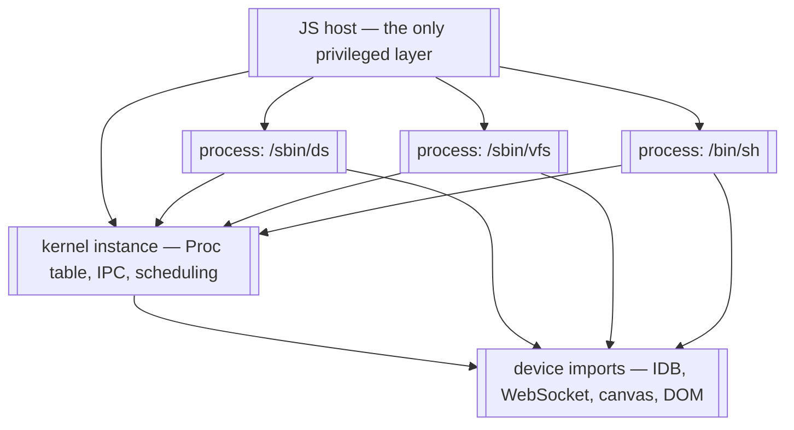

# ARCH_WASM32 — MINIX/Rust as a WebAssembly target

Rough design for an `arch-wasm32` port: the kernel, servers, and userland
compiled to WebAssembly and run in a browser tab (or Node, or any wasm host).

Status: **partially implemented.** M0 (host-mode HAL), M1 (kernel boots as
wasm, no processes), M2's protocol core (instance-per-process, the dispatch
protocol, Asyncify across the boundary, a real two-process rendezvous), M2c (the
real servers, built for `os = "minix"`, spawned by the kernel through to their
own main loops and the DS→RS→PM init handshake), M3a (the boot filesystem
image serving from a RAM disk instance), M3b (VM and MFS up, initialised, and
waiting on a receive), M3c (VFS mounts root and reaches its main loop — the whole
chain, VM → ramdisk → MFS → VFS, running on wasm), M3d (INIT, the first *user*
process: it runs, writes to the console through the kernel, reaches PM, and exits), and
M3e (the tty server, and INIT's stdio routed through VFS and the tty to the real console),
and M3f (the shell: prompt, input, a builtin command, exit) are all **done**, and so is M7
(exec as module instantiation, §7.2, and fork, §12 risk 1) — see §11 for commands and
results. M3 — console, TTY, shell — is complete, with the module-backed half of its title:
a shell forks for a command it cannot answer itself, and the child execs the module the boot
image carries at that path. It runs in a browser tab as well as under Node
(`tools/wasm-browser/`). M4 (the block device, §9.1), M5a (the display, §9.2) and M5b (the console
composed onto the guest's display, §9.3) have landed since, along with the published demo in `docs/`.
M5c (input, §11) has landed too: the host is the keyboard and the pointer, its records reach the
guest's `input` server through the same notification path an IRQ takes on the other arches, and the
desktop's arrow moves where the browser's pointer went. What remains is M6 (network).

The design's riskiest assumption — that `fork` is implementable for a suspended
wasm process — has been **verified by a runnable spike** in `tools/fork-spike/`
(20/20 checks, including a negative control, with buffer sizing and overflow
behaviour measured). See §4.2 and §12, risk 1.

## 1. Goal and non-goals

**Goal.** `just run-wasm` produces a `kernel.wasm` plus a set of process
modules, and opening `index.html` boots the same boot-process stack as QEMU
(DS → RS → PM → SCHED → VFS → VM → MFS → TTY → shell) and gives you a prompt.

**Non-goals.**

- Bit-exact hardware fidelity. The wasm port is a fourth arch, not an emulator;
  where hardware semantics cannot be reproduced (§5), the design says what
  replaces them.
- Beating QEMU on speed. Asyncify (§4) costs roughly 2–3x plus code size. That
  is acceptable for the goal above.
- Preserving MINIX's threat model unchanged. This is the one honest casualty;
  see §6's closing note.

## 2. Why this is viable at all

Three properties of this codebase do most of the work:

1. **`crates/kernel/src/hal.rs` is the single `#[cfg(target_arch)]` boundary.**
   It is six lines long and re-exports one arch crate. Everything else in
   `crates/kernel/src/` — `sched.rs` (985 lines), `ipc.rs` (2161), `proc.rs`
   (750), `syscall.rs` (1376) — is arch-independent and survives untouched.
2. **`crates/arch-common` has zero dependencies and is already `#![no_std]`.**
   The arch-independent primitives (IPC message types, grants, endpoints) are
   portable by construction.
3. **The kernel is `#![no_std]`.** It needs only `core` for wasm32, so the
   kernel-side build does not need the `rust/` fork or `just bootstrap` (§10).

The port surface is therefore the ~150 functions in
`crates/arch-x86_64/src/hal.rs`, a new `crates/arch-wasm32`, and a handful of
`#[cfg]` gates where the kernel reaches past the HAL into paging (§7).

## 3. The model: instances as processes

The central decision: **each MINIX process becomes its own WebAssembly module
instance**, and the JS host is the actual privileged layer.

A wasm instance has its own linear memory and can reach the outside world only
through declared imports. That is, almost exactly, MINIX's process model: a
process owns an address space and reaches the kernel only through the syscall
gate. Here the import table *is* the syscall gate — enforced by the engine
rather than by rings.

What each layer owns:

| Layer | Owns | Corresponds to |
|---|---|---|
| JS host | Instances, their `WebAssembly.Memory`, cross-instance copies, timer ticks, async device I/O | MMU + physical memory + interrupt controller + device hardware |
| Kernel instance | `Proc` table, IPC, scheduling decisions, privilege table, VM bookkeeping | The MINIX kernel |
| Process instance (×N) | One process's code, data, stacks, heap | One user process or server |



Note the asymmetry: the kernel instance is authoritative about *policy*
(scheduling, IPC routing, privileges) but is not privileged relative to the
host. It cannot read another instance's memory any more than a process can. So
every cross-process memory operation in the kernel — `deliver_msg`, grant
copies, `safecopy` — has to either go through a host import or use a shared
arena (§5).

## 4. Control transfer — the crux

`crates/arch-x86_64/src/asm.rs:354` is `switch_to(new_rsp: u64)`. MINIX's
context switch is a stack-pointer swap; `restore()` (`asm.rs:956`) resumes a
process by building an `iretq` frame out of `p_reg`. The other two ports have
the same primitive under a different name — `switch_to_user(proc_ptr)` in
`arch-riscv64/src/switch.rs:21` and `arch-aarch64/src/switch.rs:27` — so
"resume a process by taking over the CPU and its stack" is a uniform assumption
across all three existing arches. Wasm is the first target that cannot provide
it at all.

**Wasm has exactly one stack per instance and no way to switch it.** The
`stack-switching` proposal (typed continuations) would fix this and is not
shipped in browsers. So the stack swap cannot be reproduced, and this is the
single largest difference from the other three ports.

The design replaces the stack swap with a **host-driven dispatch loop**, using
Binaryen's **Asyncify** as the enabling mechanism for blocking calls.

### 4.1 The dispatch protocol

Kernel instance exports:

```
minix_kernel_init(config_ptr: i32, config_len: i32)
minix_kernel_step() -> i32            // returns a dispatch descriptor
minix_kernel_syscall(proc_nr: i32, nr: i32, args_ptr: i32) -> i64
minix_kernel_interrupt(kind: i32, payload_ptr: i32)
```

Host loop:

```
for (;;) {
  const d = kernel.step();            // who should run, and why
  switch (d.op) {
    case RUN:  instances[d.proc_nr].resume(); break;   // returns on yield/syscall
    case SLEEP: await nextTimerTick(); break;
    case EXIT: return;
  }
}
```

Process module imports:

```
host_syscall(nr, a, b, c, d, e, f) -> i64
host_yield()
host_console_write(byte) / host_console_read() -> i32
host_exit(code) -> !
```

### 4.2 How a blocking syscall works

`recv` with no sender must suspend the calling process and run someone else.
In a normal kernel that is a stack switch. Here the process module is compiled
with Asyncify, so the syscall import **unwinds the caller's stack into linear
memory** and returns control to the host. The host then resumes whoever the
kernel says should run next. When a message arrives, the host resumes the
blocked instance, Asyncify rewinds from the saved buffer, and `host_syscall`
returns to the caller with the result.

```mermaid
sequenceDiagram
    participant H as JS host
    participant K as kernel instance
    participant A as process A
    participant B as process B

    H->>A: resume
    A->>K: host_syscall(SENDREC, B, msg)
    K->>K: pick_proc, enqueue A as blocked
    K-->>H: dispatch: RUN B
    Note over A: Asyncify unwound A's stack to linear memory
    H->>B: resume
    B->>K: host_syscall(RECV)
    K->>K: copy message, unblock A
    K-->>H: dispatch: RUN A
    H->>A: resume
    Note over A: Asyncify rewinds; host_syscall returns
    A->>A: continues with straight-line code
```

**Why Asyncify rather than restructuring userland.** The alternative is to make
everything a continuation — every blocking syscall becomes an explicit state
machine. That would touch all of `minix-std`, `minix-libc`, and every server.
Asyncify keeps userland source unchanged: `recv()` still looks synchronous.
Given the project ships a whole userland, that trade is worth the runtime cost.

The kernel instance is Asyncify-compiled too, for its own blocking points
(waiting on device I/O).

#### Verified against Binaryen 132

`tools/fork-spike/` exercises this end to end and confirms it. Details worth
carrying into the implementation, read out of the instrumented module rather
than from documentation:

- `--asyncify` adds exactly two mutable i32 globals and exports
  `asyncify_start_unwind` / `asyncify_start_rewind` / `asyncify_stop_rewind` /
  `asyncify_stop_unwind` / `asyncify_get_state`. **Nothing outside those hooks
  writes the state global**, so the state machine is entirely host-drivable and
  the guest needs no cooperation. That suits a microkernel better than
  emscripten's guest-driven flow: the kernel is already the entity that decides
  a syscall must block, so it can drive all four transitions itself and userland
  stays straight-line.
- `asyncify_data` is `{stack_ptr, end, start}` at offsets 0/4/8 with an
  **ascending** buffer. `asyncify_start_unwind` asserts the *initial*
  `stack_ptr` is within bounds, but **the unwind path then pushes frames without
  re-checking**. Measured: a 64-byte buffer with a 512-frame stack suspended
  normally and overwrote 8184 bytes past the end — no trap. An undersized buffer
  corrupts the process's own memory rather than failing. Size it from the
  process's stack limit (~36 bytes per frame; MINIX's `DEFAULT_STACK_LIMIT` of
  4 MiB implies a 2–2.5 MiB buffer) and place it **flush against the end of
  committed linear memory** so overflow traps instead of landing in the
  process's own data.
- When a suspended operation finally completes, the state must return to NORMAL
  **before the import returns**, or the instrumented caller re-enters its rewind
  path and traps with `unreachable`. Emscripten does this from the guest's
  runtime wrapper; with a raw module the host's import is the only place that
  knows the wait is over. This is the one non-obvious rule in the protocol.

See `tools/fork-spike/README.md` for the full protocol and the host-side fork
mechanics.

### 4.3 The frame becomes a struct

There is no trap: a syscall is an ordinary call. So `TrapFrame` (a `[u8; 256]`
with `read_frame_field`/`write_frame_field` poking offsets) is replaced by a
plain kernel-side struct that the syscall shim fills from its arguments:

- `read_syscall_nr`, `read_syscall_arg(i)` → field reads
- `write_retval` → field write
- `read_frame_ip`/`write_frame_ip` → meaningless without a program counter; the
  call/return is the engine's business
- `exec_init_regs`, `set_initial_regs` → set the new module's entry arguments
- `copy_frame`, `trapframe_to_mcontext`, `mcontext_to_trapframe` → only needed
  for signals, which are redesigned in §6.3

This is a simplification, not a loss: the 256-byte frame exists only because
the hardware hands you a stack image.

## 5. Memory model

**A process's address space is its instance's linear memory.** MINIX VAs map to
wasm offsets by subtracting a base and bounds-checking. Consequences:

- **Wasm pages are 64 KiB, not 4 KiB** (`memory.grow` granularity). Keep
  `PAGE_SIZE = 4096` for MINIX's own VM bookkeeping and treat one wasm page as
  16 MINIX pages. The allocation granularity differs from the accounting
  granularity; `arch-wasm32::hal` owns that translation.
- **VA space is 32-bit.** wasm32 has i32 addresses and a 4 GiB ceiling, so the
  wasm target is effectively a 32-bit-address-space port: `user_stack_base`,
  `mmap_base`, `user_heap_base` etc. need a wasm32 layout that fits below 4 GiB.
  `VirBytes`/`PhysBytes` stay `u64` (they are opaque handles), but every user VA
  must fit in 32 bits. wasm64 would lift this; it is a stretch goal (§11).
- **`brk`/`mmap` become `memory.grow`.** No demand paging is possible: wasm
  memory can only grow, never be mapped at a chosen address or faulted in.
- **No COW, no file-backed lazy mmap.** `FILEMMAP.md` documents that exec is
  already file-backed lazy mmap. That mechanism is replaced, not ported: exec
  becomes module instantiation (§7.2).
- **There is no physical address space** — see §5.3. The kernel's frame arena
  (`alloc_phys_page` and friends) is memory *inside the kernel instance*, page
  tables do not exist (`pt_levels()` is 0), and no address ever crosses an
  instance boundary.

### 5.1 Cross-process copies and IPC payloads

`deliver_msg` and the grant machinery write directly into the target process's
memory today. In the instance model only the host can do that. Two options:

- **(a) Host-mediated copy.** Correct and simple; every IPC message and every
  `safecopy` crosses the FFI boundary. `ipc.rs` is a hot path, so this is the
  biggest performance risk in the design.
- **(b) Shared mailbox arena.** One bounded `WebAssembly.Memory` imported by the
  kernel and by every process, with the kernel allocating indices. Message
  payloads and small grants never cross the host boundary.

Recommendation: **(b), with (a) for anything large.** The caveat is that wasm
memory has no protection, so a misbehaving process could *scan* the arena and
read another process's message. It cannot touch another process's private
memory — that stays sealed — so the protection that matters (server privilege
separation over private data) is preserved. Worth stating in the port's
documentation rather than discovering later.

**What was built: (a), and the reason is that the seam turned out not to be
optional.** There are three places in the kernel where two address spaces meet —
`vm::virtual_copy` (which `SYS_VIRCOPY` reduces to), `ipc::copy_from_user`, and
`ipc::delivermsg` — and none of them can be reached from outside the kernel when
the two sides are separate memories. Each now asks the HAL for a copy via
`hal::CROSS_ADDRESS_SPACE_COPY`, which is `Some` on wasm32 (the host performs it)
and `None` where page tables already join the two spaces, so the hardware arches
keep their existing code path untouched.

A second gap surfaced only once that worked, and it is worth recording because
it is invisible from the kernel: the receive path sets `MF_DELIVERMSG` and leaves
the actual copy to *the syscall-return epilogue*, which lives in each arch's asm.
A wasm instance has no such epilogue — its syscall is an ordinary call whose
return belongs to the host — so `ipc::deliver_pending_msg` names that step and
`kernel-wasm` calls it. A third followed the notification work:
`system::kernel_call_finish` writes the kernel call's reply straight to the
caller's address, so PM's `SYS_GETKSIG` answer never arrived and PM span forever.
And a fourth only surfaced once a *server* was given a request to answer: the
epilogue does two things, and only the copy had been given a wasm equivalent.
The other is the return value — a `RECEIVE` that blocks is answered later, and the
sender's endpoint reaches the guest through the frame `mini_send` writes, which is
where the shipping arches read it on the way back to userland. Without it a resumed
call returned the value cached at *block* time, so DS replied to endpoint 0 instead
of to its client (`PORTING_PLAN.md` finding 15). `kernel-wasm` now records a blocked
call's result and answers `minix_proc_retval`, and the host reads that slot on
rewind rather than replaying what it saw.
Measured cost of the whole thing: **two FFI crossings per message**
(sender→kernel, kernel→receiver), which is the number (b) would remove. The arena
stays the right optimisation if the boundary ever costs too much; it is no longer
on the critical path to a booting system.

**The seam is routed everywhere it has been found, and the worklist is now
closed.** Each site is gated rather than rewritten: where
`hal::CROSS_ADDRESS_SPACE_COPY` is `None` the original code runs verbatim, so the
shipping arches are byte-for-byte unchanged and only wasm takes the new path.
Every conversion that takes a user pointer reduces to one of two operations —
`vm::virtual_copy` when two address spaces meet, and `vm::read_from_proc` /
`vm::write_to_proc` when a kernel buffer is on one side — and `PORTING_PLAN.md`
finding 10 carries the per-site table, including the two entries that turned out
to be already converted when the list was finally read through.

Three of the eight were found by a test rather than by reading, and the last one
is the sharpest: `sys_kernel_call_handler` read the caller's message with a raw
`copy_nonoverlapping`, so on wasm **every kernel call dispatched on the kernel's
own memory** — and it did so silently, returning 0. A `SYS_VIRCOPY` test that
simply asked for a copy and checked the bytes caught it in one run, which is the
argument for the test below existing at all.

The lesson worth keeping is about the searches: each of those three had been
grepped for and missed, because the grep excluded the site's shape (`kbuf`, or the
argument pattern). A grep over a kernel that assumes an identity map is not an
audit. The last five sites were therefore read one at a time, and each conversion
was required to bring a test: `do_trace_handler` and `SYS_PRIVCTL` were already
routed through `vm::virtual_copy`, `EXEC_SETUP`'s name read and `vm::vm_memset`
(the `do_safememset` helper, which had lost the process argument C's
`vm_memset(caller, who, ph, c, count)` carries) were converted and are exercised
by the M2 harness, and `do_vumap`'s vector transfers were converted with the
harness asserting the input-vector read itself — the call cannot *complete*,
because its result is physical addresses and this port has none, but that is
`PORTING_PLAN.md` finding 14 rather than a seam gap. `ps_str` turned out to need
nothing: it is passed to `arch_proc_init` as a value, and no implementation
dereferences it.

**A ninth site came later, and its shape is the one worth remembering.**
`verify_grant` resolved a grant id by reading the *granter's* grant table with
`core::ptr::read` at `s_grant_pa + id * size_of::<CpGrant>()` — the granter's own
memory, addressed out of a priv structure rather than out of a message. Every
grep above was a message grep, so none could have matched; reading C's
`do_safecopy.c` is what turned it up. It now goes through `vm::read_from_proc`,
and the M2 harness pins it with a real `SYS_SETGRANT`/`SYS_SAFECOPYFROM` pair
across two instances (`PORTING_PLAN.md` finding 16). *Finding 17* is the bug that
test uncovered underneath it: `proc_init` never marked the dynamic privilege
slots free, so the allocator `SYS_SETGRANT` needs could never return one.

### 5.2 Pointer width: the port's sharpest constraint

wasm32 pointers are 32 bits. M1 established that this is not a formality: the
kernel assumed 64-bit pointers in four places, none of which had ever been
exercised on a 32-bit target.

| Site | Assumption | Fix applied |
|---|---|---|
| `vm.rs` `NR_PHYS_PAGES` | `0x8_0000_0000` as a `usize` literal | compute through `u64`, cast the quotient |
| `ipc.rs` `ipc_senda_handler` | `usize::from_le_bytes` over an 8-byte message field | read `u64`, narrow to `usize` |
| `clock.rs` `MinixTimer` | static asserts pinning a 32-byte layout | asserted only where 64-bit pointers hold |
| `syscall.rs` | `asm!` compiler barrier (unstable on wasm32) | `compiler_fence` on that target |

All four fixes are ABI-neutral on the 64-bit arches, and the host kernel suite
still passes after them. But the general lesson is a **port invariant rather than
a bug**: on wasm32 a `usize` is four bytes, so any ABI struct containing a pointer
or a `usize` has a different layout there than on the three shipping arches.
`MinixTimer` is already written that way — it stores a function pointer and an
opaque argument as `usize`.

This lands hardest on M2, where servers exchange message structs over IPC:

> Message and ABI structs must carry `u64` handles and fixed-width integers —
> never pointers, never `usize`.

A struct that violates this agrees with itself on any one target and disagrees
with a server compiled for another, which is the kind of mismatch that shows up
as corrupted fields rather than a link error. A static size assertion per message
struct, as `clock.rs` already does for `MinixTimer`, is the cheap way to hold the
line.

### 5.3 Why there is no physical-address model to build

M1–M2 left `SYS_UMAP` and `SYS_VUMAP` answering `EFAULT`: their result is a
physical address, `vm_lookup_range` walks a page table, `pt_levels()` is 0, so the
walk says "not mapped" every time. The obvious question is what a physical address
*should* mean here. The answer is that nothing needs one, and the existing code
already depends on that.

**On the three shipping arches "physical" and "kernel virtual" are the same
number.** Each HAL identity-maps the kernel and says so: x86_64's `kern_vaddr()` is
`0x200000` ("identity-mapped at 0x200000"), RISC-V is linked at `0x80200000` with
RAM starting at `0x80000000`, AArch64 loads at `0x40000000` where its RAM starts.
Their `pte_user_owned` functions test the assumption out loud — a frame is shared
when `pte_to_phys(pte) == va`. That coincidence, not a physical-address space, is
what lets the drivers hand device-facing addresses around.

**On wasm there is no such identity and nowhere to put one.** `kern_vaddr()` is 0 —
"there is no kernel half" — because a process's address space *is* its instance's
linear memory and nothing else. The kernel instance cannot address a process's
memory at all; only the host can, which is exactly what §5.1's seam is for.

**No driver needs a foreign address, because the port's drivers bounce.** C's
`virtio_blk` programs the virtqueue straight from the caller's `iovec`, so it needs
`sys_vumap` to turn another process's addresses into ones a device can use. This
port's block server instead reads into its **own** `scratch` buffer and
`safecopy_to_client`s it (`crates/servers/src/virtio_blk.rs`), with writes going the
other way; the descriptors `virtio_to_queue` builds name that scratch and two
driver-local statics. So the grant/seam machinery M2 pinned *is* the replacement for
`vumap`, and both directions of it are now exercised.

The invariant that holds the line:

> A physical address is only ever dereferenced by the kernel instance, and never
> crosses an instance boundary. Anything a device must touch is named as an offset
> in the instance performing the I/O.

That is why the device port needs no address translation at all: `queue_notify`
becomes a host import, the host reads the vring out of the *caller's* memory (it
owns that instance), and the descriptor values are the driver's own offsets — to
the host, the same thing a physical address is to QEMU. `VirtioPhysBuf` keeps its
shape, and `alloc_phys_page`'s arena is in-process memory whose addresses are private
to the kernel instance — but that is constructed here rather than inherited.
`arch-sim`'s base is a fixed `0x100000` that its own comment calls "arbitrary
non-zero", which is true where a returned page is only stored; on this port the
kernel dereferences it, so the base has to name real bytes of *this* module.
`arch-wasm32` therefore owns a page-aligned 2 MiB `static PHYS_ARENA` and hands its
address to `init_phys_alloc` (`crates/arch-wasm32/src/hal.rs`). Taking `arch-sim`'s
base instead points the arena at the module's own statics: in the layout where this first showed,
the privilege table sat at `0x100e40`, four kilobytes into the first page, so the first exec frame
landed on a `Priv` entry and the desktop's `s_trap_mask` came back 0 (`PORTING_PLAN.md` finding 61).
The invariant above is what made the difference invisible for as long as it was — nothing crossed an
instance boundary either way.

The refusal is now deliberate rather than incidental. On a target whose
`pt_levels()` is 0, `umap` and `vumap` answer `ENOSYS` — "this port has no such
thing" — where they used to reach `EFAULT` as a side effect of `p_cr3 == 0`, which
reads as "your address was bad". For whoever ports a driver next, that is the
difference between a porting task and an afternoon of debugging. Arches with page
tables keep `EFAULT`, because there it is the correct answer. `vumap` still reads
its input vector before refusing, because that transfer is real and is what the M2
harness pins.

## 6. Privilege, traps, signals

### 6.1 No rings

There are no privilege levels. What replaces them:

- **Ring 3 → a separate instance.** Enforced by the engine; stronger than the
  hardware version in one respect (a process genuinely cannot address another's
  memory).
- **Ring 0 → the kernel instance plus the JS host.** But the host is the real
  supervisor (it can read and write every instance's memory), so the kernel's
  authority is *contractual*, not enforced. The VM server's control over other
  processes' address spaces becomes bookkeeping that the host acts on.

### 6.2 Traps are process death

A wasm trap (out-of-bounds access, `unreachable`, integer divide by zero) is not
catchable within the instance. The host catches `WebAssembly.RuntimeError` and
routes it to the kernel's process-termination path — the same path as an
unrecoverable hardware fault. `read_fault_addr` has no equivalent; the trap
gives no address.

### 6.3 Signals without sigframes

`sigframe_*`, `build_sigframe`, and the naked `minix_sigreturn_trampoline` in
`crates/minix-rt/src/lib.rs` all rely on building a stack frame in the user's
address space and forcing a jump to the handler. Forcing a jump is impossible.

The replacement, which fits MINIX's existing shape: **deliver signals at
syscall-return time, in the process's own shim.**

1. The kernel sets `p_pending` as it does today.
2. Instead of building a frame, the kernel marks the process's next resume as
   "signal pending".
3. When the host resumes that instance and `host_syscall` is about to return,
   the shim checks the flag, calls the handler (a plain function call), and
   every handler is uniformly `-> !`, ending in the sigreturn trampoline.
4. The trampoline calls `host_syscall(SENDREC, PM, PM_SIGRETURN)` exactly as it
   does now.

This removes `Mcontext` save/restore entirely: there is no register state to
restore, because unwinding and rewinding already returns the process to the
right place with the right locals. The naked per-arch trampolines get a wasm
arm that is just a normal Rust function.

### 6.4 No preemption of a runaway process

A synchronously executing wasm call cannot be interrupted from outside. The JS
event loop is blocked until it returns; a Worker cannot be signalled either
(only terminated, destructively). So quantum-based preemption degrades to
**cooperative**: the host injects a tick at the next syscall or yield point.

This is a real semantic change. MINIX's scheduler expects to be able to
preempt. Mitigations, in order of preference:

1. Accept it. MINIX userland and servers are extremely syscall-heavy, so yield
   points are frequent in practice.
2. Optional: run each process in its own Worker and terminate on quantum
   overrun, treating it as a crash. Requires COOP/COEP headers for
   `SharedArrayBuffer`.
3. Engine-level fuel metering would solve it properly; browsers do not expose it.

What it costs in practice (findings 60 and 62, both of which M5c walked into) is worth stating here,
because "frequent yield points" is not the same as *rotating*: this port rotates a process only when
one of its syscalls ends, so a process that never blocks (the shell retrying its read at the prompt)
stays at the head of its run queue and the instance a notification just woke waits behind it. Nothing
is lost, but a front end that parks the guest on "this slice only retried the console read" has to ask
the *host* as well: `host.input.pending` is the front end's answer to "is there work the guest has
been told about", and a slice does not park while any is outstanding.

A `SYS_thread_yield` is the one point where the guest itself asks for the CPU to go elsewhere, and
until finding 62 it was bookkeeping only: the flag was cleared and the process re-linked on the
syscall-return path, but nothing *dispatched* the process the yield had just made runnable, because
dispatching is the host's job and the host was still inside the dispatch. So the yielder held the CPU
for the rest of the slice, and at a prompt that slice is the tty's console-read retry — around 400
syscalls of it. Every round of the input path's handshake therefore cost a whole slice, eight of them
and ~3200 syscalls per pointer record, so a drag over the desktop spent the syscall budget on the
spins between the rounds rather than on the rounds. Both engines now hand control back to the host on
a yield and resume the guest after it, which is what makes a yield mean "let someone else run" on a
target whose processes are separate instances.

## 7. Kernel-side changes beyond `hal.rs`

### 7.1 Paging call sites

This is the one place the "`hal.rs` is the only `#[cfg]`" invariant erodes. The
kernel reaches past the HAL into paging in a bounded set of places:

| File | Reaches into | Wasm disposition |
|---|---|---|
| `pagetable.rs` (624 lines) | `walk`, `map_page`, `clear_page`, `boot_cr3`, `pt_mapkernel` | Entire module is x86/RISC-V/AArch64-only; not compiled for wasm |
| `exec.rs` | `pt_levels`, `pt_index`, `pte_to_phys` | Replaced by module instantiation |
| `syscall.rs:952–1037` | `boot_cr3`, `clear_page`, `map_page`, `pte_user_flags` | `brk`/`mmap` paths rewrite to `memory.grow` requests |
| `system.rs:3656–3714` | `boot_cr3`, `map_page` | Same |
| `ipc.rs:691`, `grants.rs` | `pagetable::walk`, `pte_to_phys` | Grant VA→PA translation becomes instance+offset resolution |
| `vm.rs` (989 lines) | Extensively | Keep the region/alloc bookkeeping; replace the mapping half |

Rather than sprinkling `#[cfg(target_arch = "wasm32")]` at each site, expose
`hal::PAGING: bool` and gate at these ~10 call sites, or gate whole functions.
This is the design's main piece of unavoidable ugliness and should be entered
into `.rules` as a known exception once it lands.

### 7.2 exec becomes instantiation

`elf.rs` + `exec.rs` load ELF segments into a new address space. For wasm, a
program is a wasm module; exec becomes:

1. Kernel reads the module bytes through VFS/MFS as usual.
2. Kernel asks the host to instantiate that module with the standard import set.
3. Host creates the instance, links imports to the syscall gate, copies `argv`
   into the instance's memory.
4. Kernel records the instance handle in the `Proc`.

The disk image and initramfs therefore carry **wasm modules instead of ELF
binaries**. That is a userland build-pipeline change (§10), not a kernel one, and
`elf.rs` is untouched on other arches. **Done** as §10's `mkminixfs wasm32`: the
boot filesystem image holds the Asyncify'd program module at `/bin/sh`, and nothing
in the port knows how to run anything else.

### 7.3 Boot

`crates/kernel-boot` is really per-arch platform glue: trampolines,
multiboot parsing, BSS clearing, plus `syscall_handler_c`, `save_timer_context`,
`isr_deliver_msg` (all in `main.rs`). For wasm none of that applies. The
entry is:

```
host: instantiate(kernel.wasm, imports) -> call minix_kernel_init() -> loop step()
```

`BootProcessConfig.procs` (the ordered `(path, endpoint)` list) is exactly the
right shape already; the host resolves each path to a module and instantiates it
on request instead of the kernel mapping ELF pages for it.

`crates/kernel/build.rs` already emits **empty initramfs stubs** when
`target_from_rustc_target` does not recognise the triple, and wasm32 falls into
that arm — which is still what we want, because a wasm kernel carries no
userland. What changed with §7.2's step 4 is where the modules come from instead:
not a JS-side registry, but the **boot filesystem image**, built by
`mkminixfs wasm32` and read at exec time by VFS like any other file. The host is
still what instantiates them — only it can — but it no longer decides *what* they
are, which is what makes `/bin/sh` a thing that exists only in the image.

#### The host is the loader, so it declares the image

On the hardware arches the boot loader hands the kernel a module list and the
kernel fills its image table from it; PM reads that table at startup
(`sys_getimage`) and *that* is how the servers come to know which processes exist.
The host occupies the loader's seat here, so the same list has to come from it:
`minix_image_add(slot, endpoint)` names a slot, and `minix_proc_spawn_user` names
the one it creates, so a process the host starts is a process the kernel's image
names. PM then registers it by process number, which is what keeps the three
statements that have to agree — PM's slot, the kernel's `proc_nr`, and the number
`_ENDPOINT_P` reads out of an endpoint — true of each other, and keeps a fork
child out of a slot the host already has a process in.

That makes the *order* load-bearing, and it is the same order a boot image has
always had: everything the host will run is declared **before** the boot chain
starts, because PM reads the table once and a slot declared later is one PM will
hand to a child. A spec marked `startAfterBoot` is therefore declared at boot and
spawned when the system first quiesces — declaring it is the loader's statement,
spawning it is the schedule's, and only the second one has to wait.

A process that is in neither the image nor PM's table can still reach PM: a
message from an endpoint is proof the process exists, and the endpoint says which
slot it is in, so the sender registers itself on first contact (`pm_register_sender`).
What that cannot fix is the *slot*: PM does not know to keep one it has never been
told about out of its free list, which is why the declaration above is the path
and first contact is the backstop.

### 9.1 The block device (M4)

The console and the clock are devices the *kernel* talks to, so their host imports
live in the kernel's HAL. A block device is a driver's, so its import is reached
through the drivers' HAL boundary (`crates/drivers/src/hal.rs`, which is the one
file in that crate allowed to know about architectures):

```rust
block_capacity() -> u64        // 0 when the host has no device
block_read(offset, buf)        // bytes read, or a negative errno
block_write(offset, buf)       // durable when it returns
```

`virtio_blk.rs` keeps one request path and gains a third transport beside PCI and
virtio-mmio — `virtio_blk_probe` asks the capacity instead of scanning a bus, and
`virtio_blk_transfer` copies to and from the host instead of programming a queue.
Everything about the protocol stays the guest's: the driver answers `BDEV_*`, MFS
probes `BDEV_OPEN` to decide which driver serves the root, and the root's block I/O
routes itself. Nothing above the driver changed for M4 — in particular
`bdev_driver_root`'s fallback to the ramdisk is what makes a host *without* a device
a diskless boot rather than a failure.

The host's side is a **store**, which is where the persistence actually lives:

```js
{ imageId, setImageId(id), read(offset, length), write(offset, bytes) }
```

The page's store has one more call, which is not the device's: `clear()` closes its connection and
deletes the database, so the next boot seeds itself from the image again. The device never asks for
it — the page's "start over from the boot image" control does, on the two states with no other way
out (a store whose contents came from another image, which the device refuses to attach, and a
filesystem a tab left unclean, which the next mount will not write). A file store is cleared by
deleting the file.

The boot filesystem image is the device's *initial contents*, so a fresh store boots
an installed system and every run after it sees what the last one wrote — no install
step to get wrong. `imageId` is the one assumption this adds over a real disk: a
store outlives the image it was seeded from, so a rebuilt image over an old store
would be two filesystems mixed. A store whose identity does not match is refused and
the device is not attached at all, which is loud (the guest falls back to the
ramdisk and the host says why) where the mixture would be silent.

The Node implementation is a file (`tools/wasm-browser/file-store.js`, driven by `run.js`); the
page's is IndexedDB behind the same four calls (`tools/wasm-browser/store.js`). The page's cannot
answer the way the file does — IndexedDB is asynchronous and `host_block_read`/`host_block_write`
are not — so it holds the disk in memory for the session and writes changed pages back as records,
which is a weaker promise than the reference's durable-on-return `block_write` (`PORTING_PLAN.md`
finding 54).

Holding it is a tab's, not a page's: the page takes a Web Lock named after the database for as long
as the document exists, because two tabs would otherwise be two in-memory copies of one disk and
`imageId` cannot tell those apart — the records are the same records, only the sessions are
different. A tab that is refused the lock gives up the disk rather than the boot: it comes up on
the ramdisk and says which of the three reasons it got (`page.js`).

### 9.2 The display (M5a)

The display is the same arrangement as the block device, with one difference that shapes the whole
milestone: a display's *mode* is not the guest's to choose. A canvas is the size the page made it,
the way a panel is the size the hardware fixed, so the driver asks the host rather than probing for
an adapter:

```rust
fb_geometry() -> (u32, u32)     // (0, 0) when the host has no display
fb_present(buf) -> i32          // one frame, XRGB8888, rows back to back
```

The guest's half is `fb`'s third backend (`drivers::video::fb::CanvasArch`), and it is the
virtio-gpu backend's shape rather than bochs': there is no device memory to map and no mode to
program, so the surface is a buffer in the *server's own* memory (`FB_BUF`, attached with
`CanvasArch::new`) and `device().base` is a virtual address rather than a physical one. The mode is
adopted from the host at `init` and a mode the surface cannot hold is refused outright — the pixels
are this process's memory, so exceeding it would corrupt an address space instead of clipping a
picture.

Two things follow, and both are the port's rather than the driver's:

- **`/dev/fb` cannot be `mmap`ped, and the server says so.** VFS's device-`mmap` path asks the
  kernel to map a *physical* range into the caller (`CDEV_MAP`, then VM's `VR_DIRECT`); there are no
  page tables here and `VM_MAP_PHYS` answers `EINVAL`, and the surface is one instance's memory
  that another instance cannot be handed a view of. So `CDEV_MAP` answers `EOPNOTSUPP` and the
  device is copy-in, copy-out — `read`/`write`/ioctls, which is what the reference's own clients
  use anyway (`fb_read`/`fb_write` are grant copies there too).
- **A flush is the only thing that reaches the host.** `FBIOFLUSH` calls `fb_present`, which is
  what a device with a write-back cache needs and what bochs's scanned-out LFB does not: the pixels
  leave when the driver says they are ready — the hook the compositor's own flushes use (§9.3).

The host's half is one object per front end — `{width, height, present(bytes)}` — with
`tools/wasm-browser/display.js` as the page's implementation (a canvas, plus the B,G,R,X → R,G,B,A
conversion an `ImageData` needs) and a recording object in each harness. `display = null` is a
machine with no display and makes the driver find no device, which is why `run.js` boots headless
while `page.js` always has a canvas.

What the reference contributes here is only the driver: its text path is the tty console writing
VGA cells (i386), and its `fb` driver is ARM-only and paints a boot logo. The three bands this
port's `fb` paints are that driver's own verification pattern — with a canvas, the pixels are
something a check can read rather than something a human has to look at.

### 9.3 The console on the display (M5b)

The console and the display are two halves that this port had never joined. The console is the tty
server's (`/dev/console`, major 5): MINIX keeps its *cells* in the console driver, in a file of its
own beside `tty.c`, because its `write` hook drops bytes into a VGA text plane or a framebuffer the
driver mapped, and the hardware remembers where each character landed. This port has no such plane —
its console is a byte stream to the host, and until M5b the front ends re-derived the layout from
it (`tools/wasm-browser/terminal.js`: one line and a cursor, CR and BS only). The display is the
canvas `fb` presents (§9.2), which nothing composed into.

M5b is therefore two things, and both are the port's own rather than the reference's:

1. **The console's screen model** (`crates/servers/src/console.rs`, the `console.c` the port never
   built): an 80×24 cell grid, a cursor, and the control characters and escape sequences a console
   acts on — CR, LF, BS, tab stops every 8 columns, wrapping and scrolling, and `CSI H/f/J/K`. It is
   fed from the same bytes `console_write`/`console_echo` put on the console, in the same order, so
   the screen and the host's terminal pane are the same stream; and it is *not* a terminal emulator
   (SGR is parsed and dropped, as the reference's console drops it — `wterm` is the client that
   renders colour) and not a scrollback buffer.
2. **A window server that runs on this arch**, with the two changes the arch forces: its surface is
   its own memory (there is no device memory to map) and its frames reach the display as a datagram
   write to `/dev/fb`. The cells then reach the desktop over `minix_std::wserver`'s own protocol, so
   the console is a window client like any other and the display keeps one owner.

**How a frame reaches the display** — the question §11's M5b left open, answered here. The
compositor composes into a surface of its own and hands each frame to `/dev/fb` as **one datagram
write** (the CDEV shape VFS already documents for socket devices: the caller's VA, the length, the
client's endpoint), followed by the `FBIOFLUSH` that presents it. So:

- The frame *goes through the device*, which is what keeps `/dev/fb` meaningful on this arch and
  keeps the display's presenter single: the compositor is a device client exactly as it is on the
  other arches, where the difference is only that `mmap` makes its frame a direct memory write
  instead of one `SYS_VIRCOPY`.
- The write is not a present. A client that draws in pieces shows one frame rather than one per
  write, and a flush that changed nothing shows none — which is what makes a console window
  affordable at all (see the damage note below).
- It travels directly to the fb server, bypassing VFS, for the reason the flush always has: VFS is
  single-worker and the shell's blocking console read holds it, so a device request from the
  compositor would wait for keystrokes.

**Why the compositor repaints cells rather than desktops.** The tty's console writes arrive eight
bytes at a time (the CDEV inline shape), and each one flushes. A whole-desktop repaint is ~786k
bounds-checked volatile stores and a 3 MiB frame copy, so a desktop per write would make a screenful
of shell output take seconds. The compositor therefore keeps what the surface holds per window
(`drawn`, `drawn_cursor`) and a flush paints only the cells that differ — a cell-repaint per eight
bytes, a whole repaint only when the *windows* change (create, close, move, resize). The same
split appears on the host's side of the seam: `display.js` copies a presented frame and converts it
at the next animation frame, so two hundred presents during a burst cost two hundred memcpys and one
canvas upload. A display refreshes on its own clock; the guest cannot make it refresh per byte.

**Two dispositions worth keeping.** A host with **no** display does not stop the compositor: the
surface is its own memory, so it composes either way — a client's window is a window — and its
flushes send nothing, because there is nothing to send them to (`WS_SHOW`; `fb` there is a driver
that found no device, which is the disposition it already had). That is not tidiness — the first
version exited, and the console's window create then blocked forever on a peer that had left,
because IPC to a process that has exited *queues* rather than failing (finding 56). And **the mode
is checked, not adopted**: the surface is sized for 1024×768, so a host canvas of another size is
refused outright rather than drawn past the end of an address space.

The console's window is created at tty's init, which is what fixes the boot order: `wserver` has to
be receiving before `tty` starts (and `fb` before both, since the first frame goes through it), so
the wasm boot list is `… vfs, fb, wserver, tty, init` (`SYSTEM_SPECS`). That order is the reason the
window creation is wasm-only for now: the hardware arches' shared list (`BOOT_PROCS_ALL`) starts
`tty` *before* `wserver`, and a create sent to a window server that has not started yet blocks on
the peer rather than failing. On those arches the console's cells are the VGA plane's anyway —
`console_write` ends in the kernel's own serial path — so putting the console on their display means
reordering that list and checking the pointer-driven paths against a window that a boot process now
owns: a follow-up, not a gap in this one.

## 8. The HAL surface, function by function

All ~150 items in `crates/arch-x86_64/src/hal.rs`, grouped. "Delete" means the
function has no meaning on wasm; "no-op" means it stays in the API because the
kernel calls it unconditionally, but it does nothing.

| Group | Functions | Wasm disposition |
|---|---|---|
| Console | `serial_write_byte`, `serial_read_byte`, `serial_byte_available`, `poll_console` | **Rewrite.** Host imports. Blocking read unwinds via Asyncify. |
| Interrupt flag | `irq_save`, `irq_restore` | **No-op.** x86_64 already returns `false`/does nothing here, so this sets no precedent. |
| CPU idle | `cpu_idle`, `pause`, `hlt`, `halt` | **Rewrite.** Yield to the host loop; `halt` unwinds to it. |
| Time | `read_cycles`, `read_tsc`, `read_tsc_ctr_switch`, `write_tsc_ctr_switch`, `init_profile_clock`, `stop_profile_clock` | **Rewrite.** Host tick counter + `performance.now()`; the host is the clock source. |
| Per-CPU / sched globals | `set_current_proc`, `current_proc`, `init_cpulocals`, `sched_run_q_head`, `sched_run_q_tail`, `sched_nr_queues`, `sched_current_proc`, `sched_bill_proc`, `sched_set_bill_proc`, `smp_proc_ptr`, `smp_set_proc_ptr` | **Rewrite.** Single-CPU statics inside the kernel instance. |
| CPU identity | `cpu_id` | **Constant `0`.** |
| Locking | `Spinlock`, `bkl_lock`, `bkl_unlock`, `mfence` | **No-op** (single-threaded), or Atomics for the SMP stretch. |
| Frames | `TrapFrame`, `read_frame_field`, `write_frame_field`, `exec_init_regs`, `read_syscall_arg`, `write_retval`, `read_syscall_nr`, `read_frame_ip`, `write_frame_ip`, `set_initial_regs`, `copy_frame`, `frame_default`, `read_frame_pointer` | **Rewrite as a struct.** Filled by the syscall shim; the 256-byte byte-array form is an artifact of the hardware trap frame. |
| Context switch | `arch_proc_init`, `switch_to`, `restore`/`switch_to_user`, `Mcontext`, `trapframe_to_mcontext`, `mcontext_to_trapframe` | **Delete.** Replaced by host dispatch (§4). Register save/restore has no analogue. |
| Signals | `sigframe_size`, `sigframe_addr`, `read_frame_sp`, `build_sigframe`, `sigframe_set_entry`, `sigframe_restore` | **Delete.** No stack frames; delivery at syscall return (§6.3). |
| TLS / FPU | `set_tls_current`, `release_fpu`, `FPU_STATE_SIZE` | **No-op / constant.** TLS base is the engine's business. |
| Paging registers | `boot_cr3`, `read_cr3`, `write_cr3`, `tlb_flush`, `tlb_flush_page`, `clear_rw`, `read_fault_addr`, `PageNotMapped`, `vm_paging_fork`, `exec_create_root` | **Delete.** Callers gated (§7.1). No MMU, no faults. |
| Page-table encoding | `pt_levels`, `pt_index`, `pte_*` (~24 fns), `build_pte`, `pte_to_phys`, `pte_user_owned` | **Delete.** Callers gated (§7.1). |
| VA layout | `PAGE_SIZE`, `PAGE_SHIFT`, `KERNBASE`, `kern_vaddr`, `user_stack_base`, `user_stack_size`, `user_heap_base`, `user_heap_limit`, `mmap_base`, `vm_scratch_base`, `MAX_USER_ADDRESS`, `user_priority`, `user_quantum_ms`, `user_quantum_cycles`, `MAP_*` | **New wasm32 layout module.** Must fit in 32 bits; witness the 64 KiB wasm page vs 4 KiB MINIX page mismatch (§5). |
| ELF | `ELF_MACHINE` | **Unused.** exec is module instantiation (§7.2). |
| Port I/O | `has_port_io`, `inb`/`outb`/`inw`/`outw`/`inl`/`outl`, `phys_insb`/`phys_outsb`/`phys_insw`/`phys_outsw` | **Delete.** `has_port_io` → `false`. |
| PCI | `PCI_ADDR_PORT`, `PCI_DATA_PORT`, `pci_config_addr`, `pci_cfg_read8`/`read16`/`read32`, `pci_cfg_write32` | **Delete.** Devices come from a host manifest (§9). |
| CMOS / RTC | `RTC_INDEX`, `cmos_read`, `cmos_write` | **Rewrite.** `Date.now()`. |
| Physical memory | `init_phys_alloc`, `alloc_phys_page`, `alloc_phys_contig`, `free_phys_contig`, `phys_alloc_base`, `phys_alloc_usable_size`, `phys_free_pages` | **Re-based, not rewritten.** `arch-sim`'s allocator is kept, and `init()` gives it the address of a page-aligned 2 MiB static (`crates/arch-wasm32/src/hal.rs`); "physical address" stays an opaque handle (§5.3) — but note finding 61: inheriting `arch-sim`'s default base pointed that handle at the module's own statics, and the privilege table is inside it. |
| Misc platform | `init`, `fork_needs_child_flag_clear`, `bss_start`, `bss_end`, `qemu_exit` | `init` is a wasm-side setup; `fork_needs_child_flag_clear` → **`false`**, corrected in M7b: the design first said `true` on the grounds that the child needs its own return value, but the predicate does not decide the return value — it decides whether the *child* waits for PM's `SENDNB` reply to be enqueued (`false`, as x86_64 and `arch-sim` answer) or is cleared and enqueued by `SYS_SCHEDULE` (`true`, as riscv64 and aarch64 answer, where PM's reply to the child is skipped). On this port the child's resume is a message arriving through the copy seam like everyone else's, so `false` is the answer that fits, and the return value is the host's business either way (§7.2, M7b) — which 5a then confirmed: the child resumed, and it resumed when PM's `SENDNB` reached it. BSS symbols still work; `qemu_exit` → host exit import. |

## 9. Devices as host imports

| Guest driver | Wasm backing | Notes |
|---|---|---|
| `ser_input`, `tty.rs`, `serial_*` | DOM/canvas terminal buffers | Blocking read = Asyncify unwind |
| Timer (`clock.rs`, `init_profile_clock`) | `performance.now()` + host-injected ticks | Host *is* the interrupt controller |
| `virtio_blk.rs` | IndexedDB (persistent) or in-memory | Async host ops — needs Asyncify |
| `virtio_net.rs` | WebSocket (or WebRTC data channel) | No raw sockets in a browser |
| `pci.rs` | Deleted; host provides a device manifest | No PCI bus |
| `fb.rs` | **The host's display** (M5a): the surface is the server's own buffer, the mode is the host's, and `FBIOFLUSH` presents a frame. `CDEV_MAP` refused — no page tables to map a physical range through |
| `wserver.rs`, `fbfont.rs` | **The desktop** (M5b, §9.3): the compositor composes into a surface of its own and hands each frame to `/dev/fb` as one datagram write, which the fb driver presents. `wserver` is a *port invention* (3.3.0 has no window system); the font is `userland`'s `FONT_8X16` |
| `input.rs` | **The host's own records** (M5c): the browser's pointer events become HID records in a host queue, which the input server drains when the interrupt the host raised wakes it — and that interrupt is what makes anyone look, because a driver blocked in `RECEIVE` cannot poll. The kernel's half is one export (`minix_kernel_irq`), the general host→kernel notification rather than an input-specific seam (§13) |
| `RTC`/`cmos_read` | `Date.now()` | |
| `qemu_exit` | host exit import | |

The `DL` protocol between `net` and `virtio_net` survives; only the transport
underneath changes. That is the same shape as the existing
virtio-pci → virtio-mmio split.

## 10. Toolchain and build

**Kernel: no fork, no bootstrap.** The kernel is `#![no_std]` and needs only
`core`, which `wasm32-unknown-unknown` provides from rust-std. `rust-toolchain.toml`
pins stock 1.96.0 and `.cargo/config.toml` pins no rustc, so the kernel build can
use the stock toolchain while the three MINIX triples keep using the fork:

```
cargo build -p kernel --target wasm32-unknown-unknown --release
```

**Userland: needs the fork.** ~~`minix-std`/`minix-rt`/`minix-libc` bottom out in
a MINIX syscall ABI, so:~~ **Correction: they do not.** `crates/servers` and
`crates/userland` depend on `minix-rt`, `minix-std`, and `minix-util` — all
`#![no_std]` — and **not** on the fork's `std`. They build for
`wasm32-unknown-unknown` with the pinned stock toolchain, exactly like the
kernel, so no target spec and no std PAL are needed:

```
cargo check -p servers -p userland --target wasm32-unknown-unknown
# 0 errors, 0 warnings
```

The original claim here assumed userland linked the fork's std (as `RUSTC.md`
suggests for the coreutils, which *are* real Rust programs). The servers are not.
Only `coreutils` would need the PAL, and it is not on the path to a booting
system.

What it did take was the same class of repair M1 found — arch gaps and 32-bit
width — across four crates:

- `minix-rt`: the wasm32 syscall gate (`syscall0..6` over a host import) and a
  sigreturn trampoline implementing the §6.3 contract, since there is no stack
  for a naked function to read.
- `minix-rt`: `HEAP_LIMIT`'s 4 GiB arm, which a 32-bit `usize` cannot hold — and
  which every branch of a `cfg!` guard still type-checks, so the literal had to
  be written through `u64` even though the arm is unreachable.
- `drivers/hal.rs`: a wasm32 arm for that crate's arch boundary (the same
  single-file discipline as the kernel's), pointing at `arch-wasm32`'s inert
  port-I/O and PCI surface — the disposition §8 already prescribes.
- `drivers`, `servers`, `userland`: a wasm32 virtio-mmio placeholder, a `uname`
  arch string, two `asm!("pause")` spin hints replaced with the portable
  `core::hint::spin_loop()`, and one more `usize::from_le_bytes` over an 8-byte
  message field.

That last one is the second occurrence of the same bug (§5.2 lists the first, in
`kernel/src/ipc.rs`). Two instances of an ABI field read at the wrong width is no
longer a coincidence, and it is the argument for the per-struct size assertion
§5.2 proposes.

Verified against the shipping target rather than assumed: a stage1 toolchain is
present, so `cargo check -p minix-rt -p drivers -p servers -p userland --target
x86_64-pc-minix` is clean too, and every change above is behaviour-neutral there.

- new target spec `wasm32_unknown_minix.rs` alongside the three existing ones in
  `rust/compiler/rustc_target/src/spec/targets/` — **done as a JSON spec
  instead**, `tools/wasm-target/wasm32-minix.json`, built with `-Z
  json-target-spec -Z build-std=core,alloc`. `os: "minix"` is the whole point
  and the `std` PAL below is not needed for it: the servers and userland depend
  on `minix-rt`/`minix-std`, not on `std`. The JSON form needs no fork and no
  bootstrap, which is why it is the route taken for the moment; moving it into
  `rust/` later makes it an ordinary `--target` with no `-Z` at all.
  **This is load-bearing, not cosmetic** — without `os: "minix"` the build
  compiles the `#[cfg(not(target_os = "minix"))]` host stubs instead of the real
  servers (97 of them return `ENOSYS`). See `PORTING_PLAN.md` finding 5.
- a wasm arm in `rust/library/std/src/sys/pal/minix/`
- a `#[cfg(target_arch = "wasm32")]` arm for `syscall0..syscallN` in
  `crates/minix-rt/src/lib.rs`, calling `extern "C" fn host_syscall(...)`.
  Declare the import with `#[link(wasm_import_module = "minix")]`. No
  `wasm-bindgen` — the kernel is `no_std` and raw imports keep the boundary
  explicit and auditable.
- a `WASM32` entry in `crates/boot-image/src/targets.rs` — **done, in the CLI's half only**. It
  resolves by arch name (`mkminixfs wasm32`) and deliberately *not* by rustc triple, because
  `target_from_rustc_target` answers the other question — which userland binaries an image for
  this target holds — and for wasm32 that answer is none (see §7.3). `crates/kernel/build.rs`
  asks that one, so a wasm kernel still embeds nothing.
- a wasm image: `mkminixfs wasm32` writes `target/images/wasm32-minix/minixfs.img` holding
  `manifest::WASM_MODULES` instead of `BOOT_BINS` — the program modules rather than executables.
  **Done**, and it is the module store §7.2's step 4 needs. What it costs is an ordering the
  harness owns: the module is built, Asyncify'd, staged in `target/wasm32-minix/release/`, and
  only then does the image builder read it. An image built before the Asyncify pass holds a
  module the dispatch loop cannot drive.
- `build-wasm` / `run-wasm` Just recipes; run-wasm serves a directory rather
  than invoking QEMU
- `wasm-opt --asyncify` over every module (kernel and processes) as a post-build
  step — **done** in `tools/wasm-servers/run.sh`, for the servers and the program module

`asm!` sites that need `#[cfg]` gateing outside the arch crates (the arch crates
simply aren't built for wasm): `kernel` (1), `kernel-boot` (61, replaced by a new
wasm platform crate), `minix-rt` (19, new wasm arm), `minix-libc` (6),
`userland` (4), `servers` (1).

## 11. Milestones

**M0 — Host-mode HAL (the bycatch). Status: DONE.**
`crates/arch-sim` implements the kernel's whole HAL surface with host
primitives, and `crates/kernel` gains a feature-gated `sim` arm, so the
arch-independent kernel — process table, scheduler, VM bookkeeping — runs under
`cargo run` on the host, with no QEMU involved.

```text
cargo run --manifest-path crates/kernel-sim-tests/Cargo.toml
# 24/24 checks passed, 2 notes
```

This is valuable even if M1–M7 never happen: it turns `cargo test` into a real
kernel test surface, makes the IPC and scheduler logic fuzzable, and shrinks
the QEMU loop to the genuinely arch-specific parts. It is also a strict
prerequisite for the wasm port — `arch-sim` *is* `arch-wasm32` minus the import
boundary. Note `crates/kernel-tests` currently hard-depends on `arch-x86_64`,
so no such shim exists today.

Scoped from the actual call sites rather than from `hal.rs`'s full 144 items —
`crates/kernel/src` references **96** of them (`grep -oh 'hal::[A-Za-z_0-9]*'`),
which splits roughly as:

| Bucket | Items | Treatment in `arch-sim` |
|---|---|---|
| Console | `serial_write_byte`, `serial_read_byte`, `serial_byte_available`, `poll_console` | Real: host stdout/stdin |
| Clock | `read_cycles`, `read_tsc`, `read_tsc_ctr_switch`, `write_tsc_ctr_switch`, `init_profile_clock`, `stop_profile_clock` | Real: monotonic host clock |
| CPU/sched globals | `current_proc`, `set_current_proc`, `init_cpulocals`, `sched_run_q_head/tail`, `sched_nr_queues`, `sched_current_proc`, `sched_bill_proc`, `sched_set_bill_proc`, `smp_proc_ptr`, `smp_set_proc_ptr`, `cpu_id` | Real: statics (single-CPU; test build is already `RUST_TEST_THREADS=1`) |
| Frames | `TrapFrame`, `read_frame_field`, `write_frame_field`, `copy_frame`, `frame_default`, `read_frame_sp`, `read_syscall_arg`, `write_retval`, `read_syscall_nr`, `read_frame_ip`, `write_frame_ip`, `set_initial_regs`, `exec_init_regs`, `read_frame_pointer`, `arch_proc_init` | Real: a documented byte layout, since the kernel treats frames as `[u8; 256]` |
| Physical memory | `init_phys_alloc`, `alloc_phys_page`, `alloc_phys_contig`, `free_phys_contig`, `phys_alloc_base`, `phys_alloc_usable_size`, `phys_free_pages` | Real: static bump/free-list arena |
| Signals | `build_sigframe`, `sigframe_set_entry`, `sigframe_restore`, `sigframe_size`, `sigframe_addr`, `mcontext_to_trapframe`, `trapframe_to_mcontext`, `Mcontext` | Real: needed by PM tests |
| Inert | `irq_save`/`irq_restore`, `cpu_idle`, `halt`, `pause`, `hlt`, `release_fpu`, `set_tls_current`, `tlb_flush*`, `mfence`, `bss_start`/`bss_end`, `has_port_io`→false, `fork_needs_child_flag_clear`, port I/O, PCI, CMOS, `qemu_exit` | No-ops / constants |
| **Paging (22 items)** | `boot_cr3`, `read_cr3`, `write_cr3`, `clear_rw`, `read_fault_addr`, `pt_levels`, `pt_index`, `build_pte`, `pte_*` (×12), `PtEntry`, `PageNotMapped`, `vm_paging_fork`, `exec_create_root`, plus `PAGE_SIZE`/`KERNBASE`/`MAP_*` | **Inert.** Returns `PageNotMapped`/no-op, which is what the no-paging profile (§8) needs anyway |

Two structural notes for whoever implements it:

- **It is all-or-nothing, not incremental.** The kernel calls 96 items
  unconditionally, so nothing compiles until the whole surface exists. Budget for
  one large crate plus a compile-error iteration pass, not a gradual build-out.
- **Wire it behind a feature, off by default.** `kernel/src/hal.rs` gains a
  `#[cfg(feature = "sim")]` arm ahead of the target-arch arms, and `arch-sim` is
  an optional dependency. That keeps `just build-x86` and friends untouched, so
  in-progress work cannot break the three shipping arches.
- **Test harness pattern already exists.** `crates/kernel-tests` is a
  `harness = false` binary that links `kernel` and drives tests itself; the host
  build should mirror that rather than fight `#![no_std]` + the default test
  harness.

What was built, and what it found:

| Piece | Note |
|---|---|
| `crates/arch-sim/` | `#![no_std]`, no `std` dependency. Console capture, deterministic clock, 8 MiB bitmap-tracked page arena, frame layout matching the offsets `debug.rs` reads directly |
| `crates/kernel/src/hal.rs` | A `sim` arm **before** the target-arch arms — a host build of an existing target arch would otherwise silently pick the real x86_64 HAL and execute privileged instructions |
| `crates/kernel/Cargo.toml` | `sim = ["dep:arch-sim"]`, off by default |
| `crates/kernel-sim-tests/` | **Excluded** from the workspace, mirroring `crates/kernel-tests`. Feature unification would otherwise turn `sim` on for the real boot binaries too |

Coverage: frame layout, console in both directions, the physical page arena, the
process table, the scheduler's run queues and `pick_proc`, IPC rendezvous, and the
VM page pool.

The first runs immediately earned their keep — two findings:

**1. `table::is_ok_proc_nr` and `table::proc_addr` overflow on their input.**
Both compute the table index *before* validating it (`NR_TASKS as i32 + n`), so
`is_ok_proc_nr(i32::MAX)` and `proc_addr(i32::MAX)` panic in a debug build, and a
release build only *happens* to be safe because the wrapped negative index casts
to a very large `usize`. A validator whose job is rejecting bad input thus panics
or relies on an accident. Recorded as a `NOTE` rather than fixed — reachability
depends on whether callers clamp, which needs an audit. Written up in
`PORTING_PLAN.md`.

**2. IPC payloads cannot be verified on the host, and their copy error is
discarded.** `mini_send` copies the message via `copy_from_user`, whose result the
kernel drops (`let _ = ...`). With no address translation the copy fails, so the
receiver's buffer stays zeroed and nothing reports a problem. The rendezvous
*bookkeeping* is fully testable here — source endpoint recorded in `p_delivermsg`,
flags cleared, run queues consistent — but payload integrity still needs a real
arch. Also written up in `PORTING_PLAN.md`.

Deliberately **not** exercised: anything needing real address translation. Exec,
`system.rs`'s root address-space setup, and grants treat HAL values as real
pointers. `boot_cr3` returns 0 and `pt_levels` returns 0 so a page-table walk
reports "not mapped" without dereferencing an invented address, and the paths
that would misbehave fail loudly rather than corrupt state. That boundary is now
measured rather than assumed: it is exactly the IPC payload copy.

**M1 — Kernel boots as wasm, single instance. Status: DONE.**
`crates/arch-wasm32` is the HAL and `crates/kernel-wasm` is the platform layer
(the analogue of `kernel-boot` at the host boundary). No processes yet.

```text
sh tools/wasm-boot/run.sh
# 4/4 checks passed, 2 notes
```

The kernel prints its banner through `env.host_console_write`, and a deliberate
panic reports the message and source location to the console before calling
`env.host_halt` and trapping. The built artifact is 102 KB (`104268` bytes).

M1's real work turned out not to be the HAL. Four blockers surfaced, and three
were **32-bit width assumptions the kernel had never been asked about** — see
§5.1. The fourth was the predicted one: `syscall.rs`'s `asm!` compiler barrier is
unstable on wasm32 and became a `compiler_fence` there. `consts::sigframe` also
needed a wasm32 arm, since the signal-frame offsets were only defined for the
three hardware arches.

Also learned from the link: the import boundary is the *used* set, not the
declared one. `--gc-sections` dropped `host_console_read` and
`host_console_available`, because M1 has no input path. Reading an import list as
a contract would be a mistake.

**M2 — Instances as processes + IPC. Status: DONE.**
The dispatch protocol, the syscall boundary, and Asyncify across an instance
boundary all work, driven by the kernel's own process table, run queues, and
`mini_send`/`mini_receive` — not a stand-in.

```text
sh tools/wasm-m2/run.sh
# 32/32 checks passed, 4 notes
```

The demonstration is a two-process rendezvous. `crates/wasm-procs` is one
hand-written module instantiated twice; the host loop asks the kernel who should
run, and the observed interleaving is the proof:

```
A: sending to B      <- blocks in the kernel here
B: waiting for A
B: got A's payload
A: unblocked         <- resumed by the host, straight-line code either side
```

A is unwound when the kernel reports it blocked, and rewound when the kernel
re-enqueues it. Nothing in the guest knows it was suspended, which is the
property §4.2 rests on.

What each layer did: the kernel blocked and re-queued A, decided the run order,
completed the rendezvous, **and moved the payload**. That last part is a change
from how this milestone first landed — the host used to hand-carry the bytes
between instances, because `mini_send`'s `copy_from_user` could not reach the
sender's memory. §5.1 is what fixed it, and the harness now shows the kernel
asking for exactly the two copies the path needs and none other:

```
100:0x100050 -> -1:0x12af64 (64 bytes) => 0   copy_from_user: A's message into the kernel
-1:0x12b2e4 -> 101:0x100050 (64 bytes) => 0   delivermsg: kernel buffer into B
```

That log is also what makes the milestone checkable rather than merely green: a
payload arriving by some other route would show up as a missing or extra copy.
The host now supplies one primitive — a copy between two memories it owns — and
decides nothing.

M2 also carries the port's first `SYS_VIRCOPY` test, because that is the operation
DS needs before it can read a client's key and it is the only place the seam is
exercised process-to-process rather than kernel-to-process. One instance asks the
kernel to copy its buffer into another instance's; the second then reads *its own*
memory, so nothing the host or the sender did locally can satisfy it. Two things
made it worth the wiring: it proved `SYS_VIRCOPY` end to end, and in doing so it
found a seam site that reading had missed three times — see §5.1 and
`PORTING_PLAN.md` finding 13.

The harness has since grown around that seam, because each new site got its test
rather than its patch: `SYS_MEMSET`, `SYS_EXEC` and `SYS_VUMAP` were converted and
pinned there, and M2 now also carries the port's only grant test — a
`SYS_SETGRANT`/`SYS_SAFECOPYFROM` pair where the table lives in one instance and
the copy is made out of it in another, followed by the `SYS_SAFEMEMSET` that
writes the pattern back the other way, its flags written into the granter's own
table. The pair is the check DS's label seeding depends on, and it is the one site
whose address came out of a priv structure rather than a message (§5.1,
`PORTING_PLAN.md` findings 16–17); the memset is what makes `verify_grant`'s write
arm exercised rather than inferred (finding 14).

Two things the work settled:

- **Run-queue membership is the IPC code's business.** `mini_send` dequeues a
  caller that blocks and the matching side re-enqueues it, so the host never
  reconciles queues — it only asks who is runnable.
- **Endpoints are the kernel's encoding, not arbitrary handles.** The first
  attempt used hand-picked endpoints `1`/`2` and deadlocked silently: both sides
  blocked and `mini_send` still returned OK, because a blocking send and a
  completed one are indistinguishable by return value. The host now asks the
  kernel for endpoints via `minix_make_endpoint`. This is the same shape as the
  discarded-`copy_from_user` finding in M0 — IPC failing in a way that looks like
  success.

The servers compile for wasm32 — see §10 and the correction below — and since M2c
three of them (DS, RS, PM) *run* as modules the kernel spawns, which is the
integration this milestone was waiting on. VFS is the one boot service not yet
instantiated, and the chain past PM belongs to the later milestones.

### M2b — the heap, end to end. Status: DONE

`brk` was chosen as the first syscall to carry all the way through, because the
allocator sits under every server and fails obscurely when it fails at all. The
shape of the answer turned out to be a division of labour rather than one call:

| Layer | What it decided |
|---|---|
| Kernel | Whether the break is legal, against a window **derived from the HAL** (`hal::user_heap_base()..+1 MiB`) instead of a fixed address |
| Host | Everything about memory: `WebAssembly.Memory` is host-owned, so `memory.grow` is the only pager this port has |
| Process | Nothing — it asked, then touched only what was granted |

The process reports its break through a second exported static (`heap_report`),
because the host cannot know the heap base and parsing the console to find out
would make the check circular.

The guest module is linked with `--initial-memory=2097152` — **less** than the
heap window's end at 3 MiB, deliberately. That is what stops the host from being
a bystander: the window cannot exist unless the host grows the instance, and the
host grows it once per process at exec, which is the analogue of the pre-map the
other arches do with a page table. A single `st.backTo(end)` is used for both
that and for any break the kernel grants past it.

The refusals matter as much as the grants: a break outside the window must come
back `ENOMEM`, and the process must not write anywhere it was not granted. An
in-window break that silently failed would look exactly like one that worked —
the failure mode this port keeps meeting (see M2 and M0's findings).

Measured: `brk(0)` is `0x00200000`, `brk(0x00218000)` is granted, the byte 1 past
the grant round-trips, and `brk(0x01000000)` is refused. 14/14 checks.

**Not done, and worth stating plainly:** this is the *`SYS_brk` syscall* path.
`minix_rt::minix_alloc_zeroed` does not use it — it sends `VM_BRK` over IPC to
the VM server, and assumes `HEAP_BASE..HEAP_BASE+1 MiB` is already mapped. On
wasm32 both halves of that are still open: VM must be running as a process, and
the exec-time pre-map has to exist for the shortcut in `minix_alloc_zeroed` to
be sound. Real heap growth beyond 1 MiB is VM's job in both worlds, so that is
the next thing the boot chain has to deliver.

### Correction to §10: the servers *were* compiling, but not the real ones

Building for `wasm32-unknown-unknown` gives `target_os = "unknown"`, and the
servers gate their real bodies on `target_os = "minix"` — **1210 times**. The
`not(minix)` counterparts are host test stubs; 97 of them return `ENOSYS`
outright. So the earlier "compiles cleanly for wasm32" result was true of the
stub arms, not of the code that runs on a Minix.

`tools/wasm-target/wasm32-minix.json` (an `os: "minix"` spec built with
`-Z build-std`) removes the ambiguity: `minix-rt`, `minix-libc`, `libs`, `fs`,
`drivers`, `minix-std`, `minix-util`, `servers`, `userland` and the kernel all
compile with their real bodies selected. Doing so immediately surfaced four
latent bugs that the stubs had been covering (missing wasm32 arms for
`USER_STACK_TOP` and VM's phys range, `minix-libc`'s `c_long`-based C ABI, and
`i8` used where `c_char` is unsigned on riscv64/aarch64). All are written up in
`PORTING_PLAN.md`.

One bycatch worth keeping: this target is the **only** way to run `cargo clippy`
over `target_os = "minix"` code, because the fork's rustc has no clippy-driver.
It found 6 deny-by-default errors there, now fixed, plus 118 warnings that only
bite under `-D warnings`.

**M2c — Real servers reach their main loops, the DS handshake closes in both
directions, and PM's chain starts. Status: DONE.**

```text
sh tools/wasm-servers/run.sh
# 26/26 checks passed (M2c's 24, plus the two the RAM disk instance adds)
```

DS, RS and PM — the *real* servers, built for the real `os = "minix"` target —
are instantiated as wasm processes, spawned by the kernel, and each reaches its
own `loop { RECEIVE }`. PM then consumes the boot notification that
`boot_init` leaves pending on its privilege structure, asks the kernel for
pending signals, finds none, and goes back to waiting:

```
ds (slot 6, ep 6): nr=47 a0=0xffff
rs (slot 2, ep 2): nr=47 a0=0xffff
pm (slot 0, ep 0): nr=47 a0=0xffff        <- RECEIVE: inside its main loop
                   nr=50 a0=0x7           <- KERNEL_CALL 7 = SYS_GETKSIG
                   nr=47 a0=0xffff        <- back to RECEIVE
```

The notification needed no message between instances — it is a bit set on PM's
priv structure — but its *reply* did need the copy seam (§5.1), which is how the
`SYS_GETKSIG` answer reached PM's own memory. That round trip is the chain
starting to move, and it is visible only because the reply crossed.

Once that round trip is done all three are back where they started — blocked in
`RECEIVE` from `ANY`, which is the state the harness asserts on:

```
ds (slot 6, ep 6): nr=47 a0=0xffff
rs (slot 2, ep 2): nr=47 a0=0xffff
pm (slot 0, ep 0): nr=47 a0=0xffff
```

`crates/wasm-servers` is the module and each export is a two-line shim over a
server's own `*_server_main`. The shims exist because a wasm module cannot export
a Rust `main` and because `src/bin/*.rs` are `#![no_main]` binaries that a
`cdylib`-only target cannot build — nothing is skipped and no server was modified.

The import boundary the linker actually left is three imports:

```
env.memory, env.minix_syscall, env.host_cycles
```

**The evidence is a syscall trace, not a print.** Each server runs its own init
and then blocks in RECEIVE, and the trace was originally read as "the first
syscall each instance issues is `RECEIVE` from `ANY`", because that *is* "it
finished init and is inside its main loop" while init was private to each server's
own statics. It no longer holds as written: RS's init is now observable work
(`SYS_SETGRANT`, then a `SEND` of the `RS_INIT` handshake to DS, then its first
`RECEIVE`), and DS's first `RECEIVE` is what completes that handshake. The
assertions were re-anchored accordingly — "reached its main loop" now means "is
blocked in the kernel on a receive, and its last receive names `ANY`", which is
true of each of the three however much work its init did — and PM's copies are
identified by process rather than by position in the log, because the handshake
now interleaves with them.

The `__heap_base` fallback M2 used does not hold here — lld does not export it for
this module — so the module names its own Asyncify scratch region with an
exported static instead of the host inferring one. Given §12's note that an
Asyncify overflow corrupts memory silently, having the host told where to put the
buffer is the sturdier arrangement of the two.

**The servers talk to one another now.** RS registers a read-only grant over its
public process table, tells the kernel about it (`SYS_SETGRANT`), and sends DS an
`RS_INIT` message carrying the grant id — C's `rproctab_gid`, which C delivers as
SEF init info at spawn time; this port has no channel for that, so RS sends the
message after both processes exist. It is a *blocking* send, which is safe because
both are already in the kernel's process table: DS reaching its first receive is
all the rendezvous needs, so the order the two are scheduled in does not matter.
DS recognises the message by C's `IS_SEF_INIT_REQUEST` shape, copies the 4480-byte
table out of RS's instance through the grant (`SYS_SAFECOPYFROM`), and maps each
in-use entry into its label table. That is what makes DS able to *name* a service,
and naming is what authorises a publish.

The round trip that proves it belongs to a client: announce (`rs_up` → RS's
`do_up`, which publishes the label to DS) → `DS_PUBLISH` → `DS_RETRIEVE`, reading
back the value. The client reports `rs_up=0`, `publish=0`, `retrieve=0`,
`value=0x2a`, and the copy log shows the three transfers the chain needed — the
kernel reading RS's 48-byte grant *entry* out of RS's own instance, DS's
`SYS_SAFECOPYFROM` of the 4480-byte table, and DS reading the client's key through
`SYS_VIRCOPY`. A second client runs the same protocol against the same key without
announcing itself and is still refused, so the authorisation the label table
provides is measured rather than assumed.

**The handshake closes in both directions, for two services.** DS answers the init
request once it has copied the rproctab, and PM answers from its own main loop,
where the request arrives; RS consumes each answer in `do_init_ready`, moving the
slot out of `RS_INITIALIZING`. The effect is a flag inside RS rather than a copy,
so the harness asks RS for it — `minix_rs_is_active` is called on the RS
*instance*, which is the only place that state exists, once per asked service.
`do_init_ready` keeps C's other branches too: a reply from a slot that was never
asked to initialise is `EINVAL`, and a service reporting a failed init is treated
as crashed and given no reply at all (`EDONTREPLY`). The first of those is measured
in the run rather than only in host tests: the client that announced itself with
`rs_up` — a process RS does know — then claims to be initialised, and RS answers
`EINVAL`, because being known is not the same as having been asked.

Which services RS asks is a table in `rs_server_main`, standing in for C's
`SF_SYNCH_BOOT` boot-image flag (which MINIX 3.3.0's reference tree never sets, so
C's own boot takes the deferred path). This port takes the synchronous one — RS
blocks for each answer during its init — because the harness runs clients
alongside the servers and finding 21's window is exactly a client arriving
mid-handshake, and because there is no heartbeat yet to notice a service that
never answers.

RS waits for those answers *during* its init rather than picking them up in its
main loop — which turns out to matter beyond tidiness, because with an answer left
to the loop a client request can be dispatched to that service in the window where
it is still inside the `SENDREC` carrying its answer. RS's next request to it is
then refused as `ELOCKED` by the kernel's deadlock detector, whose size-2 escape
covers a SEND/RECEIVE pair but not a sender that is mid-`SENDREC` (`PORTING_PLAN.md`
finding 21). The other boot services are marked active when their slot is created
because this port asks nothing of them; extending the table means adding the loop
branch to that server first, and the period/heartbeat machinery that goes with a
service that never answers is what a runtime-start path will still need.

Two things to know about the harness: it builds with nightly (`-Z
json-target-spec -Z build-std=core,alloc`), and per-server modules are not yet
separate images — one module with three exports is instantiated three times, so
each instance carries all three servers' code. §7.2's "exec becomes
instantiation" wants one image per process, which `--export` plus `--gc-sections`
should give cheaply.

Getting this far turned up the largest finding of the port so far: **the wasm
kernel was not running the boot sequence.** `kernel-wasm` called `kernel::init`,
`init_cpulocals` and `init_basic_syscalls`, but not `kernel::table::proc_init`,
`kernel::system::system_init` or `kernel::ipc::register_ipc_syscalls` — all three
of which every other arch runs before starting a process. So there were no
privilege structures (which is why the first notification attempt returned `-1`)
and an empty kernel-call vector (`SYS_VIRCOPY` would have answered ENOSYS). The
servers had been reaching their main loops regardless, because their init only
touches their own statics — which is exactly why nothing had noticed.

**M3 — Console, TTY, shell.** Shell from a module-backed filesystem, running
real coreutils. Progress: M3a (RAM disk), M3b (VM + MFS), M3c (VFS mounts root),
M3d (INIT, the first user process), M3e (the console, end to end), M3f (the shell) —
see below. M3 is complete: the module-backed half of its title (exec from the image)
is §7.2's work and M7's, and both halves of M7 — exec as module instantiation and
fork — are done, so the shell forks for an external command and the child execs the
module the image carries at that path.

**M4 — VFS/MFS + host block device. Status: DONE.** The host is the device (§9.1), the browser's
disk is IndexedDB behind the same four calls the Node front ends give a file, and a session survives
a reload. `virtio_blk` finds the device instead of finding nothing, MFS mounts the root from it, the
shell's `>` redirect writes through the filesystem to it, and a later boot reads back what an
earlier one wrote — checked by `node tools/wasm-browser/run.js`, which boots four times over one
store (the last two writing files they never sync, so the shutdown is what makes them durable), and
by `node tools/wasm-browser/page.test.js`, which reopens the page's own disk and requires it to
answer with the file the session wrote and with a clean superblock, and which imports the page a
second time to check the tab that cannot have the disk. The page knows the disk may be
absent or refused and says which it got, on its own status line, and the disk belongs to the tab
that has it — a Web Lock held for the life of the document — so a second tab is told it is taken
rather than handed the same records to write.

Reaching that exposed two things M4 had already recorded (the image was built without
`MFSFLAG_CLEAN`, so every mount of this port's root was read-only — finding 48 — and nothing synced
or unmounted at shutdown — finding 49) and five more. The clean bit was written into the block
cache and thrown away by the unmount's invalidate (50); VFS leaked a vnode reference per path
resolution and `pm_fork` leaked its child's directories (51); MFS's own inode-reference accounting
does not balance, which is why the forced pass carries C's `unmount_all` argument (52); VFS
fabricates a PFS mount for a server this boot does not start, so the shutdown skips device-less
mounts as `do_sync` already does (53); and the page's disk cannot be durable when a write returns,
and a tab closed at the prompt leaves the filesystem unclean (54).

The two-tab check then found one more, in the checks themselves: `store.js` copied the image
with `slice`, which on a Node `Buffer` is a *view*, so the harness's own image bytes were being
written by the first session — a second boot hashed a filesystem that was no longer the one it read
(55).

M4's own UI is the two controls the page now has, because both are states a reader can be in with
no way out otherwise: "end the session" sends `^U` and `exit`, which is the guest's shutdown (this
port's init becomes the shell, so `exit` at the prompt *is* INIT's exit, and PM follows it with
VFS's `pm_reboot`), and "start over from the boot image" closes the store's connection, deletes the
database and reloads, which is the only way out of a disk the store refuses and of a filesystem a
previous tab left unclean. Both are wired only for the tab that holds the disk — a tab that was
refused the lock deleting the other one's disk is the mixture the lock exists to prevent.

**M5 — Display and input.** Worth reading the reference before writing any of this, because most of
the milestone is *not* there to port: 3.3.0's text path is the tty console driver writing VGA cells
(i386; its ARM backend is an empty stub), its pixel path is the ARM-only `fb` driver painting a boot
logo into an mmap'd LCD, `wserver` does not exist under any name, and the pointer events `pckbd`
produces have no consumer in the tree at all. What the port therefore has is the `fb` driver — real,
ported, and needing only a third backend — plus two things of its own: a canvas, and a compositor.
Three landings:

- **M5a — the host's display, and `/dev/fb` on it. DONE** (§9.2). `fb` boots on wasm into
  `CanvasArch`: it adopts the host's mode, paints its surface, and a flush hands the frame over.
  `/dev/fb` (major 19, a node the boot image already has) is served by the same CDEV protocol as on
  the hardware arches, with `CDEV_MAP` refused because there are no page tables to map through.
- **M5b — the console on the display. DONE** (§9.3). `wserver` runs on wasm into a surface of its
  own and hands each frame to `/dev/fb` as one datagram write, so the display keeps a single
  presenter and the compositor is a device client like the reference's own framebuffer clients. The
  console's cells exist in the guest for the first time (`crates/servers/src/console.rs`, the
  reference's `console.c`): an 80×24 grid fed from the same bytes the tty puts on the console, pushed
  to the compositor over `minix_std::wserver`'s protocol, and shown in a window on the desktop. The
  question this milestone left open — a client write versus the compositor linking the HAL and
  presenting directly — was settled in favour of the write, and §9.3 records why; the two traps it
  turned up (an exited window server wedges the console's create, and a desktop repaint per eight
  bytes of output is not affordable) are in §9.3 and finding 56.
- **M5c — input: the browser's events into the guest. DONE.** The vocabulary and the wire format
  are the reference's (`INPUT_PAGE_KEY`/`INPUT_PAGE_GD`/`INPUT_PAGE_ABS`, `INPUT_EVENT`, the `input`
  server's routing), and what it needed was the *wake*: `input`'s polling alarm never fires on this
  port (`SYS_SETALARM` is registered and nothing expires it — the wasm kernel has no timer
  interrupt), and a driver blocked in `RECEIVE` with no timer is a driver nothing can tell about a
  DOM event. So the machinery is the host→kernel notification neither the reference nor this port
  had — one export, `minix_kernel_irq(irq)`, which walks the hooks the driver registered with
  `SYS_IRQCTL` exactly as a hardware interrupt does. It is deliberately *not* input-specific: it is
  the interrupt-controller role, which is the answer §13 leaned towards, and it is what a timer tick
  or a network event would arrive through next.

  The rest is ordinary, and the pieces are the ones the other devices already established. The host
  holds a queue of records (HID usage page, usage, value) and the input server drains it through the
  same kind of host import `fb` and `virtio_blk` use — `host_input_read` into the caller's own
  memory, `-1` for "nothing pending". `wserver` registers as the input server's consumer while it
  attaches, which is the registration the hardware arches make too, and `WS_INPUT` now answers
  instead of refusing. And the desktop draws its own arrow again: the pointer overlay was compiled
  out on wasm precisely because nothing could move it.

  Two things this cost, both recorded as findings. The console line `init: pid=` is assembled across
  a blocking `getpid` in the wasm INIT, so the new boot process's own output landed inside it
  (finding 59 — fixed by writing the line once). And a woken driver sits *behind* the spinning shell
  in the run queue, so the front end's park rule had to learn what "the guest is idle" means when
  the host is holding work it has announced (finding 60). The second is the reason the M5c check
  exists in both engines: `run.js` drives it at a live prompt and fails without the fix, while
  `boot.cjs` runs its copy at quiescence and never saw it.

  What is *not* wired yet is the browser's *keyboard* on the desktop: a key already has a consumer
  here (the console, which is this port's UART), and nothing on this port asks the desktop for one
  (`userland`'s `wterm` is not built for wasm), so `page.js` sends pointer records only. The guest
  side is ready for keys — the input server queues the KEY page and the desktop routes it to the
  focused window's waiter — and a browser key would be one `host.input.push` away once a window is
  there to want it.

Both blockers above are recorded here rather than discovered later, and neither is a stub in the
landed code: M5a needs the first (it is the thing that makes mmap impossible) and M5c needed the
second, which it has now.

**M6 — Network.** `virtio_net` over WebSocket.

**M7 — fork and exec of arbitrary modules.** See §12 and the M7a/M7b plans below — **done**: M7a
steps 1–4, so a process can exec a module, *is* that module, and the module came off the disk, and
M7b's 5a (fork alone) and 5b (the shell running an external command). A shell now forks for a
command it cannot answer itself, the child execs the module the image carries at that path, the
command's output reaches the console through the stdio the shell inherited, and the shell reaps it
and reads its next line — M3's title.

**The page — the system in a browser tab. Status: DONE.** Not a numbered milestone: a front end
rather than a piece of the system, and the thing the port was for.  It runs the same artifacts the
check harness runs, boots the same eleven instances, and answers keystrokes at a `#` prompt — which
is what forced finding 41 and the slice-and-park mechanism below.

**Stretch.** SMP via Workers + `SharedArrayBuffer` (the `Spinlock`/`bkl_*`
surface already exists and would become Atomics-based; each worker gets its own
cpulocal region in shared memory). wasm64 to lift the 4 GiB ceiling.

**M3a — The boot filesystem image reaches a RAM disk server on wasm. Status: DONE.**

```text
sh tools/wasm-servers/run.sh
# 26/26 checks passed
```

The RAM disk block driver runs as a wasm instance at `RAMDISK_PROC_NR`, and the host
puts the MinixFS image into its linear memory — the wasm stand-in for the kernel
mapping the image on the hardware arches. `RAMDISK_IMAGE_VA` gains a wasm arm at
`0x0100_0000`, which is exactly `MAX_USER_ADDRESS`: a wasm instance's memory holds the
process and nothing else, so there is no high half for a device window and the image
sits immediately above the process's own VA range instead. The instance is grown from
its initial 16 MiB to 32 MiB to cover it, well clear of the wasm stack, which
`--stack-first` keeps in the low 1 MiB.

The device's length comes from the image's own superblock, not from a constant. That
was not a preference: `RAMDISK_IMAGE_SIZE` had drifted to half the image, and a device
that is too small reports end-of-file rather than an error, so the tail of any file
past the mark would have read as zeros. `PORTING_PLAN.md` finding 22 has the
measurement; `just test-arches` now boots all three hardware arches with the corrected
device size, so the fix is not wasm-only.

The checks are the three every server in this harness already passes — reached its
main loop, blocked in the kernel on a receive, receiving from any sender — plus two
new ones: the image is present in that instance and describes its own length, and the
**server's** derived device size equals the image the host placed. Reading the
server's answer rather than the host's constant is the point; finding 23 is what
happened when it was a `panic!` instead.

**M3b — VM and MFS run as instances. Status: DONE.**

```text
sh tools/wasm-servers/run.sh
# 26/26 checks passed, over six servers
```

MFS is spawned at `MFS_PROC_NR` and passes the three server checks: it reaches its main
loop, blocks in the kernel on it, and is receiving from any sender. `mfs_init()`
completed on wasm — globals, inode cache, the buffer cache, and the BDEV wiring to the
RAM disk instance — so the file server is waiting for work. `wasm-servers` now depends
on `fs` directly for the entry point, as `servers`' own `mfs` binary target already did.

VM is spawned at `VM_PROC_NR` first, because MFS's allocator runs during init and every
`brk()` goes through VM. It passes the same three checks. It looked for a while as
though it did not — its 256 `SYS_VM_PAGING` calls in `vm_init_boot` filled a 64-entry
trace that only kept the *head*, so nothing recorded the `RECEIVE` it reached
afterwards. `PORTING_PLAN.md` finding 24 is the correction: the harness now keeps both
the head and the tail, because the ordering checks need the one and the loop checks need
the other.

Not done at M3b, and it is what M3c needed: the `asked` table in RS held only DS and PM, so
nothing asked VM or MFS to initialise. VM's `RS_INIT` branch existed but was never reached,
and MFS had none. Extending it wants a platform-honest table, per the decision recorded with
M2c; M3c did extend it, to the seven services listed below.

**M3c — VFS mounts root. Status: DONE.**

```text
sh tools/wasm-servers/run.sh
# 32/32 checks passed, over nine servers
```

VFS is spawned at `VFS_PROC_NR` and reaches its main loop, which means its whole init
ran: `mount_root` asked MFS for the root superblock, MFS asked the RAM disk instance for
the block over BDEV, and `mount_devman` brought up the device tree afterwards. Its tail
is six `SENDREC`s, then `SYS_BOOT_COMPLETE` (call 60), then the `RECEIVE` it waits in.

Two servers had to exist for that to finish, and neither was optional: a `virtio_blk`
instance spawned with **no device attached**, because `mount_root` names it as the
preferred root driver and then asks whether it has a device — an honest `EIO` lets
`bdev_driver_root` take the ramdisk fallback, and keeps the platform branch out of `fs`;
and **devman**, because `mount_devman` blocks until it starts. Both were absent-peer
stalls, and `PORTING_PLAN.md` finding 25 records the measurements and the reasoning.

With this the whole chain runs on wasm: **VM → ramdisk → MFS → VFS**, plus DS, RS, PM,
an honest virtio_blk and devman. Nine instances, each in its own main loop, each blocked
in the kernel on a receive from any sender.

A service's console output reaches this harness only through the kernel: the server instances
have no console import of their own, so their `write(2, ...)` is served by
`sys_write_handler`, which reads the message out of that instance through the copy seam and
emits it. That path had never actually carried a byte. The harness's syscall trampoline
forwarded only the first two argument registers into the kernel, so every server `write`
arrived with `count = 0` and returned success — and nothing noticed, because no server prints
during a boot that works. It surfaced as a `panic!` whose message never appeared, which is
also why a service's failure used to be indistinguishable from a service that had quietly
stopped. `PORTING_PLAN.md` finding 29 has the diagnosis, including the branch that was blamed
for it first; finding 28 is the kernel-side read it uncovered next to it.

What M3c does *not* do, and it is the rest of M3: nothing is running as a *user* process
yet. There is no shell and no `init`. RS's `asked` table now holds seven services — DS, PM,
RAMDISK, VIRTIO_BLK, DEVMAN, MFS and VFS — so each of those is asked to initialise through
RS and answers; VM is the one still never asked, and the period/heartbeat machinery for a
service that never answers is still owed.

**M3d — The first user process. Status: DONE.**

```text
sh tools/wasm-servers/run.sh
# 37/37 checks passed, over nine servers and one user process
```

INIT is spawned at `INIT_PROC_NR`, and it is the one instance here that is not a server. The
difference is kernel state rather than a label, so the harness asks the kernel for it:
`minix_proc_kind` answers "ordinary user" for INIT and "system server" for DS, and the
second answer is what stops the first from being a constant. Finding 9 is what this guards
against — the wasm kernel once ran no boot sequence at all, so no process had a privilege
structure and every check still passed.

Both of its effects cross an instance boundary, and neither could have been observed before
findings 28 and 29:

- Its output leaves through `sys_write_handler`'s console shortcut. INIT declares no console
  import and `p_fd_vfs` is 0 (it has not dup2'd a redirect onto fd 1), so the lines exist on
  the console only because the kernel read them out of INIT's own memory through the copy
  seam (§5.1).
- Its pid is not a kernel syscall. `minix-rt`'s `getpid` reaches PM with `PM_GETPID`, so
  `init: pid=11` is PM's answer, and INIT can only have got it because the shared USER
  privilege slot lets an ordinary user send to PM. (`11` because this port assigns
  `mp_pid = endpoint + 1`; C's `INIT_PID` of 1 is not the scheme here, and changing it is
  not this milestone's business.)

It ends by exiting rather than by returning: `SYS_EXIT` is what tells PM that a process died
(`sys_exit_handler` sets SIGNALED | SIG_PENDING | SLOT_FREE, queues the status, and notifies
the signal manager). `minix-rt::exit` then traps, so the harness has to tell two traps
apart — it reads a trap whose last syscall was EXIT as the exit it is, and deliberately does
*not* call `minix_proc_exit` on it, because that would store SLOT_FREE on its own and clear
SIGNALED, which is exactly what PM's `GETKSIG` loop looks for.

What M3d does not do is the TTY half of M3, and `userland::init` cannot run to its end
without it: its next act is to open `/dev/console`, dup2 it onto 0..2 and mark those fds
VFS-owned so the shell it execs inherits tty-backed stdio — and at the point M3d stopped
there was no console device behind VFS's device layer (M3e adds it) and no `/bin/sh` to exec.
Its no-console path is a spin with no syscall in it, which on this target hangs the host
synchronously rather than failing (finding 12), so running `init` unmodified has to wait for
those.

**M3e — The console, end to end. Status: DONE.**

```text
sh tools/wasm-servers/run.sh
# 42/42 checks passed, over ten servers and one user process
```

The tty server is spawned at `TTY_PROC_NR` and reaches its main loop, which is the third
thing `/dev/console` needs and the first two of which were already there. Its init is not
passive: `tty_server_main` registers the console with devman
(`devman_add_device("tty0", 0)`), which costs a grant table (`SYS_SETGRANT`) and a copy of
the registration blob out of the tty's own instance, and it retries while devman's tree is
not up. The harness reads the result from devman's *own* device table rather than from the
tty's side: what a driver registers is devman's state, and a tty whose registration was
refused is indistinguishable from one whose registration landed, because
`devman_add_device` retries only on the one retryable errno and gives up quietly otherwise.

INIT then walks the chain, in `userland::init`'s own order, and the console says so:

```text
kernel: init: open(/dev/console) -> 0
kernel: init: dup2 onto 0..2 -> 0
kernel: init: stdio is VFS-routed
kernel: init: VFS-routed write -> 27
```

The third and fourth lines are the result: from the `set_fd_vfs` on, nothing INIT writes
takes the kernel's console shortcut. It leaves as a `VFS_WRITE`, VFS vircopies the bytes out
of INIT's instance into a `CDEV_WRITE` message, and the tty writes them with its own
`write(1)` — so a line on the console and a returned byte count are two independent pieces
of evidence about the same chain, and the harness checks both. Nothing in the port had
walked that route before: every `write` any process had made went to the kernel and stopped
there.

The dup2 is load-bearing rather than bookkeeping, and that is why it is checked on its own:
forwarding fd 1 to VFS asks VFS for *fd 1's* filp, so with nothing dup2'd onto fd 1 the
VFS-routed write answers `EBADF` instead of reaching a driver.

Two things were worth establishing rather than assuming, and both came out favourably:

- **The console's output path needs no wasm-specific mechanism.** The tty emits console
  bytes with its own `write(1)` (`console_write`, and `console_echo` for echoed input),
  which takes the kernel's console shortcut — the path findings 28 and 29 fixed — on every
  arch. So the tty needs no console import: on a hardware arch the kernel writes the byte to
  the UART, and here it reads the bytes out of the tty's own instance and emits them.
- **The device mapping is not missing.** VFS's `sef_cb_init_fresh` already maps major 5 to
  `TTY_PROC_NR` in its dmap, so `/dev/console` resolves to this instance the moment the
  instance exists at that slot. It is a static table rather than C's protocol, and the
  code says so: `TODO(1A.5): replace with RS-driven registration once tty publishes its
  dev_nr at boot` (`PORTING_PLAN.md` finding 30).

The first attempt at the open answered `ENOSYS`, and that turned out to be the most
valuable part of the milestone: a server answering "I do not know that call" because the
message it received had no `m_type` in it. Every kernel-*forwarded* syscall was sending its
request out of the wrong memory on this port — the kernel builds it in the caller's
`p_sendmsg` and then asks the copy seam to fetch that address from the *caller's* instance,
where it means something else entirely. Only the identity-mapped shipping arches made the
fetch resolve to the right bytes. `PORTING_PLAN.md` finding 31 has the diagnosis and the
fix; it is why the milestone could not have been reached before, and why nothing else
noticed — no process's own IPC goes through that path.

**M3f — The shell. Status: DONE.**

```text
sh tools/wasm-servers/run.sh
# 80/80 checks passed, over thirteen servers and one user process
```

M3's last piece, and its prerequisite on the shipping arches is exec: `init` `execve`s
`/bin/sh`, and on this port exec is module instantiation (§7.2), which the host has not
implemented. So the shell runs *in place* in INIT's slot, with the console set up exactly as
init does it — the substitution an exec would have made, minus the exec itself. What the
console shows:

```text
kernel: # echo hello from the shell
kernel: hello from the shell
kernel: # exit
```

The prompt, the tty's echo of the command, the builtin's output and the exit are four
separate facts, and the harness checks two of them as such: the prompt says a reader started
and its first write went out through VFS and the tty, and `hello from the shell` matched
*exactly* — not as a substring, because the echoed command contains it too — says a whole
line came back in, was parsed, and its result was written out. The input is the host's
(`consoleInput`), so the read direction is exercised rather than assumed, and exercised all
the way down: the host's bytes, the kernel's serial ring, the tty's blocking read, VFS's
`CDEV_READ` and the shell's line editor. `echo` being a shell builtin (`shell.rs::run_builtin`)
is what makes a first command need no exec at all.

Getting there required finding 33, and finding 33 is what finding 32 was missing: the serial
ring's read path wrote the byte through the *caller's* pointer, so on this port a reader
received zeros and never saw a newline. That is why the first attempt looked like a hang
while being an infinite loop on a line that could never end — and it is why the harness now
ends such a run with a named diagnosis instead of an external kill, and why its step cap had
to grow: every console byte a reader consumes costs several dispatches, and the old bound
cut the shell off mid-line, which looked like a reading bug and was a harness limit.

**M7a — Exec as module instantiation. Status: DONE (steps 1–4: a program is its own module, the
kernel asks and the host instantiates, argv crosses, and the bytes come off the disk; step 5, M3's
title, came with M7b's fork half below).**

This is the other half of M3's title — "shell from a *module-backed filesystem*, running real
coreutils" — and the largest remaining piece of the port. On the shipping arches `init`
`execve`s `/bin/sh` and the shell `fork`s and `exec`s for every external command, and neither
has an analogue here yet. It is scoped on its own because the two halves come apart: **exec**
is what makes a process *become* another program (what init needs, and what M3f worked
around), and **fork** is what lets a shell run commands (already verified by the spike in
`tools/fork-spike/`, §12 risk 1). Exec first: it needs no stack cloning, and its absence is
the thing M3f routed around rather than solved.

Four facts constrain the shape, all established while landing M3e and M3f:

- **A program module must be a cdylib.** `tools/wasm-target/wasm32-minix.json` is
  `"only-cdylib": true` and links with `--no-entry`, so `userland`'s `[[bin]]` targets cannot
  be built for this target at all — which is why `wasm-servers` and `wasm-procs` are cdylibs
  with `#[unsafe(no_mangle)] pub extern "C"` entries. `/bin/sh` as a module therefore means a
  cdylib exporting an entry per program, not a `[[bin]]`.
- **The initramfs is empty for wasm by construction.** `crates/kernel/build.rs` emits empty
  stubs for a triple it does not recognise, so there are no module bytes inside the kernel to
  load, and §7.3's answer — *the host supplies modules from JS* — is the only source today.
  "The image carries modules" is a build-pipeline task (§10), not a kernel one.
- **The host already has every mechanism exec needs**: `minix_syscall` (the gate a program
  module imports), `host_copy_between` (the seam, for argv into the new instance),
  `asyncify_scratch_ptr` (per-instance scratch — and the reason Asyncify must be applied to a
  program module exactly as `run.sh` applies it to `wasm-servers`), and the `specs` /
  `makeServer` path that already creates one instance per slot.
- **The kernel's exec bookkeeping is arch-specific where it matters.** `exec.rs` and the exec
  syscalls build page tables and set a `TrapFrame`; the equivalent here is "record the
  instance the host created". That is §7.2's steps 2–4, and it is where the wasm arm diverges
  rather than shares.

The steps, each with the check that would establish it:

1. **A program as its own module. DONE.** A cdylib exporting one entry (start with the smallest
   useful program), built and Asyncify'd by the harness, instantiated by the harness for a
   slot. *Check:* it runs as a process, writes to the console through the kernel's shortcut,
   and exits — M3d's three facts, but from a module that is not `wasm-servers`.
2. **The kernel asks, the host instantiates. DONE.** A wasm arm for exec calling a new HAL entry
   (`hal::exec_module(path)`), which the wasm HAL forwards to a host import; the host creates
   the instance, swaps it into the calling slot, and the dispatch loop runs the new one.
   *Check:* the slot that called exec runs the new module's entry, and the old instance is
   gone.
3. **argv. DONE.** §7.2's step 3: the host copies argv into the new instance's memory and the
   entry reads it. *Check:* the program prints its own argv. Two ends to it, and both are in
   place — the module declares an argv area (`argv_area_ptr()`), the host fills it in and passes
   a C argv, and the entry parses it with `userland::parse_args`; and on the exec path the argv
   is the *caller's*, built by `minix_rt::execve`, parsed back out of the exec frame by the
   kernel (`elf::parse_exec_frame`), and handed to the host as a blob of strings.
4. **Module bytes from the filesystem. DONE.** The path resolves through VFS/MFS and the bytes that
   arrive *are* the module, which needs a wasm image (`mkminixfs` for this target, embedding
   module blobs instead of ELF). *Check:* exec'ing a path that exists only in the image works.
5. **Then M3's title is earned**, and M7's fork half is what lets the shell run coreutils
   rather than only its builtins. Scoped below as **M7b**.

Steps 4 and 5 are both done: exec as module instantiation (M7a) and fork (M7b).

**M7a step 1 — a program as its own wasm module. Status: DONE.**

```text
sh tools/wasm-servers/run.sh
# 48/48 checks passed, over ten servers, one user process and one program
```

`crates/wasm-program` is the new crate, and it is deliberately not `wasm-servers` with another
export: a server is one module whose entries the kernel's boot image chooses between, while a
program is chosen from the outside by the path exec was given — which is the arrangement step 4
will need, so starting with one module per program is what keeps that decision visible. It is a
cdylib exporting `minix_program_main(argc, argv)`, built and Asyncify'd by the harness exactly as
the servers are, and its `Cargo.toml` carries the same two-import boundary (`env.memory`,
`env.minix_syscall`).

What the run shows, at the end of the boot transcript:

```text
kernel: # exit
kernel: hello from a module
```

That line is three claims at once, which is why it is one check. The host's array is the
expectation — `['echo', 'hello', 'from', 'a', 'module']` — so the module printing its arguments
back means argv arrived *in the instance*, through the area the module declares and the offsets
the module chose; and because the entry dispatches on `argv[0]`, reaching `userland::echo` at all
says that half arrived too. It is also the real `userland::echo`, the same one the shell runs as
a builtin and the shipping arches exec, not a copy for this port. And the bytes reached the
console the only way a program with no open console can reach it: `p_fd_vfs` is 0, so the kernel
took the shortcut and read them out of *this* instance through the copy seam (§5.1) — finding 29
is what that write looks like when it transfers `count = 0` and reports success instead.

Two things the step cost, both recorded rather than papered over:

- **The program had a privilege structure of its own to ask for.** A slot outside `BOOT_IMAGE`
  has none: `minix_proc_spawn` fills in the table and stops there, which is right for every
  server here because `proc_init` already attached a structure to each boot slot. But a
  priv-less process is not a user process — it cannot send to PM, VFS or DS at all — so the
  harness now asks for the shared USER slot through `minix_proc_spawn_user`, and *checks* which
  kind the kernel made (`minix_proc_kind`) rather than trusting the slot number. That check is
  M3d's, and finding 9 is why it is asked.
- **`RTS_NO_PRIV` is not decoration, and `do_fork`'s two statements are not separable here.**
  The first version copied `do_fork` line for line — the privilege link *and* the flag — and the
  program never ran: an empty syscall trace, and a run-queue check that failed because a
  non-runnable process was sitting in a queue. `PORTING_PLAN.md` finding 34.

One deliberate oddity: the harness starts the program at the first quiescence rather than with the
boot processes. A spawned slot is immediately runnable, so the boot-time version was scheduled
while INIT was blocked on its `getpid` reply and wrote *into the middle of INIT's console line*.
The kernel was right and the harness was early.

What step 1 does *not* establish is a caller: nothing asked the kernel to create that process,
the harness did, and the slot was chosen by hand. That is step 2.

**M7a step 2 — the kernel asks, the host instantiates. Status: DONE.**

```text
sh tools/wasm-servers/run.sh
# 52/52 checks passed, over ten servers, one user process, one program and one exec
```

INIT's last step is `exec("/bin/sh")`, and it is now a real exec. The request travels the whole
real path — `minix_rt::execve` in INIT, `PM_EXEC` to PM, `VFS_PM_EXEC` to VFS (which resolves the
path against the boot image, through MFS and the RAM disk), then VFS's `kernel_call(SYS_EXEC_LOAD)`
to the kernel — and the kernel ends it by asking the host for a module instead of installing an
image:

```text
init → PM → VFS → kernel: SYS_EXEC_LOAD  ─┐
                                          └─► hal::exec_module(slot, path, argv) ─► host
                                                                                       │
                        the slot's instance is replaced by the module's ─────────────────┘
```

The console transcript is unchanged from M3f, which is the point:

```text
kernel: # echo hello from the shell
kernel: hello from the shell
kernel: # exit
```

Same lines, different provenance. M3f ran the shell *in place* inside `minix_init` — a call to
`userland::sh` where the exec should have been — and the shell's `# ` came from the same instance
INIT had been. Now INIT ceases to exist: the slot runs a module the host instantiated for it, and
the harness checks exactly that — the entry the slot runs changed from `minix_init` to
`minix_program_main`, the instance object is a different one, and the prompt appears *after* the
swap while `init: exec failed` never appears. That last pair is the negative control: the old
image's failure path also continues in this slot and writes a line saying so, so its absence plus
a post-swap prompt is what says the replacement happened rather than the failure path.

The stdio survives the exec because exec keeps the process: the fds, `p_fd_vfs`, and VFS's filps
all belong to the *slot*, so the shell opens nothing, dup2's nothing, and reads the same console.
That is also why this is not a `[[bin]]`-style handoff: `$(init)` and the shell are two wasm
modules and one process.

Three things stand between "the module is an instance" and "a process can exec", and each was a
real gap rather than plumbing:

- **VFS sends the path, because a module is not an image.** The ELF arm's request to
  `SYS_EXEC_LOAD` names an entry point and a code range, and *those* are what identify the image
  — the bytes arrive through VM's file regions, so no name is needed. On wasm the host owns the
  module, so the path is the only name for it: VFS now passes a pointer to its own copy of the
  resolved path at offset 56 of the message (the last word in a 64-byte message), the kernel
  reads it out of VFS's memory through the seam — the same way it reads the frame — and only the
  wasm arm looks at it.
- **The exec arm asks before it destroys.** VFS's module arm calls the kernel *first* and resets
  the process's address space afterwards (`VM_EXEC_NEWMEM`, once the host has agreed), which is
  the opposite order from the ELF arm and the right one here: asking costs nothing, so a path
  with no module is a clean `ENOENT` that PM reports to the caller. The first version reset the
  address space first, which made every later failure "the image was partly replaced" — and that
  path kills the caller, so a missing module looked like a process that had simply stopped.
- **`argv` crosses two instance boundaries before it is argv again.** `execve` builds the frame
  in the *caller's* memory; VFS fetches it with `sys_vircopy`; the kernel fetches it again with
  `read_from_proc`; `parse_exec_frame` turns it back into strings; the kernel lays them out as
  NUL-separated bytes and the host copies them into the new instance's argv area. Four copies and
two address spaces, in place of the hardware arches' single one — which is the port's copy seam
(§5.1) doing exactly what §3 says only the host can do.

What is *not* here is step 4: the module's bytes still come from a registry the host keeps,
keyed by path, rather than from the file VFS found. That is the next section.

**M7a step 4 — module bytes from the image. Status: DONE.**

```text
sh tools/wasm-servers/run.sh
# 52/52 checks passed; minixfs.img: 16777216 bytes, 1 files
```

There is no host-side module store any more. `mkminixfs wasm32` builds a MinixFS image whose
`/bin/sh` *is* the Asyncify'd program module (141,476 bytes, embedded byte for byte — a check that
can be made from outside the port, and was), the RAM disk instance is given that image, VFS
resolves the path through MFS and reads the whole file, and the host compiles **those bytes**:

```text
init execs /bin/sh → VFS resolves it → VFS reads the file into its own memory
                                      → kernel names (proc, addr, len) to the host
                                      → host: new WebAssembly.Module(those bytes)
```

Three things about that are worth stating, because each would be a different design:

- **The image is the executable, so the compile is the validation.** The kernel hands over bytes
  it has not looked at — it cannot, since knowing what a wasm module is means compiling it — and
  the engine's `new WebAssembly.Module` is what refuses a file that is not one. That is why VFS's
  module arm asks *before* resetting the address space: a refusal there is an `ENOEXEC` the caller
  can report, where the same refusal after `vm_exec_newmem` would be "the image was partly
  replaced" and kill the process. It also means an ELF at `/bin/sh` — which is what the x86_64
  image has, and what this harness booted until this step — fails loudly and in one place.
- **The size is bounded on both sides, and refused rather than truncated.** VFS reads the file
  into a 256 KiB static because on this arch the image *is* the bytes (the ELF arm reads a header
  and lets VM fault the rest in), and a module that does not fit is `E2BIG`. A truncated wasm
  module is not a smaller program; it is an invalid one, and the engine would say so somewhere
  much less informative.
- **The module name became a convention.** With no registry there is no per-path entry name, so a
  program module exports `minix_program_main` and the host reports `ENOEXEC` if it does not. The
  path still travels — the host reads it out of the caller's memory for what it prints — but it is
  a name now, not a lookup.

What step 4 could not do on its own was step 5: a shell that has exec still runs only its
*builtins* until fork exists, because an external command needs a child to exec in. That is M7's
other half, and it was the last thing between this port and M3's title.

**M7b — fork. Status: DONE — 5a and 5b both, so M3's title is earned.**

This is the last piece of M3's title — "shell from a module-backed filesystem, running real
coreutils" — and the only remaining thing a shell needs that it does not have. §12 risk 1 is
resolved: `tools/fork-spike/` proved that a process suspended inside a syscall can be forked by
cloning its linear memory into a fresh instance, and that both instances then rewind and diverge.
What is left is not a question but a chain, and the chain is five layers deep because MINIX's
`fork` is three round trips:

```text
user: fork()  →  PM_FORK → PM alloc_proc (a table copy, no arch code)
              →  VM_FORK → VM: the address space clone
                        → kernel SYS_FORK      → the child's Proc
                        → kernel VMCTL_SETADDRSPACE → the child becomes runnable
              →  PM replies to the parent with the child's pid; the child's own return is 0
```

**What each layer needs, and why.** In order of how much of it is arch-shaped:

- **PM's `do_fork` needs nothing.** It is `core::ptr::copy_nonoverlapping` over `mproctab` plus a
  free-slot search — the same on every arch, and it already picks the child's slot and drives the
  rest. This is the layer that makes the piece look bigger than it is.
- **VM's `do_fork` needs a wasm arm of maybe twenty lines**: skip `pt_new_for_fork` (the page-table
  deep copy — the clone the guest needs is its *memory*, and the host is the only layer that can
  make it), and set the child's address-space handle to something non-zero. That second part is
  load-bearing and silent: `do_fork` guards the `sys_vmctl_set_addspace` call with
  `child_cr3 != 0`, and that call is what clears `VMINHIBIT` — so a zero handle means the child is
  created, never made runnable, and simply never runs, with the harness's dispatch loop reporting
  "nothing runnable" as if the process had finished. Finding 35 is the same class of trap: an id the
  shipping arches always have a real value for.
- **The kernel's `do_fork_handler` needs its proc copy plus one wasm arm**, and the proc copy is
  already arch-independent — it is `copy_nonoverlapping` over `Proc`, `write_retval(child, 0)`, the
  `SENDING` clear, `NO_QUANTUM`/`NO_PRIV`, and the `*F` name. What the arm adds is
  `hal::fork_process(parent_slot, child_slot)`, which is the whole of what the host is being asked
  for. `do_vmctl_set_addspace` needs nothing: on wasm there is no page table to load, and setting
  `p_cr3` to the handle plus clearing `VMINHIBIT` is exactly right as it stands. One flag to settle
  before writing it: `do_fork_handler` ends by consulting `hal::fork_needs_child_flag_clear()`, and
  the four arches disagree about it — x86_64 and `arch-sim` answer `false` (the child waits for
  PM's `SENDNB` reply, which is what enqueues it), riscv64 and aarch64 answer `true` and clear
  `RECEIVING`/`REPLY_PEND` on the child directly because PM's reply is skipped there. The wasm HAL
  re-exports `arch-sim`'s `false`, and §8's HAL table says `true` — so the design and the code
  disagree, and this piece is where it matters. `false` is the better fit for this port: the child's
  resume is then driven by a real message from PM arriving through the copy seam, which is the same
  path every other blocked process in this harness takes, rather than by a scheduler call that
  nothing on this port makes. Deciding it is not optional — with the wrong answer the child is
  either resumed twice or never.
- **The host is where the work is**, because it owns both memories and the per-process records, and
  because the spike found that memory alone is not the process. Four invariants, three of them
  silent when wrong — the spike's README states all four and its harnesses assert them:
  1. **The snapshot is copied in *after* `instantiate()`.** Instantiation re-applies the module's
     data segments, so a child that never receives the snapshot restarts from the entry point —
     and then re-issues the fork request, forking recursively.
  2. **The child's memory is the parent's size**, not the module's minimum: a parent that grew past
     it would be truncated at the fork point.
  3. **The host-side record is duplicated, not just the memory.** `st.pending` (the syscall the
     parent is suspended in), `entry`, `entryArgs`, the tail — the port's copies of what the
     kernel's `Proc` holds. Miss this and the child re-blocks on the syscall it had already been
     waiting for.
  4. **The divergent replies go in before either side resumes**, which here means simply that the
     resume path already reads `minix_proc_retval(slot)` — 0 for the child, PM's pid for the parent
     — so the clone needs no message doctoring at all. Worth knowing before looking for where to do
     it.
  The host also has to stop assuming one instance per entry in `specs`: a forked slot has no spec,
  no boot order and no argv of its own, so `procs` becomes a slot-indexed set of records that
  `makeServer` *populates* rather than a list of specs that *is* the process table.
- **The image needs the commands the shell will run.** `/bin/echo` is another `WASM_MODULES` entry
  pointing at the same module file, because the module dispatches on `argv[0]`: one module, several
  paths, which is what makes a multi-call program possible in an image whose modules are megabytes
  wide. Nothing in the loader changes for it.

The two checks, in the order they can be reached:

1. **5a — fork alone. DONE.** The program module gained an arm for a small fork test (`argv[0]`
   chooses it, as `echo` and `/bin/sh` are chosen), and the image carries a path to it. *Check:*
   two instances exist for two slots, the child's memory is the parent's at the fork point, both
   print — the child with a 0 from `fork`, the parent with the pid PM gave it — and the parent
   reaps the child, which is PM's `GETKSIG` path and the first time a wasm process has died with a
   parent waiting. The harness's console, at the end of its run:

   ```text
   kernel: forktest: parent pid=4 fork=12
   kernel: forktest: child pid=12 fork=0
   kernel: forktest: parent reaped pid=12 status=0
   ```

   The checks behind those lines are in `tools/wasm-servers/boot.cjs` and are the ones §11 asked
   for; the child's pid is one it asked PM for itself, so the match against the parent's `fork`
   return is two routes out of the same process table agreeing rather than one number asserted
   twice.

   Three things it cost, all in `PORTING_PLAN.md`: finding 37 (every `asynsend3` on this port read
   its own request out of the kernel's memory, so PM's notify to VFS queued nothing and reported
   success), finding 38 (the two async delivery paths woke the receiver without handing it the
   message, and without setting the return value `RECEIVE` means as the sender's endpoint — a bug
   that is latent on every arch), and finding 39 (PM's mproc table has to mirror the kernel's
   `Proc` table index for index, which it did not). The last of those is why the harness's fork
   test runs at slot 3: PM can only fork a process whose endpoint it already knows, and nothing
   registers a process the kernel creates outside `BOOT_IMAGE` — the registration path finding 39
   describes is still owed.
2. **5b — the shell runs an external command. DONE.** The console script changed from `echo hello`
   (a builtin, and what M3f proves) to `/bin/echo hi` followed by `echo second`: one line that is
   `fork` **and** `exec`, and one that is still the builtin, so the two paths are told apart rather
   than one standing in for both. *Check:* the output appears, and the harness sees the sequence —
   a new slot, a clone of the shell, an exec in that clone, and an exit the shell reaps. The
   harness's console, at the end of its run:

   ```text
   kernel: # /bin/echo hi
   kernel: hi
   kernel: # echo second
   kernel: second
   kernel: # exit
   kernel:
   kernel: hello from a module
   kernel: forktest: parent pid=4 fork=13
   kernel: forktest: child pid=13 fork=0
   kernel: forktest: parent reaped pid=13 status=0
   ```

   The `# ` before `exit` is the third prompt, and the empty line after it is the shell's own echo
   of the newline: the shell came back from reaping the child and asked for another line. `hi` is
   the external command's output — a module instantiated from the bytes the image carries at
   `/bin/echo`, printing argv the shell passed it — while `second` is the builtin's, from the same
   image with no fork and no exec. The lines below those are M7a step 1's program and 5a's fork
   test, which run after the shell has exited.

   Two things it cost, beyond 5a's three findings. Finding 40 is the one that mattered: the
   child's exec failed with `EFAULT` before a byte moved, because `vm_check_range` walked a page
   table that does not exist on this arch and answered "not mapped" for every address. The other
   was the harness's own: its syscall budget is a budget for the whole run, and the shell now
   costs several times what a builtin-only run did, so the run ended mid-script with the budget
   report *blaming VFS* — see finding 12's addendum, which is worth reading before believing any
   spin diagnosis on this port.

   What 5b still does not establish is the *loop*: the shell forks once here, and a shell that
   runs a directory of commands forks repeatedly. Each fork clones the whole instance — the
   spike measured *memory size* per fork rather than stack depth — so repeated `fork`/`exec` cost
   is measured by nothing yet.

What the spike does *not* prove is worth carrying into this work, because each is something the
port will be the first to do: repeated suspend/resume on one process (every case in the spike
suspends exactly once, and a shell forks in a loop), fork cost on a real workload (the spike's is a
byte copy of a 4 MiB memory, so *memory size* is the lever, not stack depth), the Asyncify
expansion on a real server, and interaction with signals, which §6.3 proposes delivering at
syscall-return time — a rewind boundary is a natural place for that and is untested.

**The page — the system in a browser tab. Status: DONE.**

Not one of the numbered milestones: it is a *front end* rather than a piece of the system, and it
sits alongside M3 and M7 rather than between them. What it establishes is the thing the port was
for — the whole chain, from the kernel to a `#` prompt that answers keystrokes, running in a
tab.

```sh
sh tools/wasm-browser/build.sh     # the same artifacts the check harness runs
node tools/wasm-browser/serve.js  # then open http://127.0.0.1:8080/
```

The page is four files with no dependencies and no bundler: `index.html`, `page.js` (the DOM
front end), `host.js` (the engine: instances, the copy seam, exec, fork, the dispatch loop) and
`terminal.js` (the renderer's model). It boots `SYSTEM_SPECS` — the eleven system instances, INIT
execing `/bin/sh` out of the boot image — and from there the console is the same one the other
arches have:

```text
kernel: # /bin/echo hi
kernel: hi
kernel: # echo second
kernel: second
```

**Why a browser needed a mechanism a script did not.** The page has to stop a running guest, for
two reasons that turn out to be one reason: a keystroke must get in while the guest is running, and
an idle prompt must not pin the tab. A script needs neither, which is why the check harness can
run the guest to quiescence and this cannot.

The one reason is that **an idle console on this port is a spin, not a block**. The shell retries
`read(0)` in user mode and the tty's `do_read` does the same (finding 32), so a guest with nothing
to read never returns to the host's loop — the harness only ever survived that because its whole
console script is queued before the run starts, which means the tty's reads always find a byte.
The page's first idle prompt is the first time this port has had to wait for a human.

So `pump()` ends a slice after a fixed number of syscalls and unwinds the instance through
Asyncify — the same mechanism a blocked syscall uses, which stops the guest *between* syscalls with
its state serialised rather than pausing it from outside. `sliceWasSpinOnly()` then reports whether
a slice did nothing but retry the console read with an empty queue, which is what "the guest is
waiting for you" looks like from outside; the page parks on it, taking no slices at all until a
keystroke, with a two-second safety valve in case the reading is ever wrong. An idle page costs
nothing, and the status line says which state it is in.

Doing that found **finding 41**: `RTS_PREEMPTED`, which `thread_yield` sets and the hardware
arches' scheduler loops clear on every syscall return, was never cleared on wasm. A process that
yielded and then blocked in `RECEIVE` was woken with the flag still set, and every wake-up path
re-enqueues only when `p_rts_flags == 0` — so the run queue drained and the console went silent
after the first command. The fix is the syscall-return step `kernel-wasm` was missing. This is the
shape to expect again: **the arch is not only the HAL**, and anything a hardware arch runs in its
scheduler loop is missing on wasm until it is written there.

What the page does *not* do, and which milestone it belongs to:

- **Persistence, and what looks after it is two buttons.** The page's block device is IndexedDB
  (§9.1, M4): the root is mounted from it and writes go back to it, and the session is left clean by
  "end the session" (which sends the `exit` that INIT's exit — the shutdown — consists of) rather
  than by typing it. "start over from the boot image" is what a disk the store refuses has instead
  of a dead end. Finding 54 has the detail, including what a session that was *not* ended leaves
  behind: an unclean filesystem, which the next boot mounts read-only. MFS now says so at the mount
  (`mfs: … not unmounted cleanly, mounted read-only`) — before M5b the only sign was a write
  failing later, which reads as a broken command rather than a disk that may not be written.
- **The display is a canvas, and the console is on it.** The guest's `fb` server owns `/dev/fb` and
  presents its frames to a canvas (§9.2, M5a), and the compositor's desktop — the console's window,
  its cells, its cursor — is what those frames now hold (§9.3, M5b). The page's terminal pane is
  still the host's byte renderer (`\n`, `\r`, `\b` and printable characters, no wrapping or ANSI
  escapes), which is deliberate: the two panes are two views of one session, the guest's cells and
  the host's byte stream, and the terminal is where the *boot* log is, since kernel and direct-fd
  writes never pass through `/dev/console`.
- **No worker.** The guest runs on the main thread and yields to the browser between slices.
  Moving it into a Worker would decouple the two and would need the console to cross
  `postMessage`.
- **Not the only engine.** `tools/wasm-servers/boot.cjs` drives the same system to assert 80 facts
  about it and keeps its own copy of the mechanism, since a check harness needs no yielding.

Verified by `tools/wasm-browser/run.js` (19 checks: the boot, the park, a typed command that forks
and execs, the reap, quiescence, the pointer reaching the desktop while the shell is busy, a drag
long enough that the old cost exhausted the budget, and four
boots over one disk — the last two writing files they
never sync, so the shutdown is what makes them durable; it runs headless, so its guest's `fb` server
finds no display) and `tools/wasm-browser/page.test.js`
(45 checks: the server's MIME types, then `page.js` itself under a stub DOM, so the page's own code
— the pump policy, the key map, the repaint coalescing, the pane toggle, the cursor's position, both
controls, and the guest's composed desktop arriving in the canvas with the channels a canvas wants —
is not left
to a human
to try, then the same session's disk reopened over a stub IndexedDB, which must answer with the file
the session wrote and with a clean superblock, then the disk cleared and an unseeded store over it,
and then the page imported a second time under a held Web Lock — the second tab, which has to boot
from the ramdisk and say why). What neither can check is the part that is only a browser: the
pixels, the real `fetch` and `indexedDB`, and whether a keystroke feels immediate.

The server check is there because a module script is fetched under strict MIME checking, and a
static server that answers `text/plain` for a JavaScript file leaves a page that will not start
with nothing on it to say why — the browser reports it only in its own console, which is a round
trip through a human. The modules are therefore `.js` rather than `.mjs` (the one extension every
static server maps to a JavaScript type, with a `package.json` next to them so Node agrees the
contents are ES modules), and `index.html` creates the module script itself so that a load failure
can explain itself on the page rather than only in the console.

## 12. Risks, ranked

**1. fork — RESOLVED by spike.**
A running process's stack lives in the engine's native stack and cannot be
snapshotted, so `fork` cannot clone a *running* stack. The design's proposed
route — clone the parent's linear memory at a suspension point, where Asyncify
has serialised the stack into that same memory, and rewind both instances — was
an inference about Asyncify internals.

`tools/fork-spike/` built and ran it: **it works.** A suspended process forked
by memory cloning resumes correctly in both instances and diverges exactly as
parent and child should, and a negative control (same clone with the serialised
stack zeroed) traps, confirming the buffer is load-bearing rather than
incidental. Because `asyncify_start_rewind(ptr)` re-establishes Asyncify's
globals *from the memory-resident struct*, a fresh instance needs no global
copying at all — that is why the clone is sufficient.

One correction the spike forced: **memory alone is not the whole process.** The
host-side per-process record must be duplicated too, or the child re-blocks on
the syscall it had already been waiting for. In the port that is the `Proc`
record, which fork duplicates anyway — but it is not free, and forgetting it is
silent.

Remaining caveat, now measured rather than assumed: serialisation is **linear in
stack depth at ~36 bytes per frame plus 60 bytes fixed** (fitted over depths
1/16/128/1024), and fork worked correctly at every depth tested up to 1024
frames. A 4 MiB asyncify buffer covers ~116,000 frames. The hazard is sizing:
overflow is **silent** (see §4.2), so the buffer must be derived from the
process's maximum stack, not guessed.

Fork cost measured 1.3–2.5 ms per fork, flat in stack depth — because it is
dominated by copying a 4 MiB linear memory, not by the serialised stack. **The
lever on fork cost is the per-process memory size, not the stack depth.** A real
figure needs a realistic workload, and there is one now: the page running five
`/bin/echo` commands in a row (`node tools/wasm-browser/run.js`) costs **1.7–2.2 ms
and 16 MiB of copy per command**, flat across the five, with every child in the
slot the previous child's reaping freed. The rest of a command — the IPC, the
scheduler, VFS and the tty — is 723 cross-seam copies and 183 KB, a hundredth of
the clone. So a command costs its parent's memory size, and a loop of 250 of them
costs ~4 GiB of copying and about half a second: viable, and still the
per-process memory size that sets the price.

Fallbacks if a real workload defeats it (needed only for the deep-stack case):

- **spawn-only userland** for M2–M6 (sh's pipeline support is the main
  casualty; `PM_EXEC`-based spawn already exists)
- a `fork` shim that fails cleanly with a clear error, so programs fail loudly
- require `vfork`/`posix_spawn` semantics from ported userland

**2. IPC performance.** Every message crossing the host boundary is an FFI
round trip, in a hot path. Mitigated by the shared arena (§5.1), whose cost is
the loss of intra-arena read protection.

**3. Asyncify cost.** Roughly 2–3x runtime plus code size, on every module.
Acceptable for the goal; worth measuring at M2 rather than assuming. Separately,
`fork` copying a process's whole linear memory measured 1.3–2.5 ms and is flat
in stack depth, so per-process memory size — not stack depth — is what to tune.

**4. Cooperative scheduling only.** §6.4. Semantic change, not a bug, but it
changes what the scheduler can promise.

**5. `minix-libc` and the `naked_asm!` trampolines.** `minix-libc` has C and 6
`asm!` sites; the sigreturn trampolines need a wasm arm. Mechanical but tedious,
and easy to underestimate.

**6. Two toolchain paths.** Stock toolchain for the kernel, fork for userland.
Workable, but the Justfile needs to be explicit about which is which, or builds
will silently use the wrong one.

**7. Pointer width in ABI structs.** wasm32 pointers are 32 bits, so a message or
ABI struct containing a pointer or a `usize` has a layout that differs from the
shipping arches. M1 had to repair four instances of this in the kernel (§5.2), and
M2 will multiply the surface by exchanging messages between servers. The invariant
that keeps it contained is in §5.2; the risk is that a violation is silent on any
single target.

**8. This target cannot test the mechanism it replaces.** There are no page faults here, so there is
no demand paging: no `VR_FILE` regions, no vmfd, no FDIO, no one-shot exec pre-fault — the whole
file-backed exec path does not exist on this target, and `exec` is module instantiation instead
(§7.2). That is the design working as intended, and it has a consequence worth naming rather than
leaving implicit: **the target with the strongest harness is the one least able to exercise the
port's most fragile path.** Two bugs on the hardware arches, found while this half of the port was
being finished (`PORTING_PLAN.md` findings 57 and 58), were invisible here for exactly that reason —
every wasm check was green, and none of them could have been otherwise. A green wasm run is evidence
about what wasm *executes*, not about the mechanism wasm replaces. `TEST_GATES.md` is where what each
target does and does not cover is written down.

## 13. Open questions

- ~~Does the fork-as-checkpoint spike actually work?~~ **Answered: yes** —
  `tools/fork-spike/`, 20/20 checks. Buffer sizing is measured (~36 bytes/frame)
  and the overflow failure mode is characterised (§4.2, §12 risk 1).
- ~~Can the pinned stock 1.96.0 build `core` for `wasm32-unknown-unknown` in this
  workspace, or does it need `-Zbuild-std=core`?~~ **Answered at M1: no, and no.**
  The kernel, `arch-common`, `arch-sim`, and `arch-wasm32` all built and linked
  for wasm32 with the pinned stock toolchain and no `build-std`.
- ~~What should a "physical address" mean, given that `SYS_UMAP`/`SYS_VUMAP`
  exist to hand one out and `pt_levels()` is 0?~~ **Answered: nothing, and nothing
  needs one** — §5.3. No driver in the port wants a foreign address, so there is
  no model to build; only `umap`/`vumap`'s refusal wants making deliberate.
- Browser memory ceiling per tab vs. a 256 MiB guest budget. Minimum viable
  `-m` for the full server stack is unknown.
- Is the shared mailbox arena (§5.1) acceptable, or is full host-mediated
  copying required? This is a design-taste question, not a technical one.
- Does the sequence of M5/M6 matter? Neither blocks the shell.
- The wasm harness (`boot.cjs`, `run.js`, `page.test.js`) and `just publish-wasm` run by hand: no
  workflow mentions any of them, so the best-tested surface in the project is unguarded while the
  weaker arch gates are watched on every push. Wiring it in drags a nightly and Binaryen into a
  runner, which is why it has stayed manual — a decision to take rather than one to inherit.
- ~~M5c's wake (§11): one input-specific export, or the general host→kernel notify — the
  interrupt-controller role, with `input` as its first user?~~ **Answered: the general one, and M5c is
  its first user.** `minix_kernel_irq(irq)` is the host saying "this line is asserted", the kernel
  walking the hooks a driver registered with `SYS_IRQCTL` — no input-specific seam, and nothing for
  the next device to invent. The clock is still driven by `host_cycles` rather than by a raised line,
  because the kernel reads that one directly; a timer *interrupt* (which is what would expire
  `SYS_SETALARM` and let a server arm an alarm at all) is now a caller of the same export away.

## 14. What this buys if it stops at M0

M0 alone (host-mode HAL, §11) is worth doing independently:

- the arch-independent kernel — scheduler, IPC, VM bookkeeping, 5000+ lines that
  today can only be exercised inside QEMU — becomes testable under `cargo test`
- the IPC and scheduler paths become fuzzable
- the QEMU loop narrows to genuinely arch-specific parts, speeding up every
  other port
- `arch-sim` is the direct skeleton of `arch-wasm32`

Verified while writing this: the HAL boundary is genuinely a single file (§2),
`arch-common` has no dependencies, the kernel build script already tolerates
unknown triples (§7.3), and nothing in this repo's own documentation has
previously considered wasm (grep for `wasm` across `*.md` outside `.refs/` and
the upstream `rust/` submodule returns nothing).
