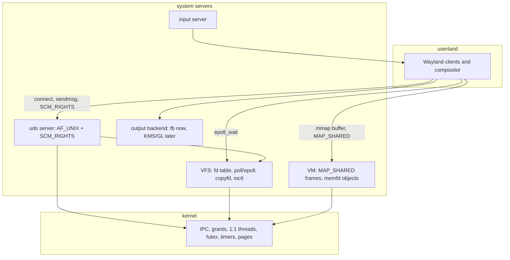
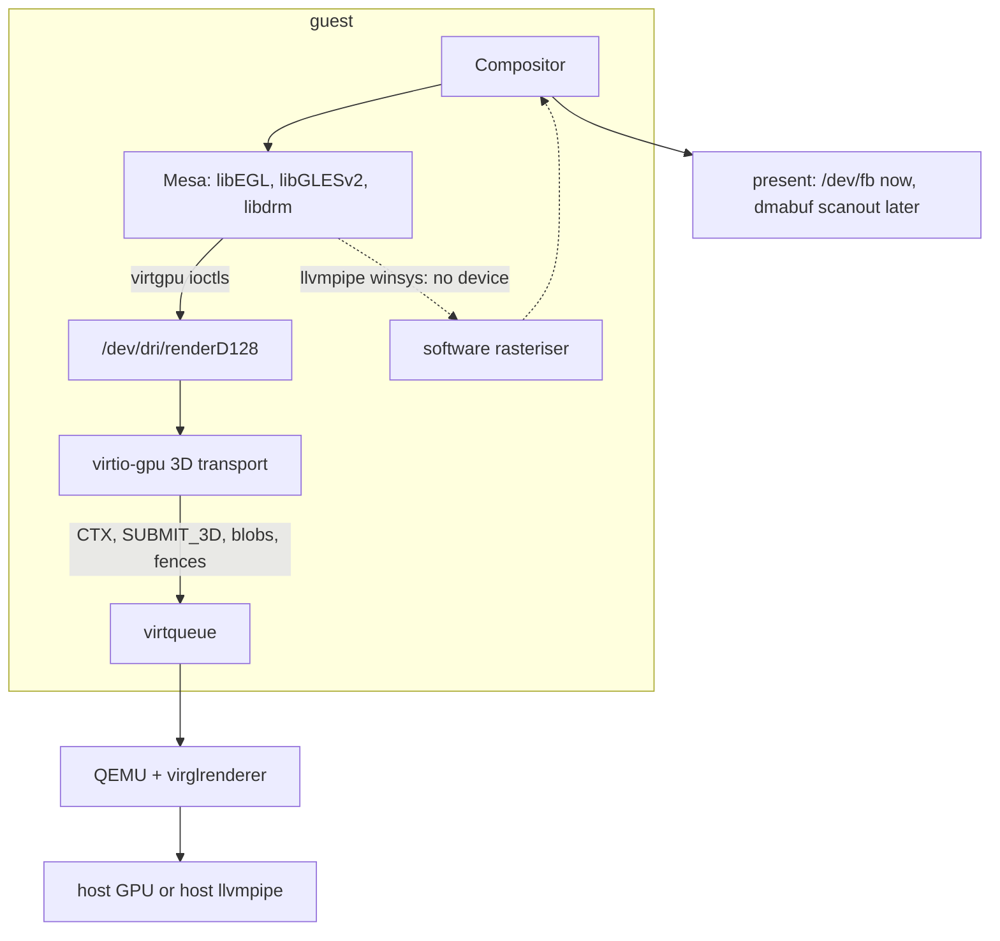

# Wayland on minixrs — design proposal and gap analysis

Status: **draft; no Wayland code landed yet.** The loader support it depends
on now has (dynamic linking, `dlopen`, multi-module TLS, an 18-object budget —
§6.9). This document proposes how to get a Wayland compositor — and eventually
a desktop — running on this port, and records what the reference tree has that
we do not, so the deviations are deliberate rather than accidental.

North star: `cosmic-comp` (System76 COSMIC, built on **smithay**) on screen, at
which point a Wayland session is a distribution-grade port rather than a demo.
First deliverable: a **real Wayland server running an unmodified `wl_shm`
client**, presenting to `/dev/fb` in QEMU.

There is prior art in-tree: the reference implements UNIX domain sockets
(`.refs/minix-3.3.0/minix/drivers/net/uds/`) with `SCM_RIGHTS` fd passing. That
is a design to study, not to copy wholesale — §5 records where we should deviate.

---

## 1. Scope

**In scope**

- The OS primitives Wayland needs: local sockets, fd passing, a scalable
  readiness API, shared buffers.
- A display output path and an input path the compositor can consume.
- A compositor: first in-house, later smithay/`cosmic-comp`.

**Out of scope (initially)**

- GL fidelity (blur/shadows/dmabuf) — Phase 3.
- A full session (D-Bus, portals, logind) — Phase 4.
- The `libcosmic` app suite — Phase 5.
- The **wasm32** target. A browser has no sockets, fds or `SCM_RIGHTS`; the web
  demo keeps its own `WS_*` protocol. The wasm port must not constrain this
  design.

---

## 2. Why Wayland is a good forcing function

The capability set is not "graphics"; it is a specific, bounded list of OS
services that a Wayland session exercises end to end. Implementing them pays
off beyond the desktop:



- AF_UNIX + fd passing ⇒ also unlocks D-Bus, `systemd`-style socket activation,
  and `SCM_RIGHTS`-based privilege separation generally.
- `poll`/`epoll` + `eventfd`/`timerfd` ⇒ any event-driven server, not just a
  compositor.
- shared buffers + `memfd` ⇒ a real answer for `shmget`-class IPC, which is
  currently half-built (§4).
- dynamic loading ⇒ the loader grew the way a real userspace needs it
  (`dlopen`, multi-module TLS, an 18-object budget), so the C graphics stack can
  be built as **shared objects** rather than linked into every binary.
- an output abstraction ⇒ a place for the virtio-gpu driver to become useful.

---

## 3. Inventory

Paths are in this tree (`minixrs/crates/...`) unless noted.

### 3.1 What we have

- [x] **Framebuffer device** — `/dev/fb` driver with bochs-display (x86),
      **virtio-gpu** (riscv64/aarch64) and canvas (wasm) backends;
      `FBIOFLUSH`/`FBIO*` ioctls; device `mmap`. `crates/servers/src/fb.rs`,
      `crates/drivers/src/video/{fb,virtio_gpu,tda19988}.rs`.
- [x] **A compositor** — `/sbin/wserver` (boot proc 18): windows, title-bar
      chrome, close button, resize grips, pointer hit-testing, key routing,
      whole-repaint on window change and cell-repaint on flush.
      `crates/servers/src/wserver.rs`, protocol in
      `crates/minix-std/src/wserver.rs`.
- [x] **Input server** — `/sbin/input`: PS/2 (`8042`) and virtio-input, decoded
      to **HID records** (keyboard page `0x07`, pointer pages `0x01`/`0xFD`/`0x09`),
      delivered by IRQ notification. `crates/servers/src/input.rs`,
      `crates/drivers/src/input/`.
- [x] **`select(2)`** — VFS `select` with the CDEV select protocol
      (`CDEV_SEL1_REPLY`/`CDEV_SEL2_REPLY`, driver-side `sel_endpt`/`sel_ops`).
      `crates/servers/src/vfs/select.rs`. A driver that cannot *send* a readiness
      report because VFS is busy ends the change with a `NOTIFY` instead, and VFS
      re-asks its suspended waits (`rescan_suspended`) — `KNOWN_ISSUES` 36.
- [x] **`ioctl(2)` with magic grants** — VFS `do_ioctl` → `CDEV_IOCTL`, argument
      struct moved by grant with direction from `_IOW`/`_IOR`.
      `crates/servers/src/vfs/device.rs`.
- [x] **Grabs / grants / copies** — `cpf_grant_*`, `SYS_VIRCOPY`,
      `SYS_SAFECOPY*`, and **`VFS_COPYFD`** (`COPYFD_FROM`/`COPYFD_TO`,
      `do_copyfd`) — the fd-duplication primitive fd passing is built on.
      `crates/servers/src/vfs/filedes.rs`, `crates/minix-std/src/lib.rs`.
- [x] **`mmap`** — anonymous, file-backed (via VFS `FDLOOKUP`, lazy, COW), and
      device (`VR_DIRECT`). `crates/servers/src/vm/mod.rs`.
- [x] **Writable `MAP_SHARED` file mappings** — `VR_SHARED`: shared cache frames
      rather than private copies, with an explicit COW exception at fork
      (`crates/servers/src/vm/{cow.rs,region.rs}`). **The reference rejects
      these** (§4) — this is a pre-existing deliberate deviation, and it is
      exactly the capability `wl_shm` needs.
- [x] **COW fork with shared-frame alias tracking** — `cow_setup_fork`,
      `handle_cow_fault`.
- [x] **`mprotect`** — a net-new VM call (`VM_MPROTECT`, §5 row 19): the region
      carries the new `VR_*` permission bits (what a *later* fault consults) and
      the PTEs of pages already present are re-mapped. The page-fault path now
      **enforces** region permissions (§8), which it never had to before.
      Gates `just test-memfd-x86` (steps 21–41: read-only protection, enforcement
      across a fork, restore, and a split sub-range).
- [x] **`select(2)` / `poll(2)` with real deadlines** — one VFS readiness engine
      (`crates/servers/src/vfs/select.rs`) and a `SYS_SETALARM`-backed deadline
      (`crates/servers/src/vfs/alarm.rs`), shared by both calls. Gated by
      `just test-select-x86` (`/bin/seltest`). §5 row 3, §6.3.
- [x] **`eventfd`** — a VFS-internal 64-bit counter (`crates/servers/src/vfs/eventfd.rs`)
      whose readiness the same engine watches, woken by a write from another
      process. Gated by `just test-eventfd-x86` (`/bin/eventfdtest`). §5 row 20.
- [x] **Anonymous VFS-owned objects** — the vnode + descriptor + filp wiring
      `memfd` and `eventfd` share (`crates/servers/src/vfs/anon.rs`): no
      filesystem behind the vnode (`v_fs_e` = NONE, `v_fs_count` = 0).
- [x] **1:1 kernel threads + `futex` + TLS** — `SYS_thread_*`, `SYS_futex_*`,
      pthreads in `minix-libc`. `crates/kernel/src/thread.rs`.
- [x] **Signals** — kernel `SYS_KILL/GETKSIG/ENDKSIG/SIGSEND/SIGRETURN`; PM
      `sigaction`/`sigprocmask`/`sigsuspend`/`sigreturn`.
- [x] **PTYs and pipes** — 4 static PTY pairs + line discipline
      (`crates/drivers/src/tty/pty.rs`, `crates/servers/src/tty.rs`), `pfs`
      pipe FS, `VFS_PIPE2`.
- [x] **Console cell model + bitmap font** — `crates/servers/src/console.rs`,
      `crates/minix-std/src/font.rs` (`FONT_8X16`).
- [x] **Dynamic `/dev`** — `devman` over VTreeFS.
- [x] **SysV IPC data structures** — semaphores and shm
      (`crates/servers/src/ipc.rs`: `do_shmget`/`do_shmat`/`do_shmdt`/`do_shmctl`)
      — implemented but unreachable (see §4).
- [x] **A C/C++ cross-build path** — `tools/cc-minix.py`, `tools/ccflags.py`,
      `just libcxx-x86`. Needed for any C dependency later (Mesa, xkbcommon).
- [x] **Dynamic linking** — landed on `main` for all three hardware arches: a
      Rust loader at `/libexec/ld.so` (`crates/ldso`), a shared C library
      (`/lib/libc.so`), and PIC targets in the fork (`*-minix-elf`). Default
      stays static, exactly as MINIX does. **`dlopen`/`dlsym`** work at run time
      (with `RTLD_LOCAL`/`RTLD_GLOBAL` groups), **TLS is multi-module** (a
      `dlopen`ed object with `__thread` state gets a reserved slice), and a
      program fits **18 shared objects** (`MAX_REGIONS = 64`, 3 regions per
      object). Read-only DSO text is shared across processes by the inode-keyed
      file page cache (`crates/servers/src/vm/cache.rs`); measured 13/13 pages
      (x86_64) and 11/11 (riscv64). `DYNAMIC_LINKING.md`.
- [x] **Static Rust `std` PAL**, `procfs`, `mfs`, `ext2`, `pfs`, `pfs`-style
      services, `virtio-net` + net server, `ramdisk`, `ahci`, `at_wini`,
      `virtio_blk`.

### 3.2 What is missing for Wayland

Organised by critical path. Each is a real gap, with evidence.

**Tier 0 — IPC and OS primitives (blocking everything)**

- [ ] **AF_UNIX / local-domain sockets.** `AF_UNIX` is a constant
      (`crates/minix-std/src/net.rs`) and nothing more; `socket()` accepts
      `AF_INET` only and returns `EPROTONOSUPPORT` for local.
- [ ] **`socketpair(2)`.** Not defined anywhere.
- [ ] **`sendmsg(2)`/`recvmsg(2)`, `struct msghdr`, `iovec`.** Only
      `send`/`recv`/`sendto`/`recvfrom` exist.
- [ ] **`SCM_RIGHTS` fd passing** (+ `SCM_CREDS` / `SO_PEERCRED`). No ancillary
      data path at all. Note `VFS_COPYFD` (the primitive) *does* exist.
- [x] **`select(2)` and `poll(2)` with a real timeout.** Both live in one VFS
      readiness engine (`crates/servers/src/vfs/select.rs`) and share a deadline
      armed through `SYS_SETALARM` (`crates/servers/src/vfs/alarm.rs`); before
      this a bounded timeout blocked forever. `poll` is native, not emulated
      over `select`, and `minix-libc` now exports both `poll` and `select`.
      Gated by `just test-select-x86` (`/bin/seltest`). See §6.3.
- [x] **`epoll` (`epoll_create1`/`epoll_ctl`/`epoll_wait`).** A VFS-internal
      instance with a **persistent interest set** (`crates/servers/src/vfs/epoll.rs`);
      `epoll_wait` copies that set into one wait entry of the same readiness
      engine (`vfs/select.rs`) and scans it as `poll` does, so a driver reply, a
      `wake_object`, or the shared deadline completes it. Gated by
      `just test-epoll-x86` (`/bin/epolltest`). See §5 row 23, §6.3.
- [x] **`eventfd`.** A VFS-internal 64-bit counter (`crates/servers/src/vfs/eventfd.rs`),
      like `memfd`: a synthetic identity, no filesystem, VFS answers `read`/`write`.
      A blocked `poll`/`select` on it is woken by a write from another process
      (`vfs::select::wake_eventfd`) — no driver round-trip. Gated by
      `just test-eventfd-x86` (`/bin/eventfdtest`). See §5 row 20, §6.3.
- [x] **`timerfd`.** A VFS-internal timer object
      (`crates/servers/src/vfs/timerfd.rs`) in the `eventfd`/`memfd` shape:
      synthetic identity, no filesystem, VFS answering `read`/`fstat` and the
      `timerfd_settime`/`timerfd_gettime` calls. One-shot and periodic, absolute
      (`TFD_TIMER_ABSTIME`) or relative, on `CLOCK_MONOTONIC`/`CLOCK_REALTIME`;
      its expiry folds into the *same* `SYS_SETALARM` deadline as `select`/`poll`
      (§6.3). Gated by `just test-timerfd-x86` (`/bin/timerfdtest`). See §5 row 21.
- [ ] **`signalfd`, `inotify`.** Absent in **both** trees; lower priority than
      `epoll` for a Wayland compositor.
- [x] **`memfd_create` + a shareable anonymous buffer object.** Implemented
      (`crates/servers/src/vfs/memfd.rs`): an object with a synthetic `(dev, ino)`
      identity, so VM's existing shared-frame machinery maps it and `read`/`write`
      go through the same frames. `ftruncate` sizes it. Gated by
      `just test-memfd-x86` (`/bin/memfdtest`). See §6.4.
- [x] **`ftruncate` on such an object** (needed to size a `wl_shm` pool) — it is
      the vnode's size, with no blocks to allocate.
- [x] **`mprotect`.** Implemented as a net-new VM call; the reference has none
      (`lib/libc/sys/MISSING_SYSCALLS`). See §3.1 and §5 row 19.
- [ ] **Working SysV shared memory.** Structures exist
      (`crates/servers/src/ipc.rs`) but VM's remap/getphys are stubs and the
      IPC server is **not in `BOOT_PROCS_ALL`** (`crates/kernel-boot/src/lib.rs`)
      — so `shmget` is unreachable at runtime.
- [ ] **`XDG_RUNTIME_DIR` + a writable `/run` or `/tmp`.** Nothing to mount a
      socket directory on yet.

**Tier 1 — display and graphics**

- [ ] **An output abstraction** the compositor presents through (today it writes
      `/dev/fb` directly, which is fine as backend #1 but has no interface).
- [ ] **DRM/KMS, GEM/dmabuf, GBM.** None.
- [ ] **EGL/GLES/GL, Vulkan, Mesa, llvmpipe/lavapipe.** None. No GPU path
      beyond the raw virtio-gpu resource/flush surface.
- [ ] **A GPU-capable present/flip path** (virtio-gpu has the transport; no DRM
      model above it).

**Tier 2 — input and devices**

- [ ] **A compositor input backend** (or evdev device nodes + a libinput
      equivalent). We have an input *server* with HID records — good raw
      material, no consumer interface for a compositor.
- [ ] **Device enumeration** (udev/sysfs equivalent) if we ever want libinput.
- [ ] **Keymaps.** A *server-side* keymap is a committed US/evdev XKB text
      artifact compiled into `wlserver` and served on `wl_keyboard.keymap` (Phase
      2a, §6.12); a *client* that parses it still needs `xkbcommon`. Ours today is
      hand-rolled shift/ctrl handling in `wserver`.

**Tier 3 — session and desktop**

- [ ] **D-Bus** (transport needs Tier 0 first; `zbus` is pure Rust).
- [ ] **A session bus / `dbus-daemon` equivalent**, portals, logind equivalent.
- [ ] **Scalable text** — we have an 8×16 bitmap font and nothing else. COSMIC
      needs shaping and glyph rasterisation (`cosmic-text`+`swash` is pure Rust;
      a font corpus is still needed).
- [ ] **Loader conveniences the graphics stack does not strictly need.** The
      search path is compiled in (`/lib/`, `/usr/lib/`, and any name containing
      a slash opened as-is), with no `LD_LIBRARY_PATH` or `ld.so.cache`; `dlclose`
      returns success but does not unmap; `RTLD_NEXT` and `TPOFF64` are
      unimplemented. None of these blocks a stack that installs under `/lib` or
      `/usr/lib` or is referenced by absolute path — which is how Mesa's own
      driver lookups (`LIBGL_DRIVERS_PATH`, `VK_ICD_FILENAMES`) work anyway.
- [ ] **A Wayland server implementation** — scoped in **§6.11**. The wire format,
      the interface tables and both halves of the protocol landed in
      `crates/wayland` (`wire`/`protocol`/`server`/`shm`/`client`/`input`), the
      serving side is the `/sbin/wlserver` boot proc (20), and Phase 1a (registry +
      `wl_display.sync`), 1b (the `wl_shm` present path to `/dev/fb`) and 1c (input:
      `wl_seat` keyboard/pointer, focus/`enter`, and a key routed from the console to
      a client) are in. Phase 2a (the seat's keymap, §6.12), 2b (`xdg_shell`:
      `xdg_wm_base`/`xdg_surface`/`xdg_toplevel`) and 2c (several clients at once,
      with per-surface focus) are in too, as is 2d (damage tracking and the pointer's
      cursor) and 2e (popups, `layer_shell` and decorations, §6.12). No Phase 2 stage
      is open; the remaining Wayland work is Phase 3's GL path (§6.10).

---

## 4. What reference MINIX 3.3.0 has that we lack

Answering the explicit question. "Ref" is
`.refs/minix-3.3.0/minix/`.

### 4.1 Capabilities

| Capability | Reference | Ours |
|---|---|---|
| **AF_UNIX / local domain** | **Present** — `drivers/net/uds/` (`uds.c`, `ioc_uds.c`, `uds.h`), a char driver at `/dev/uds` (major 18), 256 sockets, 32 KiB rings, clone minors | **Absent** (constant only) |
| **`socketpair(2)`** | Present — `NWIOSUDSPAIR` | Absent |
| **`SCM_RIGHTS` fd passing** | Present — `struct ancillary { int fds[OPEN_MAX]; struct uucred cred; }`, via `sendmsg`/`recvmsg` | Absent |
| **Peer credentials** | Present — `SCM_CREDS`, `NWIOGUDSPEERCRED` | Absent |
| **UDS `select`** | Present — `sel_endpt`/`sel_ops`, CDEV select | Absent (no socket) |
| **`select(2)`** | Present — VFS `servers/vfs/select.c`, `MAXSELECTS = 25` | Present — `vfs/select.rs` |
| **`poll(2)`** | **Emulated over `select`** in libc | Stub (fds 0..2 only) — we are behind |
| **`mmap(2)`** | Present — VM `servers/vm/mmap.c`, anon + file `MAP_PRIVATE`; **writable `MAP_SHARED` file mapping rejected (`ENXIO`)** | Present, **including writable `MAP_SHARED`** (`VR_SHARED`) — we are *ahead* |
| **SysV shm + semaphores** | Present and **booted** — `servers/ipc/` | Structures only; VM stubs; **server not booted** |
| **PTY** | Present — `drivers/tty/pty/`, **32 pairs**, static minors 128+/192+, **no `/dev/ptmx`** | Present — **4 pairs**, same static shape |
| **`is` (Information Service)** | Present — `servers/is/`: proc/priv/image table dumps, kernel messages, VM status, F-key dumps | Absent |
| **`inet` server (full TCP/IP)** | Present — `net/inet/` with `generic/` protocol engine; alt. `net/lwip/` | Present but smaller: ARP, ICMP, UDP, minimal RFC-793 TCP subset (`crates/servers/src/net.rs`) |
| **Driver framework libraries** | `libchardriver`, `libblockdriver`, `libnetdriver`, `libinputdriver`, `libasyn`, `libbdev`, `libminixfs`, `libsffs`, `libvtreefs`, `libmthread`, `libtimers`, `libexec`, `libvirtio`, `libnetsock`, `liblwip`, `libusb`, `libddekit`, `libfetch`, `libaudiodriver`, `libi2cdriver`, `libgpio`, `libhgfs`, `libvboxfs`, `libclkconf`, `libdevman` | Only `libminixfs` + `vtreefs` (`crates/libs/`) — **the framework layer is largely unported** |
| **Filesystems** | `mfs`, `ext2`, `iso9660fs`, `pfs`, `procfs`, `vbfs`, `hgfs` | `mfs`, `ext2`, `pfs`, `procfs`, `iso9660`, `vbfs` (some library-only); **no `hgfs`** |
| **USB stack** | `drivers/usb/`: `usbd`, `usb_hub`, `usb_storage` (+ `libusb`, `libddekit`) | Absent |
| **Audio** | `sb16`, `es1370`, `es1371` + `libaudiodriver` | Absent |
| **Power / ACPI** | `acpi`, `tps65217`, `tps65950` | Absent |
| **Sensors / printer / iommu** | `sensors/{bmp085,sht21,tsl2550}`, `printer`, `iommu/amddev` | Absent |
| **Kernel `SYS_*` surface** | ~40 `system/do_*.c` incl. `do_trace` (tracing), `do_sprofiling`, `do_schedule`/`schedctl`, `do_irqctl`, `do_diagctl`, `do_setgrant`, `do_vmctl` | Mapped subset (`crates/kernel/src/system.rs`); notably **no `do_trace`**, no sprofiling |
| **Userland breadth** | ~150 command dirs (disk tools, mail, editors, net admin, `ipcs`/`ipcrm`, `top`) | ~60 coreutils + a handful of test binaries |
| **SMP / watchdog / profile** | Present | Present in part (`smp`, `profile`, `bootwatch`) |
| **Threads model** | `libmthread` — user-space M-threads; VFS worker threads; **no kernel thread abstraction** | **1:1 kernel threads + `futex` + TLS** — deliberate, better |
| **Dynamic loader** | Present but **off by default** — `libexec/ld.elf_so`, with `LDSTATIC=-static` / `MKDYNAMICROOT=no` (`DYNAMIC_LINKING.md` §2.1) | Present on all three hardware arches (`/libexec/ld.so`, `/lib/libc.so`); default still static — same posture |
| **`dlopen`/`dlsym`** | Present — `lib/libc/dlfcn/dlfcn_elf.c` | Present — `crates/ldso/src/rtld.rs` (`RTLD_LOCAL`/`RTLD_GLOBAL` groups); `dlclose` succeeds without unmapping |
| **eventfd / timerfd / signalfd** | **Absent** | Absent (parity — this is net-new work for both) |
| **DRM / GL / Wayland / X11 / D-Bus** | **Absent** | Absent (parity) |

### 4.2 The three structural traps in the reference design

These are the things a faithful port would inherit and should *not*:

1. **The name registry is the driver's table, not the filesystem.** The
   reference *does* authorise: `do_bind()` and `do_connect()` both call
   `checkperms(owner, addr.sun_path, …)` (`ioc_uds.c`) before touching the
   table, so it is the socket node's permissions that gate binding and
   connecting, and Wayland's "the socket lives in a `0700` directory" model
   works. What is *not* the filesystem is the name: a listener is found by
   `strncmp`-ing `sun_path` across the in-memory table, and the node is created
   by libc (`lib/libc/sys/bind.c`). **The trap for us is the check, not the
   lookup** — a device driver has no cheap path-to-mode query, so `checkperms`
   is not available in the form the reference uses (see §5 row 2 for the
   substitute).
2. **`SCM_RIGHTS` needs a privileged intermediary.** `VFS_COPYFD` requires
   super-user (`EPERM` otherwise); it works only because the UDS *driver* is
   privileged and copies on both clients' behalf. We have `VFS_COPYFD`, so the
   shape is available — but the copy must be performed by our socket server, not
   by the client.
3. **Readiness does not scale.** `MAXSELECTS = 25`, and there is **one
   outstanding select query per device major** (`dmap_sel_busy`), with the
   driver allowed a single watcher per minor. That is fine for a shell and
   terminal; it is not an event loop for a compositor watching dozens of
   clients. `poll` being an emulation over `select` makes it worse. **We must
   deviate** on the readiness API (§6.3).

---

## 5. Deviations register

"Follow" = model on the reference. "Deviate" = deliberately different. "Defer" =
not now, record it.

| # | Topic | Reference | Proposed | Verdict |
|---|---|---|---|---|
| 1 | Socket shape | `/dev/uds` char driver; `socket()` = `open` + `NWIO*` ioctls; data via `read`/`write` | Same shape, one server per socket family, control via ioctl+grant, data via fd read/write | **Follow** (fits our char-driver/ioctl/grant machinery) |
| 2 | Connect authorisation | `checkperms(owner, path, …)` against the socket node, then a table scan for the name | The driver cannot query a path's mode, so it authorises by **uid**: the binder's user, or root. A uid PM cannot resolve denies | **Deviate** (narrower than the reference; widen once a path-mode query exists) |
| 3 | Readiness | `select` only (25 slots), one query per major; `poll` emulated over `select`; no server timer | one readiness engine in VFS serving `select` **and** native `poll` **and** `epoll`, with deadlines armed via `SYS_SETALARM`; character drivers answer `CDEV_SELECT` and hold a late watch | **Deviate** (landed: `select`/`poll`/`epoll` + timeouts, and `uds` now answers `CDEV_SELECT`) |
| 4 | Shared buffers | writable `MAP_SHARED` file mapping rejected (`ENXIO`); SysV shm | `memfd_create` as a synthetic-identity object that VM's `(dev, ino)` page cache backs, so one object's frames are shared by every mapping and by `read`/`write` | **Deviate** (already deviating; landed, §6.4) |
| 5 | fd passing | `copyfd` back-call: the privileged `uds` driver moves each descriptor itself, while VFS waits for that driver's ioctl reply | VFS owns the transfer (`vfs/scm.rs`): it captures `SCM_RIGHTS` descriptors at `sendmsg` and installs them at `recvmsg`, keyed by the receiving socket; the driver only names the peer. `SO_PEERCRED` from the peer's owner | **Deviate** (the reference's back-call needs a second VFS thread; ours is single-threaded, so it could never be answered) |
| 6 | PTY | 32 static pairs, no `/dev/ptmx` | Keep static shape; raise the pair count; add `/dev/ptmx` clone later | **Follow, extend** |
| 7 | SysV shm | Present and booted | Finish VM remap, boot the ipc server — but `wl_shm` uses `memfd`, not SysV shm | **Follow (lower priority)** |
| 8 | Threads | user-space M-threads, no kernel threads | Keep our 1:1 kernel threads + `futex` | **Keep ours** |
| 9 | Graphics | raw `/dev/fb`, no DRM | Output backend trait: fb now, virtio-gpu/DRM+GL later | **Extend** |
| 10 | Input | input server + `libinputdriver`; no libinput/udev | Custom compositor input backend over our HID records; skip libinput/udev | **Deviate** |
| 11 | Compositor | none (X11 absent too) | in-house Wayland server first; smithay/`cosmic-comp` second | **Net-new** |
| 12 | Text | none | `cosmic-text` + `swash` (pure Rust) + font corpus | **Deviate** (no fontconfig/freetype) |
| 13 | Linking | loader exists (`ld.elf_so`) but the default build is `-static` | Default static (same posture); dynamic is the vehicle for the C graphics stack | **Follow, extend** |
| 14 | Loader growth | eager binding; `dlopen`; single-module TLS | `dlopen`, multi-module TLS and an 18-object budget all landed; **eager binding kept** (a superset of what `RTLD_LAZY` promises) | **Follow / done** |
| 15 | wasm | absent | keep the `WS_*` protocol; Wayland is hardware-arch only | **Exclude** |
| 16 | Shared-object segments | an LLD `-shared` link emits a `GNU_RELRO` `PT_LOAD` per object | Drop it (`-z norelro`) — nothing in the OS reads the header; 4 regions/object → **3**. `--no-rosegment` declined (it would map `.rodata`/`.dynstr` executable) | **Deviate** |
| 17 | `SCM_CREDS` | appended to every `recvmsg` that has room, from a credential word that stays zeroed until a `sendmsg` fills it | emitted only once a send has recorded credentials | **Deviate** (the reference lets a receiver read `cr_uid` 0 — *root* — before its peer has sent anything) |
| 18 | `memfd` | no such thing: an in-memory file must be a real inode with a filesystem behind it (or SysV shm, which VM never finished here) | an object **identity** (`MEMFD_DEV` + a never-reused id) with no filesystem at all; VFS answers the four operations that would reach one, and VM's `(dev, ino)` page cache is the storage | **Deviate** (net-new; MINIX has no memfd to follow) |
| 19 | `mprotect` | **none** — listed in `lib/libc/sys/MISSING_SYSCALLS`; nothing could reduce a region's rights, so the fault path never had to refuse one | net-new `VM_MPROTECT`: region bits + PTE re-map, and **enforcement in the fault path** (before the COW path, or COW would re-grant write on a page just made read-only) | **Net-new** (no original to follow) |
| 20 | `eventfd` | no such thing; the reference's substitute is a pipe or SysV shm | a VFS-internal counter object with a synthetic identity (`EVENTFD_DEV`), no filesystem, answered by VFS; a blocked `poll`/`select` on it is woken by `wake_eventfd`, not a driver reply. Deviation: a read on a zero counter answers `EAGAIN` rather than blocking (the port's pipes deviate the same way — no suspend/revive for reads yet) | **Net-new** (no original to follow) |
| 21 | `timerfd` | no such thing; an event loop would emulate a timeout over `select` | a VFS-internal timer object with a synthetic identity (`TIMERFD_DEV`), one-shot or periodic, absolute or relative; its next expiry folds into the **one** `SYS_SETALARM` deadline that `select`/`poll` also arm, and the tick calls `timerfd::expire`. Deviation: a read with a zero expiry count answers `EAGAIN` rather than blocking (same as `eventfd`/pipes) | **Net-new** (no original to follow) |
| 22 | `CLOCK_MONOTONIC` | `do_gettime` returns `boottime + uptime` for **both** clocks (`servers/pm/time.c`: `sec = boottime + clock / system_hz`) — so the "monotonic" clock jumps when the wall clock is set, and sits `boottime` seconds off the kernel tick timeline | `CLOCK_MONOTONIC` is the uptime tick count alone (time since boot); `CLOCK_REALTIME` keeps the `boottime` offset. Matches POSIX and the port's own `clock_server` | **Deviate** (fixes a MINIX defect, and is what lets an absolute `CLOCK_MONOTONIC` `timerfd` deadline name the same timeline `vfs::alarm` arms against — `calloop`'s timer depends on it) |
| 23 | `epoll` | no such thing; `poll` is emulated over `select` (25 slots, one outstanding query per major) | a VFS-internal instance with a persistent interest set; `epoll_wait` re-scans it through the shared wait table, level-triggered. Deviations: an instance holds at most `MAX_INTERESTS` (64) registrations; `EPOLLET`/`EPOLLONESHOT` are accepted in the mask but served level-triggered; an interest whose fd the waiter closed is dropped lazily at the next `epoll_wait` (not at close); `EPOLLERR`/`EPOLLHUP`/`EPOLLRDHUP` are not synthesised | **Net-new** (no original to follow) |

---

## 6. Design proposal

### 6.1 The socket server

A new privileged server — informally `uds` — owning `/dev/uds`, following the
reference's shape:

- `socket(AF_UNIX, SOCK_STREAM, 0)` = `open("/dev/uds")` + `ioctl(NWIOSUDSTYPE)`,
  returning a **clone minor** (we already support `CDEV_CLONED`).
- Control operations (`bind`, `listen`, `connect`, `accept`, `shutdown`,
  `getsockname`, `getpeername`, `sendmsg`, `recvmsg`, `SO_PEERCRED`) are ioctls
  carrying their argument structs by magic grant. The two `*CTRL` ones excepted:
  VFS keeps the descriptors itself (§6.2).
- Data path is plain `read`/`write` on the fd. A 32 KiB ring is adequate for
  Wayland messages; keep `SCM_RIGHTS` control separate (below).
- `socketpair()` = two opens + one `NWIOSUDSPAIR`.

**Blocking** uses the existing CDEV suspend/revive convention
(`EDONTREPLY` + `chardriver_reply_task`) — which we already have for tty/net.

**Concern to resolve:** the reference's data path is
process → VFS → driver, and our VFS is single-worker (the reason the wasm
compositor's frame flush bypasses VFS straight to `/dev/fb`). A compositor
talking to a dozen clients through a serialised VFS would stall. Mitigations, in
order of preference: (a) VFS worker threads so no client's socket I/O blocks
another's; (b) a direct server-to-server path for the hot buffer/`read`/`write`
case, mirroring the fb-flush bypass. This needs a measurement, not a guess.

### 6.2 fd passing

`sendmsg`/`recvmsg` carry a control buffer; `SCM_RIGHTS` names fds in the
sender's table. The reference's `uds` driver performs the transfer itself, with
`copyfd(COPYFD_FROM/TO)` **back-calls into VFS** (§5 row 5). That cannot work
here: VFS blocks in `fs_sendrec` while the driver handles the ioctl, so the
back-call would arrive with nobody able to answer it — the reference relies on
VFS worker threads for exactly this.

So **VFS owns the transfer** (`crates/servers/src/vfs/scm.rs`), the layering
Linux uses — the transport carries a rendezvous, the kernel owns descriptors:

- `NWIOSUDSCTRL` is intercepted before it reaches the driver. VFS reads the
  caller's `struct msg_control`, walks the `cmsghdr` chain and takes a reference
  on every `SCM_RIGHTS` descriptor. It then forwards the request to the driver
  **only to learn which socket is the peer** — the reply carries the peer's
  clone minor in its payload rather than in a user buffer — and files the
  captured descriptors under the *receiving* socket's device number.
- `NWIOGUDSCTRL` never leaves VFS. It compares the caller's `msg_controllen`
  with what is waiting (`EOVERFLOW`, leaving the set pending for a retry, as the
  reference does), installs the descriptors into the caller's table, and writes
  back one `SCM_RIGHTS` message naming the caller's new fd numbers.
- Closing a socket releases whatever is still in flight for it — the reference's
  `uds_clear_fds`.

`SO_PEERCRED` is served by the driver from the peer's recorded owner endpoint
(`PM_GETEPINFO`), as the reference's `do_getsockopt_peercred` does, and the same
credentials travel as `SCM_CREDS`: the `sendmsg` that captures descriptors also
records the sender's uid and gid — the reference's `send_fds` → `getnucred` —
and `recvmsg` appends a `struct uucred` when the caller left room for one
(room for the descriptors *and* the credentials, which is the reference's
`clen_desired <= clen_avail` test).

**One further deliberate deviation here** (§5 row 17). The reference appends
`SCM_CREDS` to *every* `recvmsg` that has space, from a credential word that is
zeroed until a send fills it — so a receiver checking `cr_uid` before its peer
has sent anything reads **uid 0**, which is root. This port emits the message
only once a send has actually recorded credentials, so its absence means "not
known", never "root".

This is the piece that makes `wl_shm` and D-Bus possible. Two consequences to
keep in view:

- A passed descriptor is held by VFS until the receiver takes it. The capture
  table is fixed-size (`OPEN_MAX` descriptors per socket, one set per socket),
  and `EOVERFLOW`/`EMFILE` are the answers when either runs out.
- "A driver calls VFS back" is now settled **for sockets only**. VND's
  `copyfd`/`fstat` stubs (`crates/drivers/src/storage/vnd.rs`) have the same need
  and remain open (`KNOWN_ISSUES.md`).

### 6.3 Readiness: `poll`, `epoll`, `eventfd`, `timerfd`

The reference offers no workable model, so this is a design choice. Three
options:

| Option | Shape | Pros | Cons |
|---|---|---|---|
| A. VFS-native | `poll`/`epoll` objects live in VFS; driver protocol generalises from one watcher per minor to a subscription set | One mechanism; reuses CDEV select; matches where `calloop` expects readiness | VFS becomes an event broker; must replace the per-major serialisation |
| B. Kernel-level | `SYS_epoll_*` in the kernel, readiness delivered by IPC notifications | Fast | Least MINIX-like; kernel has no fd-readiness concept today |
| C. Poller server | A dedicated server arbitrating interests; `epoll_wait` = `sendrec` | Fits "everything is a server" | Extra hop on the hot path |

**Recommendation: A.** Generalise the driver-side readiness contract
(`sel_endpt`/`sel_ops` → subscribe/unsubscribe/notify) and implement:

- `poll(2)` natively: one VFS entry per call, arbitrary fd count, real deadline.
- `epoll_create1` / `epoll_ctl` / `epoll_wait`: a VFS object holding a
  persistent interest set; `epoll_wait` suspends like `select` today.
- `eventfd`: a VFS-internal counter object.
- `timerfd`: a VFS object backed by the kernel timer (`SYS_SETALARM`-class);
  this also fixes `select`'s deadline problem.

**Landed (the first two, plus the deadline).** `select` and `poll` now share one
readiness engine (`vfs/select.rs`) over a single table of suspended waits, and
the deadline is real: `vfs/alarm.rs` arms the earliest wait's deadline with
`SYS_SETALARM` (absolute monotonic ticks) and the `CLOCK` notification completes
the waits that are due and re-arms for the next. `poll` carries an array of
`struct pollfd`, supports arbitrary (capped) fd counts, and reports `POLLNVAL`
where `select` answers `EBADF`. `minix-libc` exports both. Gate:
`just test-select-x86` (`/bin/seltest`, a pipe with data, an empty pipe, and a
200 ms timeout on each of `select` and `poll`).

An alarm is one per process, so VFS keeps exactly one armed for the
earliest deadline across all its waits; a wait also registers a late char-device
watch through `CDEV_SELECT`, unchanged.

**`eventfd` also landed.** It is the second readiness primitive: a VFS-internal
counter object (`vfs/eventfd.rs`) with a synthetic identity, no filesystem, and
VFS answering `read`/`write`/`fstat` directly. The engine reads its readiness
from the object itself (no driver round-trip), and a write or read from any
process completes the blocked waits watching it (`select::wake_eventfd`) — the
property an event loop needs to wake itself from another thread. Gate:
`just test-eventfd-x86`, which includes a fork whose child writes and the
parent's `poll(-1)` that must be woken.

**`timerfd` also landed.** The third primitive, and the one that makes a
deadline a *descriptor*: a VFS-internal timer object (`vfs/timerfd.rs`) in the
same shape, one-shot or periodic, absolute (`TFD_TIMER_ABSTIME`) or relative.
Its next expiry is folded into the *same* `SYS_SETALARM` deadline as the
suspended waits — `arm_earliest` picks the earlier of the two — and the `CLOCK`
notification calls `timerfd::expire` before re-arming, completing a `poll`
blocked on the object. Gate: `just test-timerfd-x86`.

**`epoll` also landed** — the last Tier-0 readiness primitive. An epoll instance
is another VFS-internal object (`vfs/epoll.rs`), but not itself a readiness
source: it holds a *persistent* set of interests, each `(fd, events, data)`.
`epoll_wait` copies that set into one wait entry of the shared table and scans it
exactly as `poll` scans its array, so a driver's `CDEV_SEL2_REPLY`, a
`wake_object`, or the shared deadline completes it — no new completion path,
only a new way to build a wait. Readiness is level-triggered by construction
(every wait re-scans the whole set), which is what `calloop` uses. The
`struct epoll_event` ABI is Linux's packed 12-byte form. Gate:
`just test-epoll-x86` (`/bin/epolltest`), which adds, modifies and removes
interests, checks readiness over an eventfd and a pipe, and wakes a blocked
`epoll_wait` from a child process. See §5 row 23 for the limits.

Blast radius: VFS, every character driver, tty, net, `uds`, `pfs`. This is the
single broadest change in the plan — budget for it.

### 6.4 Shared buffers: `memfd`

`wl_shm` works like this, and every step is a deliverable:

1. client `memfd_create("wl_shm", 0)` → fd
2. `ftruncate(fd, pool_size)`
3. `mmap(fd, PROT_READ|PROT_WRITE, MAP_SHARED)` — the client's pixels
4. `wl_shm.create_pool` sends that fd over the socket (`SCM_RIGHTS`)
5. compositor receives the fd and `mmap`s it — **the same frames**
6. compositor samples the pixels; `wl_buffer.release` frees it

**This landed** (`crates/servers/src/vfs/memfd.rs`, gate `just test-memfd-x86`).
The design turned out smaller than this document first assumed, because the
mapping machinery was already there: `MAP_SHARED` file regions are `VR_SHARED`
(`vm/region.rs`), whose pages are the `(dev, ino, offset)` entries of VM's file
page cache (`vm/cache.rs`), shared by every mapping of that identity and
surviving `fork` through `cow.rs`'s `VR_SHARED` exception.

So the missing piece was never a mapping object — it was **an identity**. A
memfd is given one rather than a filesystem:

- The vnode's `v_dev` is `MEMFD_DEV` (`arch-common/com.rs`, a reserved major) and
  its `v_inode_nr` a never-reused id, so two memfds can never alias in the cache.
- `v_fs_e` is `NONE` and **`v_fs_count` is 0**, which is what makes `put_vnode`
  skip its `req_putnode` without a special case.
- VFS answers the four operations that would otherwise reach a filesystem —
  `read`, `write`, `ftruncate`, `fstat`. The first two go through the object's
  **cache pages** (VM's `VM_MAPCACHEPAGE` window, the mechanism a filesystem
  already uses for block I/O), so `read`/`write` and the mappings are one set of
  bytes rather than two that drift.
- VM needed two small changes: a file-page fault on a memfd allocates its own zero
  frame instead of asking VFS for file content (there is no file), and
  `do_mapcache` creates-and-inserts that frame when a `write` precedes any
  mapping. A memfd page is also cacheable when it merely *starts* inside the
  object, so a pool whose size is not a page multiple keeps its last page shared.
- The `VM_MAPCACHEPAGE` window had to become a reference-holding mapping like any
  other: it takes a `PhysBlock` reference per page, which its teardown releases.
  It previously took none, so every memfd `read`/`write` consumed the cache's own
  reference and eventually freed a frame the cache still pointed at — an object
  that stopped reading its own data after a few transfers (`do_mapcache`).

The alternative — a real in-memory filesystem serving anonymous inodes — is the
more MINIX-idiomatic shape and is what we want eventually; the port's `PFS`
cannot host it as it stands (it is a pipe store: 64 × 4 KiB buffers and a
`truncate` that only accepts 0). See §5 row 18.

`mprotect` landed alongside (see §3.1, §5 row 19) — Mesa's JIT renderers and
`wl_shm` clients both want to take write access away from a buffer once written.

### 6.5 Display output

Introduce an `Output` abstraction the compositor presents through, with
backends in this order:

1. **`fb`** — what `wserver` does today: render into a surface, `write` it to
   `/dev/fb`, `FBIOFLUSH`. Zero new hardware work; enough for the first
   milestone.
2. **`virtio-gpu`** — we already have the driver, resource flush and
   `virtio_phys_delta`. A DRM-shaped API over it (resources, framebuffers,
   present/flip) is the bridge to a GL path.
3. **GL** — `EGL`/`GLES` via Mesa (`llvmpipe`/`lavapipe` for software, `virgl`
   with virtio-gpu). Large; Phase 3.

Renderer: **software first** (our rasteriser + font), GL later. Note that
smithay ships no pure-Rust renderer — its choices are `gles` (Mesa) and
`pixman` (C) — so the first smithay target must use a **custom renderer over the
software output**, not GL.

Phase 3 is worked out in full in **§6.10** below: virgl over `virtio-gpu` first,
with llvmpipe/Lavapipe/KMS kept as later options. It is a DRM-ABI port, not a
renderer we write — Mesa's `virgl` is a DRM client, so the work is a `virtgpu`
render node plus the device's 3D and blob command set.

### 6.6 Input

A compositor input backend fed by our input server's HID records (pointer
absolute/relative + buttons, keyboard usages), producing `wl_seat`
keyboard/pointer events. This avoids porting `libinput`/`evdev`/`udev`
entirely. Keymaps start with a US layout plus modifier state (what `wserver`
does now); Phase 2a serves a real XKB keymap as a committed artifact (§6.12),
while `xkbcommon` remains a port item for the client side that parses it.

### 6.7 Compositor strategy: two tracks

- **Track A — in-house (Phase 1–2).** Add a Wayland listener to a compositor of
  ours. It can be a new server or `wserver` in a second mode; it should
  implement `wl_display`/`wl_registry`/`wl_callback`/`wl_compositor`/`wl_surface`/
  `wl_shm`/`wl_buffer`/`wl_output`/`wl_seat`/`xdg_shell`/`xdg_surface`.
  Pure Rust, no Mesa, no DRM, no D-Bus. This is the milestone that proves the
  whole stack and runs a **stock** client.
- **Track B — smithay / `cosmic-comp` (Phase 4).** Port smithay against our
  custom `OutputBackend`/`InputBackend` and a software renderer, then
  `cosmic-comp`, then `cosmic-session` (D-Bus).

Track A is not a detour: Track B needs Tier 0 exactly as much, and Track A finds
the bugs in it while the blast radius is small.

### 6.8 Session and fonts

- **D-Bus**: `zbus` (pure Rust) once §6.1–6.2 land. A session bus
  (`dbus-daemon` port or a minimal broker) is a separate workstream.
- **Fonts**: `cosmic-text` + `swash`/`rustybuzz` (pure Rust) + a shipped font
  corpus; no `fontconfig`/`freetype`/`harfbuzz`.

### 6.9 The C graphics stack as shared objects

Dynamic linking changes the shape of Phase 3/4. Mesa, `libdrm`, `libgbm`,
`xkbcommon`, `libinput` and D-Bus can be built as **shared objects** against
`/lib/libc.so`, using the fork's PIC targets, instead of being statically
duplicated into every compositor and client. That is what a distribution does,
and it is the difference between "port a graphics stack" and "port a graphics
stack and link it six times".

**The loader has already grown to meet this.** Three limits this section
previously listed as prerequisites have landed, and the region work was done
explicitly for this library set (`DYNAMIC_LINKING.md` says so):

| Was a gap | Now |
|---|---|
| No `dlopen`/`dlsym` | **Landed** (`d93afc38f`) — `RTLD_LOCAL`/`RTLD_GLOBAL` groups, `dlsym`, `dlerror`. `dlclose` succeeds without unmapping. |
| Single-module TLS | **Landed** (`49befa48a`) — modules are numbered and placed around the thread pointer; a module loaded later lands in a reserved slice and is first-touch initialised. |
| 6-object budget | **Landed** (`7de765674`, `1d14d16af`) — `MAX_REGIONS` 32 → 64 and the unused `GNU_RELRO` segment dropped: 4 regions/object → **3**, so **18 objects** per process; the loader's `MAX_OBJECTS` is 24. |

What is left is small and does not block a stack installed under `/lib` or
`/usr/lib`:

- **No `LD_LIBRARY_PATH` / `ld.so.cache`** — the search path is compiled in
  (`crates/ldso/src/search.rs`). Mesa's own driver lookups go through absolute
  paths and its own environment variables (`LIBGL_DRIVERS_PATH`,
  `VK_ICD_FILENAMES`), so this is a dev-convenience gap rather than a functional
  one.
- **`dlclose` does not unload**, and `RTLD_NEXT`/`TPOFF64` are unimplemented.
  Acceptable for a compositor, which does not swap GL drivers at run time.
- **Symbol versioning** stays absent. We build the C stack against our own libc,
  so there is no versioned ABI to honour; the loader must merely tolerate the
  `DT_VERN*` sections a prebuilt `.so` might carry.

One deliberate toolchain decision worth recording: `--no-rosegment` would have
taken the cost to 2 regions per object by folding read-only data into the
executable segment, and was **declined** because it maps `.rodata` and `.dynstr`
executable (`DYNAMIC_LINKING.md` §7 Phase 2). Eager binding is likewise kept —
it is a superset of what `RTLD_LAZY` promises.

### 6.10 Phase 3 — the accelerated render path (virgl first)

Phase 3 is getting real GL rendering, starting with **virgl** over `virtio-gpu`
and keeping llvmpipe, Vulkan and a native KMS driver as later options. Target: a
GL triangle rendered by unmodified **Mesa**, presented on screen in QEMU.
Definition of done for the phase: the compositor renders GL content through an
output backend that does not read the framebuffer back.

Nothing in the reference tree helps here: MINIX 3.3.0 has **no** `virtio-gpu`
driver, no 3D, no DRM, no GL (the only "3D" in `.refs/` is unixbench's Linux
test scripts). This is net-new, and the design freedom is correspondingly large.

#### What virgl is, and what choosing it commits us to

virgl is not a renderer we write. It is **Mesa's `virgl` gallium driver**
forwarding GL to the *host* GPU, and it is a **DRM client**: it opens a render
node, creates a context, allocates GEM objects and submits command buffers
through `ioctl`s. So the guest-side work is not "implement GL" — it is:

> implement the **`virtgpu` DRM interface** on top of our `virtio-gpu` device,
> extend the device driver with the **3D + blob** command set, and then run Mesa
> unmodified.

That is a published ABI (`drm/virtgpu_drm.h`, `linux/virtio_gpu.h`), which is
what makes it tractable — and also why it is more than "add a driver".

| | **virgl** (chosen) | **llvmpipe** (kept) |
|---|---|---|
| Where it runs | host GPU, via `virtio-gpu` | guest CPU (JIT rasteriser) |
| Guest work | 3D transport + DRM render node + blobs | Mesa + `mprotect` for the JIT |
| Host work | QEMU with `virglrenderer`, a GL-capable host | none |
| Exercises | the virtio-gpu 3D path the port wants anyway | nothing new in the kernel |

llvmpipe is *easier* on the guest and needs no host GL, but it teaches the port
nothing about the GPU path and is far slower. **Choosing virgl does not foreclose
it**: the winsys is a Mesa configure flag (`-Dgallium-drivers=virgl,llvmpipe`),
so one port builds both and the choice is made at run time — that is what
"keeping the option" means here (see *Options kept open* below).

#### What we start with

- [x] **`virtio-gpu` 2D driver** — `crates/drivers/src/video/virtio_gpu.rs`:
      negotiates *no* features (`virtio_probe(…, &[], …)`), owns one resource and
      one scanout, and speaks `RESOURCE_CREATE_2D` / `ATTACH_BACKING` /
      `SET_SCANOUT` / `TRANSFER_TO_HOST_2D` / `RESOURCE_FLUSH`. `send_cmd` is the
      command transport; `virtio_phys_delta` supplies DMA addresses.
- [x] **Both virtio transports** — modern PCI and MMIO
      (`crates/drivers/src/bus/virtio.rs`), with a `VirtioFeature` mechanism that
      carries nothing for the GPU yet.
- [x] **An output backend enum** — `FbBackend::{Bochs, VirtioGpu, Canvas}`
      (`crates/drivers/src/video/fb.rs`), the seam the present path extends.
- [x] **`/dev/fb` + `FBIOFLUSH`** — a present path a first GL milestone can use
      with no new display code.
- [x] **The loader** — `dlopen`, multi-module TLS, 18 objects (§6.9), so Mesa's
      driver loading and its `__thread` state are not blockers.
- [ ] **No 3D, contexts, blobs or fences** in the device driver.
- [ ] **No DRM, GEM or `/dev/dri`.**
- [ ] **No `mprotect`** (needed only by the llvmpipe branch).

#### The work, in three layers



1. **`virtio-gpu` 3D transport** (extend `virtio_gpu.rs`) — feature negotiation,
   capsets, contexts, `SUBMIT_3D`, 3D resources, blob resources, fences.
2. **The `virtgpu` DRM node** (new) — `/dev/dri/renderD128`, GEM handles, the
   `DRM_IOCTL_VIRTGPU_*` set, `mmap` of blob memory, fences as pollable objects.
3. **Mesa + `libdrm` + EGL/GLES as DSOs** — built for `*-minix-elf`,
   `EGL_PLATFORM_SURFACELESS_MESA`, render, present.

Device commands to add (`linux/virtio_gpu.h`):

| Command | Type | Why |
|---|---|---|
| `GET_CAPSET_INFO` / `GET_CAPSET` | `0x0108` / `0x0109` | Mesa must learn the capset id/version/size |
| `CTX_CREATE` / `CTX_DESTROY` | `0x0200` / `0x0201` | a virgl context; `CONTEXT_INIT` adds `context_init` + debug name |
| `CTX_ATTACH_RESOURCE` / `DETACH` | `0x0202` / `0x0203` | make a buffer visible to the context |
| `RESOURCE_CREATE_3D` | `0x0204` | 3D resources (the non-blob path) |
| `TRANSFER_TO_HOST_3D` / `FROM_HOST_3D` | `0x0205` / `0x0206` | read/write a 3D resource |
| `SUBMIT_3D` | `0x0207` | the command buffer — where GL work goes |
| `RESOURCE_CREATE_BLOB` / `MAP_BLOB` / `UNMAP_BLOB` | `0x0208` / `0x0209` / `0x020a` | host-visible memory (the modern path) |

Features to negotiate: `VIRTIO_GPU_F_VIRGL` (bit 0),
`VIRTIO_GPU_F_RESOURCE_BLOB` (bit 3), and `VIRTIO_GPU_F_CONTEXT_INIT` (bit 4)
for modern contexts. Each must be confirmed from the device's feature word;
without `virgl=on` the capset commands fail, so the driver must degrade rather
than hang.

DRM ioctls to implement (`drm/virtgpu_drm.h`):

| ioctl | What it does |
|---|---|
| `VIRTGPU_GETPARAM` | `3D_FEATURES`, `CAPSET_ID`, `CAPSET_SIZE`, `CAPSET_VERSION`, `SUPPORTED`, `GEM_HANDLE` — how Mesa decides it can use the device |
| `VIRTGPU_CONTEXT_INIT` | create a context (`ctx_set`), with `context_init` flags |
| `VIRTGPU_RESOURCE_CREATE` / `INFO` / `UNREF` | 2D/3D GEM objects |
| `VIRTGPU_RESOURCE_CREATE_BLOB` / `MAP_BLOB` / `UNMAP_BLOB` | blob GEM: `blob_mem` (`GUEST`/`HOST3D`), `blob_flags` (`USE_MAPPABLE`, `USE_CROSS_DEVICE`) |
| `VIRTGPU_EXECBUFFER` | submit a virgl command buffer; optional `in_fence_fd`/`out_fence_fd` |
| `VIRTGPU_TRANSFER_TO_HOST` / `FROM_HOST` | staged transfer of a resource |
| `VIRTGPU_MAP` / `UNMAP` | legacy `mmap` of a GEM object |
| `VIRTGPU_WAIT` | wait on a fence (`NOWAIT` variant included) |

plus the generic DRM envelope: GEM handle allocation, `DRM_IOCTL_GEM_CLOSE`,
version/`DRM_CAP` queries, and enough of libdrm's expectations to satisfy
`drmGetDevices`/`drmOpen`.

#### Phase 3 decisions

| # | Decision | Rationale |
|---|---|---|
| **D1** | **PCI first; x86_64 is the bring-up arch.** | Blob resources are exposed through a **shared-memory PCI capability** the mmio transport does not have (verify on the QEMU we ship). x86 is already a PCI guest — but its scanout is `bochs-display` today, so virgl starts as a **second device** (`-device virtio-gpu-gl-pci`) used only as a render node, with bochs still presenting. riscv64/aarch64 follow once the mmio story is settled. |
| **D2** | **Present without dmabuf, first.** EGL surfaceless → render into an FBO → `glReadPixels` → write `/dev/fb` → `FBIOFLUSH`. | dmabuf/GBM export needs `dma_buf`, scatter-gather and PRIME — a large kernel API. The readback path proves the whole GL stack while that is designed. It is slow; it is not the destination. |
| **D3** | **The render device and the output are separate objects.** | Already true (`FbBackend` vs. the device). Keeps the first milestone from depending on scanout-from-GPU, and lets a render node exist with no display at all. |
| **D4** | **Fences become pollable.** `SUBMIT_3D`'s fence should surface as an `eventfd`/poll-ready object. | Mesa's `EXECBUFFER` in/out fences and `VIRTGPU_WAIT` need it, and it reuses Phase 0's `epoll`/`eventfd` (§6.3) rather than inventing a wait. |
| **D5** | **Mesa is built with virgl *and* llvmpipe.** | One port, two winsys. llvmpipe needs no host GL and no 3D transport, so it is both the CI fallback and the "keep the option" answer. |
| **D6** | **`libdrm` is a dependency, not something to reimplement.** | Mesa's winsys calls `drmIoctl`/`drmGetDevices`. Porting libdrm's device layer is far cheaper than teaching Mesa a new transport, and it is one DSO. |
| **D7** | **The 2D `/dev/fb` path stays the default.** | GL is strictly optional; a boot with no `virgl=on` must still reach the shell and the window server. The GPU path degrades, it does not gate. |
| **D8** | **Host-side GL is assumed only where the host has it.** | Without a GL-capable host (CI), virgl must be detected and reported, not assumed. The llvmpipe branch is the runnable-everywhere one. |

#### Staged plan

Each stage has a gate that can be run without the next stage existing.

| Stage | Deliverable | Gate |
|---|---|---|
| **3a** | `virtio-gpu` 3D transport, no Mesa: negotiate VIRGL/blob, `GET_CAPSET_INFO`/`GET_CAPSET`, `CTX_CREATE`, `RESOURCE_CREATE_3D`, a trivial `SUBMIT_3D`, read back with `TRANSFER_FROM_HOST_3D` | In QEMU with `virtio-gpu-gl-pci,virgl=on`: the capset id/version is printed, a 3D resource round-trips known bytes, and the same binary on a device without `virgl=on` reports "no 3D" instead of hanging |
| **3b** | The `virtgpu` DRM node: `/dev/dri/renderD128`, GEM, `GETPARAM`/`CONTEXT_INIT`/`RESOURCE_CREATE(_BLOB)`/`EXECBUFFER`/`MAP_BLOB`/`WAIT`, `mmap` of a blob | A **hand-written C program** (not Mesa) does ctx-create → create blob → map → exec → wait → read the result. This is the stage that isolates "our DRM ABI" from "Mesa's bugs". |
| **3c** | `libdrm` + Mesa (`virgl`) as DSOs; EGL surfaceless; a triangle into an FBO; readback; present via `/dev/fb` | A triangle on screen in QEMU, and the **same program** run under llvmpipe (`LIBGL_ALWAYS_SOFTWARE`) as a cross-check — if llvmpipe works and virgl does not, the bug is ours, not Mesa's |
| **3d** | dmabuf/GBM or a zero-readback present path; the renderer wired into the output backend and the in-house compositor | The compositor composes a GL surface; the frame reaches the display without a full CPU readback |

**3a and 3b are the two that must be done carefully.** 3c is mostly a porting
exercise; 3d is where the design can still change.

#### Host and QEMU requirements

- QEMU must be built with **`virglrenderer`**, and the guest launched with a GL
  device: `-device virtio-gpu-gl-pci,virgl=on` (PCI) or `virtio-gpu-gl-device`
  (mmio). Today every recipe uses plain `virtio-gpu-device` on riscv64/aarch64
  and `bochs-display` on x86 — so **no existing recipe enables virgl**.
- A GL-capable host is required. Headless CI has none, so the options are
  `-display egl-headless` with host Mesa on llvmpipe (`LIBGL_ALWAYS_SOFTWARE=1`)
  — slow but real — or keeping the virgl gate out of CI and CI-testing only 3a's
  negotiation path plus the llvmpipe branch. **Decide this before 3c**, because
  it decides whether virgl is a CI gate or a manual one.
- The project already requires QEMU 11+, which is new enough for blob resources
  and `CONTEXT_INIT`.

#### Dependencies

| Needs | From |
|---|---|
| `epoll`/`eventfd` for fences and `VIRTGPU_WAIT` | §6.3 — decision D4 |
| `mmap` of a shared (blob) object | §6.4's anonymous-shared-frames work, or a direct device mapping |
| `dlopen`, multi-module TLS, 18 objects | **Done** (§6.9, `DYNAMIC_LINKING.md`) |
| `mprotect` | Only the llvmpipe branch (its JIT) — not virgl |
| `pthreads`, `futex`, large `mmap` | Already present |

#### Options kept open

- **llvmpipe in the guest** — built from the same Mesa port (D5); needs
  `mprotect`, no host GL, no 3D transport; presents through `/dev/fb`. The
  runnable-everywhere fallback and the CI-carrying branch.
- **Venus / Vulkan** — `virglrenderer` also exposes Venus; `lavapipe` is the
  guest-side software Vulkan. Both are later; the DRM node from 3b is the
  prerequisite either way.
- **dmabuf / GBM / PRIME** — the zero-readback present path, needed for 3d and
  for smithay's `gbm`-based renderer. Its own design.
- **Native KMS/DRM display driver** — driving a real mode rather than a
  `virtio-gpu` scanout. The `virtgpu` DRM node is a render node; a `card0` with
  KMS is a separate, later addition.
- **`zink` over `lavapipe`/Venus** — a GL-on-Vulkan route; noted only so the DRM
  node is designed to admit it.

### 6.11 Phase 1 — the in-house Wayland server

Phase 1 is the first Wayland code in the tree: a server that speaks the real wire
protocol, a `wl_shm` client that draws through it, and a present path to
`/dev/fb`. It implements the **core** protocol plus `wl_shm`, `wl_output` and
`wl_seat` — exactly the interfaces Phase 0 was built to carry — and stops at
`xdg_shell`, which is Phase 2. This is Track A of §6.7.

#### Two decisions

**D1 — a new server, not a second mode of `wserver`.** `wserver`'s main loop is a
blocking IPC `RECEIVE` over its endpoint, and an endpoint is not an fd, so it
cannot be polled alongside a socket. Bolting a Wayland listener onto it would
need either a second thread sharing the window table or a loop that polls a fd it
can never include the IPC receive in. The Wayland server is therefore a new boot
proc (`/sbin/wlserver`, proc 20) that owns its own socket and its own `/dev/fb`
mapping. "`wserver` in a second mode" (§6.7) stays open for Phase 4, when a
compositor speaking both protocols is worth merging; for Phase 1 the two do not
collide, because `wserver` draws nothing until it has a window and the demo
creates none.

**D2 — an in-house client, not a ported one.** The Phase 1 gate says "a *stock*
`wl_shm` client renders". A stock client today means `wayland-rs` (whose pure-Rust
`wayland-backend` needs `rustix`/`libc` built for `*-minix`) or C `libwayland`
(needs a C port). Neither exists, and porting `rustix` is its own project. Phase
1's client is therefore **ours**, but built strictly on the standard protocol —
no private opcodes, no private interfaces — so the server is exercised exactly as
a stock client would exercise it. Swapping in a ported client later is then a
client-side change, not a protocol change. That tightens the gate rather than
weakening it: the deliverable is the protocol, and our client proves it.

#### The protocol lives in its own crate

A new `crates/wayland` (pure Rust, `no_std`, host-testable, like `net`) holds the
wire format and the interface tables, so the server, the client and the host
tests share one definition:

- `wire.rs` — the message header (`object_id: u32`, then `size << 16 | opcode`),
the argument encoders/decoders (`int`, `uint`, `fixed`, `string`, `array`, `fd`,
`new_id`, `object`), and the 4-byte alignment and `NUL` padding strings and arrays
require. Input is decoded against an interface's **signature** rather than
per-message code, so one parser serves every request.
- `protocol.rs` — the interface tables: name, version, the opcode→signature map
for each interface's requests and events, and the enums (`wl_shm.format`,
`wl_output.*`, …). Written by hand from the published XML, pinned by tests.
- `server.rs` / `client.rs` — an object map and the send/receive plumbing over an
fd: the server's `recvmsg`/`sendmsg` with `SCM_RIGHTS`, the client's `memfd` +
pool path.

#### Staged, each with a gate

| Stage | Deliverable | Gate |
|---|---|---|
| **1a** | **Landed** (`just test-wayland-x86`). `crates/wayland` — the framing (`wire`), the core interface tables (`protocol`) and a pure dispatcher (`server`); the gate's server binds `/run/wayland-test`, accepts a client, advertises the globals and answers `wl_display.sync` | A client connects, enumerates the globals, syncs and gets its callback — then `PASS` |
| **1b** | **Landed** (`just test-wlshm-x86`). The `wl_shm` path end to end: `shm.rs` validates a pool buffer (format, stride, extent) and blits it into a caller-supplied framebuffer with clipping; `server.rs` dispatches `wl_shm.create_pool` (naming the fd index for the caller to resolve), `wl_shm_pool.create_buffer` (validating and posting `wl_shm.error`), `wl_surface.attach`/`damage`/`frame`/`commit`, and exposes the commit and `wl_buffer.release`; `client.rs` is the client half. `/sbin/wlserver` (boot proc 20) is the serving side — it maps `/dev/fb`, speaks the protocol over `/run/wayland-0`, and composites a commit; `/bin/wlclient` is the gate's client | The client draws a pattern, commits, and is told the buffer is released; the frame reaches `/dev/fb` |
| **1c** | **Landed** (`just test-wlkey-x86`). `input.rs` translates HID usages to evdev keycodes and tracks modifier state (each side of a pair separately, so a stray release cannot clear the other's); `server.rs` advertises `wl_seat` pointer + keyboard capabilities, focuses the first surface to commit, sends `enter` for it, and exposes the input event API (`key`, `modifiers`, pointer `motion`/`button`); `/sbin/wlserver` fetches input from the input server on a 20 ms tick (an endpoint is not an fd, so it cannot be polled) and translates it; `/bin/wlkey` is the gate's client. The input server's ring now keeps a **cursor per consumer**, so `wlserver` and `wserver` read the same HID stream without stealing from each other, and a full ring evicts the slowest reader's oldest record rather than wedging the others. It also needed a UDS readiness fix: a readiness change is announced with a `NOTIFY` (a `SENDNB` cannot reach a busy VFS) and VFS re-asks its suspended waits (`KNOWN_ISSUES` 36) | A client receives a key routed from the console |
| **2** | `xdg_shell`: `xdg_wm_base`/`xdg_surface`/`xdg_toplevel`, decorations, popups, damage, cursor, keymaps | A toolkit client runs a window with chrome |

#### Present path

`/dev/fb`, exactly as `wserver` uses it: `open("/dev/fb", O_RDWR)`,
`mmap(MAP_SHARED)` (so the pixels *are* the device's), draw, then `FBIOFLUSH` sent
**directly to the fb server** — bypassing VFS, whose single worker the shell's
blocking console read would otherwise hold. The `Output` abstraction of §6.5 is
introduced here as a trait with one `fb` implementation; virtio-gpu and GL are
later backends behind it.

#### Deviations to record

- **`wlserver` is now boot proc 20** (D1's promise), and the 1a gate is a
**forked pair that is not the boot proc**: `waylandtest` still forks a client and
server so the handshake is testable without a live compositor, and it moved off
`/run/wayland-0` onto `/run/wayland-test` because the real server owns the
canonical path from boot.
- **The gate's frame is checked by reading `/dev/fb` back**: the client maps the
same device memory the server composited into and compares the pixel, which is
what turns "a release arrived" into "the frame reached the display".
- **`wlserver` binds and maps before presenting anything**: it opens `/dev/fb`,
mmaps it and binds `/run/wayland-0` at boot, reporting each failure rather than
exiting silently — a boot proc that dies quietly is a client that can never
connect with no explanation.
- **`wlserver` serves one client at a time** (Phase 1): it accepts, serves to EOF,
closes and accepts again. Multiple simultaneous clients arrive with `xdg_shell`,
when surfaces need per-client state anyway.
- **The pool fd's control message needs its own read.** The `uds` driver records
`SCM_RIGHTS` against the socket and hands it over on the next read, so the client
inserts a `wl_display.sync` barrier before `create_pool` and sends the pool
request alone: the control then lands on the `create_pool` read rather than
sharing one with earlier requests (`silent-failure-traps` territory).
- **The composited geometry is the fb's constants, not a mode query**: every
backend this port has adopts 1024x768 XRGB8888, so `wlserver` clips against
those rather than asking the device (a query would go through VFS, and VFS's
single worker may be held by the shell's console read).
- **A `uds` socket now wakes `poll`/`epoll`**, so the gate's client and server
block rather than retry. This closed the last Phase 0 gap on the socket path: the
driver answers `CDEV_SELECT` and holds one late watch per socket, and VFS retries
the reply on a short alarm tick because the port's `SENDNB` is `ENOTREADY` while
VFS is parked in the request that raised it (`KNOWN_ISSUES.md` 36).
- **One process per protocol for now** (D1): `wlserver` and `wserver` both map
`/dev/fb`, and last-flush-wins. The Phase 1 demo never has both drawing.
- **The socket name needs no filesystem**: the `uds` driver matches `sun_path` in
its own table and `bind`/`connect` authorise by uid (§5 row 2), so
`/run/wayland-0` works with no writable `/run` and no node on disk — the
`XDG_RUNTIME_DIR` gap of §3.2 stays open, and the client names the path directly.
- **No `xdg_shell` at Phase 1**: a client's surface is composited full-screen (or
at a server-assigned position), because `xdg_toplevel` does not exist yet.
- **`wl_seat` advertises only what the server implements**: it exists in 1a with
no capabilities, rather than promising events it cannot send; pointer and keyboard
arrive with 1c.
- **1c sends no `keymap` event.** `wl_keyboard.key` carries an evdev keycode, and a
real keymap is an XKB blob a client feeds to `xkbcommon` — a port item §6.6 defers.
Phase 1's in-house client interprets keycodes with `input.rs`'s US table, and the
missing `keymap` is a deviation a *stock* client would notice (it would be handed
keycodes it cannot map). Phase 2a serves one (§6.12), which is what removes this as
the blocker for a stock client.
- ~~**The input server is single-consumer.**~~ **Fixed with 1c.** The ring used to be
popped destructively (`CDEV_READ` advanced one `EV_HEAD`, and `INPUT_REG_CONSUMER` kept
one `CONSUMER_EP`), so only one process could read the HID stream — and with `wserver`
active that process was `wserver`. It now keeps a cursor per consumer and notifies
*every* registered consumer, so `wlserver` and `wserver` both read the same stream. A
reader that never registered is added on its first read, because VFS relays
`/dev/kbd`: the request's source is VFS, not the reader.

---

### 6.12 Phase 2 — the seat's keymap, and `xdg_shell`

Phase 2 is what turns the Phase 1 server into something a *toolkit* can use. A
toolkit asks two things Phase 1 does not answer: for the keyboard's **keymap**
(so it can turn the evdev keycodes of 1c into character input), and for
**`xdg_shell`** (so it can map a window rather than draw into whatever surface
the server happens to have focused). Both are on the Phase 2 row of §7;
everything else there — decorations, popups, damage, cursor, multi-output —
hangs off them.

#### Two decisions

**D1 — the keymap is a committed XKB text artifact, not a runtime compile.**
`wl_keyboard.keymap`'s `XKB_V1` format is not a private encoding: it is the text
`xkb_keymap_get_as_string(keymap, XKB_KEYMAP_FORMAT_TEXT_V1)` returns, written to
a file descriptor and handed over by `SCM_RIGHTS`, with `size` counting the
trailing `NUL`. Producing it at run time needs `xkbcommon` — a port item §6.6
lists and this phase does not do. Instead the keymap is **generated once** and
committed, and the server serves it verbatim:

```
xkbcli compile-keymap --layout us --model pc105 --rules evdev > us-evdev.xkb
```

(`xkb-data` 2.41-2ubuntu1.1, reproducible byte for byte.) The output is 64756
bytes; the server appends the `NUL` and reports `size = 64757`. The bytes are
**compiled into `wlserver`** (`include_bytes!` from `crates/servers/data/`), not
shipped as a boot data file: a boot process's read of a regular file goes through
VFS to MFS, and by the time `wlserver` runs the shell is parked in a console read
that holds VFS's single worker, so the read never completes — measured, not
assumed. The memfd is built **when the first client connects**, not at boot, for
the same reason. `include_bytes!` also means the keymap does not depend on the
filesystem at all, and `.gitattributes` marks the file binary so an EOL conversion
cannot change its size. The cost is a checked-in generated artifact, recorded as a
deviation; the alternative — compiling a keymap in the server — is a `xkbcommon`
port, which is Phase 4 scope at the earliest.

**D2 — `xdg_shell` is implemented in-house, on the standard protocol.** The same
argument as §6.11 D2: the deliverable is the protocol, not the implementation,
so the in-house server may speak it but not extend it. A stock toolkit that binds
`xdg_wm_base`, gets a configure and acks it must work; our client proves it now,
and a ported one swaps in later without a protocol change.

#### The keymap event's shape, precisely

`wl_keyboard.keymap` is `(format: uint, fd: fd, size: uint)` — opcode 0, the
**fd at argument index 1**, which `protocol.rs` already declares
(`KEYBOARD.events[0] == "uhu"`) and `keyboard_ev::KEYMAP` already numbers. What
was missing is only the transport, in **both** directions. `send_fds`/`recv_fds`
(`minix_std::uds`) exist and match the reference's split exactly — control by
`NWIOSUDSCTRL` *before* the data write, lifted by `NWIOGUDSCTRL` *after* the data
read (`lib/libc/sys/sendmsg.c`/`recvmsg.c`) — but the Phase 1 server only ever
*sends* reply bytes and only ever *receives* the pool fd. 2a adds the server's
outbound half and the client's inbound half.

The event is sent **once**, right after the client creates its keyboard (there is
nothing to address it to before `get_keyboard`). A compositor re-sends it only when
the keymap changes — focus moving to a surface with a *different* keymap — which
per-seat keymaps would make possible and 2a does not have.

#### Staged, each with a gate

| Stage | Deliverable | Gate |
|---|---|---|
| **2a** | **Landed** (`just test-wlkey-x86`). The keymap: the generated XKB text compiled into `wlserver` (`include_bytes!`); the server creates a `memfd`, writes the blob plus its `NUL`, passes it with `uds::send_fds`, and sends `wl_keyboard.keymap`; `server.rs` gains `set_keymap`/`take_keymap`/`emit_keymap`; the client resolves the fd and reads the bytes | A client receives the keymap, resolves the fd, and reads bytes whose length is `size` and whose content is the committed artifact (less the `NUL`); 1c's `key`/`modifiers` path is unchanged |
| **2b** | **Landed** (`just test-wlx-x86`). `xdg_wm_base`/`xdg_surface`/`xdg_toplevel`: bind, `get_xdg_surface`, `get_toplevel`, `set_title`/`set_app_id`, the server's `configure` (surface serial, toplevel size, `ping`) answered by `ack_configure`/`pong`, and `destroy`. `/bin/wlx` is the gate's client | A client maps a toplevel, receives a configure, acks it, commits, and its frame reaches `/dev/fb` at the configured size |
| **2c** | **Landed** (`just test-wlfocus-x86`). Several clients at once: `wlserver` polls the listener and every connection together, one `Server` (and pool table) per connection. Focus is per surface — a surface's *first* commit asks for it, the server says `leave` to the connection that held it and `enter` to the one that takes it, and input is routed only to the focused connection. Per-connection buffer release falls out of the per-connection `Server`. `/bin/wlx2` is the gate's two-connection client | Two clients each map a surface; keys go to the focused one and move on request |
| **2d** | **Landed** (`just test-wlxd-x86`). Damage: `wl_surface.damage`/`damage_buffer` accumulate into the bounding rectangle of everything marked since the last commit, a commit carries it, and only that part is recomposited (a commit naming no damage takes the whole buffer, so a client that forgets `damage` is never left stale). Cursor: `wl_pointer.set_cursor` names the surface whose commit is the pointer image, and the compositor draws it, hotspot-offset, over each presented frame. `/bin/wlxd` is the gate's client. `close` still has nothing to trigger it | Only the damaged rect is recomposited; the pointer's cursor image is drawn |
| **2e** | **Landed** (`just test-wlxe-x86`). `xdg_popup`/`xdg_positioner`, `zwlr_layer_shell_v1` and `zxdg_decoration_manager_v1`: a positioner's `set_size` becomes the popup's configure, a layer surface is configured from its own `set_size`, and a decoration is answered client-side the moment it is asked for. `set_window_geometry` and a popup's `grab`/`reposition` are accepted. `/bin/wlxe` is the gate's client | A panel layer-surface and a popup map, and the decoration manager answers client-side |

2a and 2b are **independent of each other**: 2a is exactly the keymap transport, and
2b is where the server stops being "one surface, full-screen". A stock client needs
both, which is why they are the two that unblock one.

#### Deviations to record

- **Every global is offered at version 1.** That is what makes the since-later
requests and events this port does not implement unreachable rather than broken: a
client that respects the advertised version never sends `wl_surface.set_buffer_scale`
(since 3) or `damage_buffer` (4), `wl_shm.release` (2), `wl_seat.release` (5),
`wl_output.done`/`scale` (2), `xdg_positioner.set_reactive` (3) or
`xdg_toplevel.configure_bounds` (4), and an opcode that arrives anyway is answered
`wl_display.error(invalid_method)`. The tables still list the signatures *between* two
implemented requests (`wl_surface`'s 7, 8 and 10), because those opcodes are what keep
an implemented request at its published number — `damage_buffer` is 9, not 7. Raising
a version means implementing the requests that come with it, not editing a number.
- **The keymap is a fixed artifact**, generated out of tree by the `xkbcli`
command above and compiled into `wlserver`. Layout selection, per-seat keymaps and
runtime remapping are later; a non-US user gets a US layout until they are.
- **A toplevel fills the output.** With no window management a `configure` always
offers the output size, and the frame is presented at (0,0); there is nothing to
place a smaller window with until 2c.
- **The ack is required.** A buffer committed before `ack_configure` is not shown,
which is what the spec asks of a client and what makes 2b's gate prove the ack.
- **`ping` rides with the configure.** Nothing yet waits on the `pong` (the
liveness timeout a compositor would arm is 2c); the server sends one so the client
has to answer.
- **A surface's first commit takes focus; later commits do not.** A window appearing
is a request for focus; a redraw is not, or a client that draws often would take focus
from the window the user is looking at. A client asks again by mapping another window
— which is what the gate's second key measures.
- **Focus is one (connection, surface) pair.** Input goes there and nowhere else; with
nothing focused, input is drained and dropped rather than queued, so the input ring
cannot back up behind an empty screen.
- **Damage is a bounding box.** Several `damage`/`damage_buffer` calls between two
commits grow one rectangle rather than a region list, so damage in two distant corners
recomposites the area between them too. A region list is later; a bounding box is what
makes "only the damaged rect" checkable.
- **`damage_buffer` is read as surface coordinates.** At scale 1 with no transform they
are the same thing; a scaled or rotated surface would need the conversion.
- **A commit that names no damage takes the whole buffer.** The spec would let a
compositor show nothing; taking everything is the safe direction, and it keeps a client
that never calls `damage` correct.
- **The cursor is one image, drawn when a frame is presented.** Not per-seat, and not
redrawn when the pointer moves — nothing redraws on motion yet, so a moving pointer
would smear until the next commit. A fully transparent pixel is skipped (a shaped
cursor works); a partly transparent one is copied rather than blended.
- **`set_cursor`'s serial is not validated** against a recent pointer `enter`.
- **`close` is declared and never sent.** `xdg_toplevel.close` needs a
window-management action (a titlebar button, a task switcher) this port does not
have; the decorations here are client-side, so nothing produces one yet. There is
no `xdg_surface.close` to send: that event does not exist in `xdg-shell`.
- **`set_title`/`set_app_id` are accepted and dropped**, as are the window-management
requests (`set_maximized`, `move`, `resize`, …): there is no window table for them
to act on, and the decorations this phase answers are client-side, so a title is the
client's to draw.
- **`set_window_geometry` is accepted and ignored**: a toplevel fills the output and
a popup is placed at the output's origin, so there is no subrect to record.
- **A panel and a popup are presented at the output's origin.** `wlserver`
composites every commit at (0,0) with the buffer's own geometry, so a layer
surface's anchor, margins, exclusive zone and keyboard interactivity are accepted
and ignored, and a popup's parent-relative placement is not applied. `set_layer`,
`grab` and `reposition` are accepted too. Position is the window-table work a real
compositor needs.
- **A popup is configured but not positioned.** It has no toplevel, so its configure
is the `xdg_surface.configure` alone (plus the `ping`); the serial it carries is the
whole event, which is what the gate's client acks.
- **`xdg_positioner` keeps only its size.** `set_anchor_rect`, `set_anchor`,
`set_gravity`, `set_constraint_adjustment` and `set_offset` are accepted and ignored;
only `set_size` reaches the popup's configure.
- **A layer surface is configured from its own `set_size`**, and a zero dimension
means the compositor defers to the client, which is what the gate's client is
answered.
- **`wl_pointer.set_cursor` is accepted and dropped** (Phase 1c), and stays
dropped until 2d.
- **There is no cursor theming**: 2d draws whatever image the client passed, with
no theme lookup.
- **Decorations are client-side.** `zxdg_decoration_manager_v1` answers
`get_toplevel_decoration` immediately with client-side and refuses server-side
(`set_mode`/`unset_mode` are accepted and ignored), so a toolkit with CSD is
unblocked without the window-table work SSD needs.
- **A stock client needs the keymap *and* `xdg_shell`**, not either alone: 2a
alone makes the keymap available but a toolkit still cannot map a window; 2b
alone gives it a window but hands it keycodes it cannot turn into text.

---

## 7. Phased plan

| Phase | Deliverable | Gate |
|---|---|---|
| **0** | AF_UNIX server + `socketpair` + `sendmsg`/`recvmsg` + `SCM_RIGHTS`/`SO_PEERCRED`; native `poll`/`epoll`/`eventfd`/`timerfd`; `memfd_create` + `ftruncate` + anonymous shared frames; `mprotect`; `select` timeouts. **Landed:** sockets + fd passing (`test-uds-x86`), memfd (`test-memfd-x86`), `mprotect`, `select`/native `poll` with real deadlines (`test-select-x86`), `eventfd` (`test-eventfd-x86`), `timerfd` (`test-timerfd-x86`), `epoll` (`test-epoll-x86`). **Open:** none. | Two processes connect over the socket and **pass an fd**; a third `epoll_wait`s on it. Host + QEMU test |
| **1** | In-house Wayland server, scoped in **§6.11**. **Landed:** 1a — the wire/interface crate and the registry + `sync` handshake over `/dev/uds` (`test-wayland-x86`); 1b — the `wl_shm` present path: `/sbin/wlserver` (boot proc 20) maps `/dev/fb`, `/bin/wlclient` draws into a memfd pool and commits a surface, and the frame is read back from `/dev/fb` (`test-wlshm-x86`); 1c — input: `wl_seat` keyboard/pointer, focus and `enter`, and a key routed from the device to a client (`test-wlkey-x86`), over an input-server ring that keeps a cursor per consumer and a terminal readiness path that reports instead of pushing (`KNOWN_ISSUES` 36, `test-pty-x86`). **Open:** none. | A `wl_shm` client renders through the server to `/dev/fb`, driven by a QEMU smoke scenario (same shape as `tools/smoke/`); a **ported stock** client later, on the same protocol |
| **2** | `xdg_shell`, decorations, `layer_shell`, popups, damage tracking, cursor, keymaps, multi-output — scoped in **§6.12**. **Landed:** 2a — the seat's keymap, compiled into `wlserver` and served over an fd (`test-wlkey-x86`); 2b — `xdg_shell`: `xdg_wm_base`/`xdg_surface`/`xdg_toplevel`, `configure`/`ack_configure`, `ping`/`pong`, and a toplevel presented at the configured size (`test-wlx-x86`); 2c — several clients at once and per-surface focus, with input routed to the focused connection (`test-wlfocus-x86`); 2d — damage tracking, so only the damaged rectangle is recomposited, and the pointer's cursor image (`test-wlxd-x86`); 2e — popups, `zwlr_layer_shell_v1` and client-side decorations (`test-wlxe-x86`). **Open:** multi-output. | A real toolkit client runs a window with chrome and input |
| **3** | GL rendering, scoped in **§6.10** — virgl over `virtio-gpu` first: 3D transport, a `virtgpu` render node, Mesa + `libdrm` as DSOs; llvmpipe kept as the fallback | The compositor renders GL content |
| **4** | smithay port; `cosmic-comp` against our backends; `cosmic-session` + D-Bus | `cosmic-comp` on screen; a `libcosmic` app connects |
| **5** | Portals, fonts, the `libcosmic` suite | A usable session |

---

## 8. Risks and open questions

- **The readiness redesign is broad.** VFS + all character drivers + tty + net.
  It is also the only way to a compositor. Sequence it first, behind tests.
- **Mesa is the long pole, and the loader is no longer the reason.** `dlopen`,
  multi-module TLS and the 18-object budget have all landed (§6.9), so what
  remains is the port itself. Expect its libc surface to appear one function at a
  time, exactly as bash and the coreutils did — a grind, not a design risk. The
  llvmpipe branch adds a JIT (and so `mprotect`, large mappings and thread
  affinity); virgl does not JIT on the guest side. If GL is ever the blocker for
  COSMIC-as-shipped, the fallback is a software-rendered session that is
  functional but lacks effects.
- **Phase 3 — blobs on virtio-mmio are unverified.** Mesa's modern path wants
  blob resources, and the shared-memory window is a PCI capability. PCI-first
  (§6.10, D1) is how the phase avoids betting on the mmio transport.
- **Phase 3 — host GL in CI.** virgl needs a GL-capable host; CI has none.
  Either `egl-headless` over host llvmpipe works on the runner, or virgl is a
  manual gate and the llvmpipe branch carries CI. Decide before stage 3c.
- **Phase 3 — fences are the silent-failure surface.** Mesa relies on implicit
  fencing for buffer reuse; a fence that returns too early is corruption, not an
  error. Test with a loop, not a single frame.
- **Phase 3 — `/dev/dri` through `devman`.** libdrm scans the directory; our
  VTreeFS must present it with clone-style nodes and permissions that admit a
  render node. Small, but load-bearing for "Mesa finds the device".
- **Phase 3 — don't gate the boot path.** A guest without `virgl=on` or without a
  GL host must still boot to the shell and the window server.
- **Socket authorisation.** The reference's model would let any process connect.
  Decide the check (node permissions vs. `SO_PEERCRED` allow-list) before
  Phase 1, not after.
- **VFS in the data path.** Measure it before choosing worker threads vs. a
  direct path.
- **`FILEMMAP.md` vs. the code.** §6 of that doc lists `MAP_SHARED` file
  semantics as deferred, but `VR_SHARED` and `finish_mmap_file` implement them.
  Reconcile the doc — and treat `VR_SHARED` as the base for `memfd`, not as new
  work.
- **`ipc` server is unbooted and VM shm is stubbed.** If any consumer needs
  SysV shm, the server must be added to `BOOT_PROCS_ALL` with VM remap finished
  — after VM, per the `brk` ordering rule in `.rules`.
- **wasm.** Keep it out of this design; a browser has none of these primitives.
- **The fault path now enforces region permissions.** Before `mprotect`, nothing
  could *reduce* a region's rights, so a page fault never had to be refused. It
  does now: a region narrowed to `PROT_READ`/`PROT_NONE` kills a writer rather
  than letting the fault through (and this check runs before the COW path, which
  would otherwise re-grant write). Anything that relied on a protected page still
  being writable will now die — deliberately.

---

## 9. Suggested `.rules` additions

Traps found while writing this, for reviewers to consider:

- `MAP_SHARED` file mappings are a **documented deviation**: the reference
  rejects writable ones (`ENXIO`), this port implements them via `VR_SHARED`.
  `FILEMMAP.md` §6 still calls it deferred — the code is ahead of the doc.
- `VFS_COPYFD` requires super-user, and there is **no thread to answer it**:
  VFS is single-threaded and parked in the `sendrec` while a driver handles an
  ioctl, so the reference's `copyfd` back-call (`filedes.c` `do_copyfd`, used by
  `ioc_uds.c` *and* `vnd.c`) deadlocks here. Socket descriptor passing is done on
  the VFS side instead (`vfs/scm.rs`); VND's `copyfd`/`fstat` stubs are still open.
  Do not call `VFS_COPYFD` from userland either — it is a privileged back-call.
- An absolute `CLOCK_MONOTONIC` deadline (`timerfd`'s `TFD_TIMER_ABSTIME`, and so
  `calloop`'s timer) is named in the units `clock_gettime(CLOCK_MONOTONIC)`
  returns. This port's `CLOCK_MONOTONIC` is **time since boot**, deliberately not
  MINIX 3.3.0's `boottime + uptime` (`servers/pm/time.c`), so it lines up with
  the kernel tick timeline `vfs::alarm` arms against. Reintroducing the
  `boottime` offset would make an absolute timer fire `boottime` seconds late —
  or, at the tick boundary, disarm.
- An `epoll` interest is **level-triggered** and re-scanned on every
  `epoll_wait`. A registration whose fd the caller closed must be dropped — the
  port prunes lazily at the next wait; a stale one would report `EPOLLNVAL`
  forever and spin the loop. `EPOLLET`/`EPOLLONESHOT` are accepted but not
  honoured, and an instance holds at most 64 interests.
- A character driver that answers `CDEV_SELECT` with 0 never wakes a `poll`/`epoll`
  on it. A driver that does answer it must still mind two traps: VFS asks about
  `filp_dev` (the clone minor), so the driver must key on what the open reply named,
  not the vnode's; and it cannot `SENDNB` the late reply while VFS is parked in the
  request that raised it (`SENDNB` is `ENOTREADY` when the target is not receiving),
  so it queues the reply and retries on a short alarm tick (`KNOWN_ISSUES.md` 36).
- A UDS server authorises `connect` against the socket node's permissions in
  the reference (`checkperms(owner, path, …)`, `ioc_uds.c`). This port's driver has
  no path-to-mode query, so `uds` authorises by the binder's uid plus root
  instead. Do not drop the check when porting a socket server — a bare table scan
  by path would let any process connect to the compositor.
  - A CDEV driver must not defer a read or write with `EDONTREPLY`: VFS is
  single-worker and parked in the `sendrec`, so a completion that itself needs VFS
  to process a message deadlocks. Serve blocking-looking I/O as non-blocking with
  `EAGAIN` and let the caller retry (pty, net and `uds` all do this).
  - Adding a boot process means moving `BOOT_PROCS_ALL`, `NR_BOOT_PROCS`,
  `BOOT_PROC_SLOTS`, `BOOT_IMAGE`, `BOOT_BINS` and `DEVICES` together; `pm.rs`'s
  slot-count assertions and `boot-image`'s inode pin are what notice when one is
  missed. Put a new device node **last** in `DEVICES` so existing inodes keep
  their numbers.
- A shared object costs **three VM regions** (`MAX_REGIONS = 64`, one per
  `PT_LOAD` — `-z norelro` removed the fourth), so a dynamically linked program
  fits **18** DSOs. It is the *region table*, not memory, that caps this, and
  `MAX_REGIONS` and the loader's `MAX_OBJECTS` must move together; the failure is
  an `EAGAIN` from `mmap` that used to be misreported as a bad `DT_NEEDED`
  (`DYNAMIC_LINKING.md` §8).
- A `dlopen`ed object carrying `PT_TLS` lands in a slice the TLS layout reserved
  and is first-touch initialised for threads that already exist. `TPOFF64` is not
  implemented — an object using it will not load.
- A `virtio-gpu` command issued without `virgl=on` comes back as an error
  response — the driver must **degrade to 2D**, never block (§6.10, D7). A guest
  with no GL host still has to reach the shell, so a hang here is a boot failure,
  not a missing feature.
- `SUBMIT_3D` fences are implicit in Mesa's buffer reuse. A fence that returns
  too early shows as corrupt frames, not as an error — verify over a loop.
